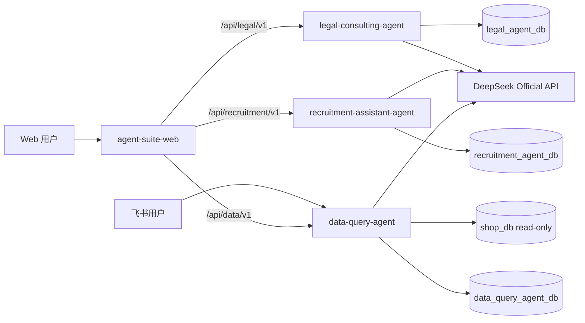

# 系统总体架构

## 1. 架构目标

平台采用统一前端、三个独立 Agent API 和一个运维协调仓库。独立性优先于代码复用：任何 Agent 均可单独部署、维护、扩展和下线，且不得通过内部 Python import、共享业务数据库或同步服务调用形成耦合。

## 2. 逻辑视图



## 3. 请求边界

- Web 前端只通过公开 OpenAPI/SSE 契约调用服务，不读取服务数据库。
- 三个 Agent 不互相调用；跨模块导航由前端完成。
- 飞书入口只进入智能问数服务，不绕过该服务的鉴权、限流和审计边界。
- DeepSeek 调用由各服务自己的模型适配器负责；模型密钥不经过前端。
- 运维仓仅编排容器和网络，不注入业务逻辑。

## 4. 数据边界

| 服务 | 默认数据库 | 权限原则 |
|---|---|---|
| 法律咨询 | `legal_agent_db` | 仅访问法律用户、会话、消息、提示词和审计表 |
| 智能招聘 | `recruitment_agent_db` | 仅访问招聘任务、结构化材料、报告和审计表 |
| 智能问数业务查询 | `shop_db` | MCP/查询账号只读，禁止DDL/DML |
| 智能问数运行态 | `data_query_agent_db` | 仅保存会话、运行、节点、审计、反馈和配置版本 |

开发环境允许共用一个 MySQL 8 实例，但四个权限域必须使用独立账号，其中 `shop_db` 查询账号严格只读。部署参数允许将任一数据库迁移到独立实例。

## 5. Agent 内部标准分层

```text
API layer
  -> application service
      -> LangGraph workflow
          -> domain nodes
              -> adapters (DeepSeek / MySQL / retrieval / Feishu)
      -> repositories
  -> schemas and error mapping
```

- API 层只做协议解析、鉴权、调用和错误映射。
- 工作流只定义节点、状态、边和恢复点。
- 节点只承担单一职责，外部副作用通过 adapter 执行。
- repository 只负责本服务的数据持久化。
- Prompt 必须按名称和版本管理，不散落在路由或节点中。

### 5.1 Agent运行时演进

- 默认使用显式LangGraph工作流。
- API和application只依赖统一Run/Thread/事件契约，不依赖具体harness。
- `workflows/factory.py`是唯一图构建入口；默认返回自定义编译图。
- Deep Agents仅作为可选高层harness，满足ADR-0005门槛后由factory接入。
- 不提前增加Deep Agents依赖，不在节点中编写`if framework == ...`分支。

## 6. 运行状态

统一运行状态：`pending`、`running`、`success`、`failed`、`retrying`、`canceled`。

每次运行至少记录：

- `request_id`
- `thread_id`
- `run_id`
- `agent_name`
- `workflow_version`
- `prompt_version`
- `node_name`
- `status`
- `retry_count`
- `started_at` / `finished_at`
- 错误码与脱敏错误摘要

## 7. 失败隔离

- DeepSeek 不可用：当前 Agent 返回标准外部依赖错误，其他 Agent 不受影响。
- 单个数据库不可用：只影响所属 Agent。
- 单个 Agent 不可用：前端对应菜单显示降级页，其他菜单保持可用。
- 飞书异常：不影响 Web 智能问数入口。
- 超时和重试必须有上限；禁止无限重试。

## 8. 部署视图

每个应用仓库拥有独立镜像和健康检查。运维仓的统一编排只通过镜像版本、环境变量和网络连接各服务，不挂载其他仓库源码。

当前阶段不创建可执行 Compose；部署配置在 `OPS-600` 阶段实现。
