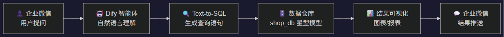
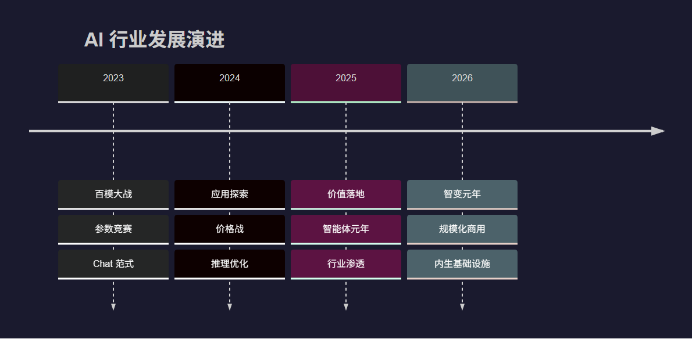
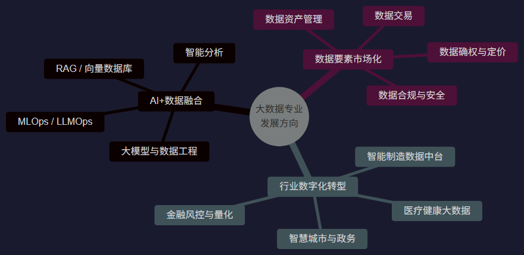
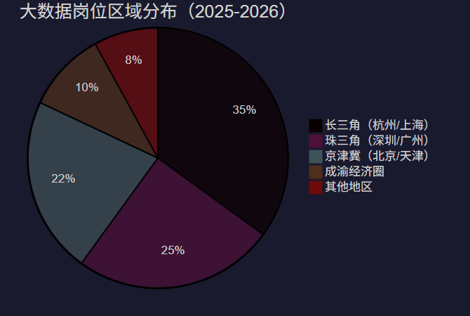
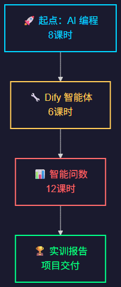

# 🚀 大数据技术企业项目实践 —— 课程导论与行业概览

> **AI编程 × 智能体开发 × 智能问数**  
> 讲师：贺圣军 | 2026 年夏季学期 | 总计 26 课时

---

## 📋 目录

1. [课程安排计划](#1-课程安排计划) — 三阶段实训体系
2. [课程考核方案](#2-课程考核方案) — 评分标准与要求
3. [AI 行业发展概览](#3-ai-行业发展概览) — 趋势、规模与应用
4. [大数据专业发展](#4-大数据专业发展方向) — 方向、岗位与能力

---

# 1. 课程安排计划

## 🗓️ 课程安排总览

| 阶段 | 模块名称 | 课时 | 核心主题 |
|:---:|----------|:----:|----------|
| **一** | 🤖 AI 编程 | **8** | AI辅助编码、Prompt工程、AI工具链 |
| **二** | 🔧 Dify 工作流智能体 | **6** | 低代码AI应用、智能体编排、工作流设计 |
| **三** | 📊 智能问数 | **12** | Dify + 企业微信 + 数据仓库 |

> 📌 **总计 26 课时** —— 从 AI 编程基础到企业级智能数据应用，由浅入深，循序渐进。

---

## 🤖 第一阶段：AI 编程（8课时）

### 🎯 学习目标

- 掌握 AI 辅助编程的核心方法论
- 熟练使用 AI IDE（Cursor / Claude Code 等）
- 理解 Prompt Engineering 最佳实践
- 独立完成一个 AI 驱动的开发项目

### 📚 内容要点

1. AI 编程工具生态概览
2. Prompt 工程：从入门到精通
3. AI 辅助代码生成与重构
4. AI 辅助调试与测试
5. 实战项目：用 AI 搭建全栈应用

> 💡 **核心理念**：不是 AI 替你写代码，而是你驾驭 AI 写出更好的代码

---

## 🔧 第二阶段：Dify 工作流智能体（6课时）

### 🎯 学习目标

- 理解 AI Agent（智能体）的核心概念
- 掌握 Dify 平台低代码开发
- 能独立设计并部署工作流智能体
- 对接企业微信等实际业务场景

### 📚 内容要点

1. AI Agent 原理与架构
2. Dify 平台入门与实战
3. 工作流编排：节点、条件、循环
4. RAG（检索增强生成）实战
5. 智能体发布与企业微信集成
6. 综合项目：业务智能体落地

---

## 📊 第三阶段：智能问数（12课时）

### Dify + 企业微信 + 数据仓库

> 🎯 **终极目标**：用自然语言对话的方式，让业务人员随时获取数据洞察

---

### 📐 智能问数：技术架构详解

| 层级 | 技术组件 | 实训内容 |
|:----:|----------|----------|
| **接入层** | 企业微信 Bot API | 消息接收、鉴权、主动推送 |
| **智能层** | Dify 工作流 + LLM | 意图识别、NL2SQL、结果解读 |
| **数据层** | MySQL 数据仓库（shop_db） | 星型模型、维度建模、SQL 优化 |
| **展示层** | ECharts / 数据表格 | 可视化图表生成、移动端适配 |

> 📦 实训数据：`shop_db` —— 完整电商数据仓库（8 张维度表 + 2 张事实表）

---

# 2. 课程考核方案

## 🏆 考核评分体系

### 🏅 实训报告 —— **60%**

- 项目完整性
- 技术文档质量
- 成果演示效果
- 创新性与扩展性

### 📋 平时作业 —— **20%**

- 课后练习完成度
- 代码质量与规范

### 📌 日常考勤 —— **20%**

- 课堂出勤率
- 课堂互动参与
- 学习态度评估

---

## 📋 实训报告详细要求

| 评分维度 | 权重 | 具体要求 |
|----------|:----:|----------|
| **项目完整性** | 25% | 三个模块均有可运行的交付物 |
| **技术文档** | 25% | 含架构设计、核心代码注释、问题记录 |
| **成果演示** | 25% | 现场 Demo 演示，功能完整可用 |
| **创新扩展** | 25% | 在基础要求之上有自主创新的功能 |

---

# 3. AI 行业发展概览

## 📈 AI 市场规模（2025-2026）

| 指标维度 | 2025年 | 2026年预测 |
|----------|--------|-----------|
| 🌍 全球 AI 市场规模 | ~7,576 亿美元 | ~9,000 亿美元 |
| 🇨🇳 中国 AI 核心产业规模 | **超 1.2 万亿元** | 维持近 30% 增速 |
| 🏢 中国 AI 企业数量 | 超 6,200 家 | 持续增长 |
| 👥 生成式 AI 用户规模 | 5.15 亿（普及率 36.5%） | 持续扩容 |
| ⚡ 日均 Token 调用量 | 突破 50 万亿 | 爆发式增长 |

> 📊 中国 AI 市场复合增长率预测：**30% ~ 47%**（不同机构模型）

---

## 🔄 行业转折：从"技术竞赛"到"价值落地"

- ✅ **政策推动**："人工智能+"行动 → "十五五"规划 → "智能经济新形态"
- ✅ **资本转向**：从基础设施层 → 应用层，关注 ROI（投资回报率）
- ✅ **格局收敛**：头部集中化，垂直深耕成为中小厂商出路

---

## 🚀 2026 年五大核心趋势

| # | 趋势 | 核心要点 |
|:-:|------|----------|
| **1** | 🤖 **智能体时代来临** | 从"能聊天"到"能办事"，50% 中国 500 强将采用 AI Agent |
| **2** | 🎯 **原生多模态融合** | 文本 + 图像 + 视频 + 音频统一建模 |
| **3** | 🧠 **强逻辑推理突破** | 从统计关联到因果推断，深度思考能力跃升 |
| **4** | 🏭 **AI 工业化渗透** | 制造业 AI 应用比例 9.6% → **47.5%** |
| **5** | 🔌 **AI 内生基础设施化** | 从"外挂工具"升级为企业核心基础设施 |

> 💡 **行业共识**：AI 不再是效率工具，而是**生产要素本身**

---

## 🔥 与我们课程最相关的三大方向

### 🤖 方向一：AI 编程

- AI IDE 月活用户爆发增长
- **开发者生产力革命**
- 从辅助工具到自主 Agent

> "未来 3 年，每家公司都是 AI 公司"

### 🔧 方向二：低代码 AI Agent

- Dify / Coze 生态爆发
- 智能体即服务（**AaaS**）
- 非技术人员也能构建 AI 应用

> "智能体将替代 80% 的重复性脑力劳动"

### 📊 方向三：智能问数

- 自然语言 → SQL 准确率跃升
- 数据民主化"最后一公里"
- 业务人员自助取数分析

> "让每个人拥有数据分析师的能力"

---

# 4. 大数据专业发展方向

## 🧭 三大发展方向

### 方向一：AI + 数据融合

- 大模型与数据工程深度结合
- RAG / 向量数据库成为必备技能
- MLOps / LLMOps 工程化实践
- 传统大数据技术栈向 AI 推理架构演进

### 方向二：数据要素市场化

- 数据确权、定价、交易制度日趋完善
- 数据资产评估师、数据合规专员等新职业涌现
- 国家层面出台数据要素学科建设意见

### 方向三：行业数字化转型

- 智能制造数据中台、工业数据分析
- 金融风控与量化交易
- 智慧城市、数字政府建设
- 医疗健康大数据

---

## 💼 核心就业岗位

| 类别 | 岗位 | 月薪参考 |
|------|------|:--------:|
| 🔴 **技术岗** | 大数据开发工程师 | 12K-25K |
| 🔴 **技术岗** | 数据分析师 / BI 工程师 | 10K-20K |
| 🔴 **技术岗** | AI 算法工程师 / 训练师 | 15K-45K |
| 🔴 **技术岗** | 大数据架构师（高级） | 35K-100K+ |
| 🟡 **复合岗** | 数据产品经理 | 20K-35K |
| 🟡 **复合岗** | 数据治理专家 | 18K-30K |
| 🟡 **复合岗** | 数据安全工程师 | 20K-35K |
| 🟢 **行业岗** | 金融风控分析师 | 15K-30K |
| 🟢 **行业岗** | 工业数据分析师 | 12K-25K |

> 🎯 **最紧缺**："AI + 数据" 双栖能力人才，供需比可达 1:8

---

## 🔑 企业最看重的四种能力

### 💻 技术硬实力

- SQL / Python / Spark 等核心技术栈
- 数据仓库建模能力
- 大模型应用开发经验

### 🧩 AI 融合能力

- Prompt 工程设计与调优
- RAG 系统搭建
- Agent 工作流编排

### 🏭 行业知识

- 电商业务逻辑与思维
- 数据分析思维
- 指标体系构建

### 🤝 综合素养

- 数据安全意识
- 团队协作沟通能力
- 持续学习与自我迭代

> 🎯 **本课程实训目标**：让你同时具备这四种能力！

---

## 📊 人才市场数据

| 指标 | 数据 |
|------|------|
| 🇨🇳 数字经济人才缺口 | **超 3,000 万** |
| 📊 大数据人才缺口（3-5年） | **150-200 万** |
| 📈 基础数据分析人才缺口 | **1,400 万** |
| 🎓 应届生起薪（核心岗） | **12K-20K/月** |
| 📈 3年后薪资中位数 | **25K-35K/月** |
| 🏢 全国开设数据相关专业点 | **超 1,500 个** |

> 💡 **黄金窗口期**：大数据 + AI 复合人才正处于供不应求的历史机遇期

---

## 🗺️ 区域需求分布

- 🔥 **杭州/上海**：岗位数量领跑，政企数据中台 + 电商直播
- 🔥 **深圳/广州**：2025年人才缺口预计 **12 万**
- 🔥 **西部增长率**：广西/西安同比增长 **53%**，增速最快

---

# 🎯 课程总结与展望

## 🗺️ 本课程学习路线图

| 阶段 | 你将成为... |
|:----:|-------------|
| 🤖 AI 编程 | 能驾驭 AI 工具的高效开发者 |
| 🔧 智能体 | 能搭建企业级 AI 应用的架构师 |
| 📊 智能问数 | 能用对话驱动数据决策的复合型人才 |

---

## ✨ 为什么学这个？

> **"AI 不会淘汰你，但会用 AI 的人会。"**  
> —— 这不是一句口号，而是正在发生的现实。

- 🔹 **行业在变**：AI 编程、智能体、Text-to-SQL 是 2026 年**最热门的三项技术**
- 🔹 **岗位在变**：95% 的企业招聘要求中已出现"熟悉 AI 工具"或"有大模型应用经验"
- 🔹 **你在变**：26 课时后，你将拥有一套**可写入简历的完整项目经验**

---

## 📚 课前准备建议

| 准备项 | 说明 |
|--------|------|
| 🛠️ **开发环境** | 安装 VS Code / Cursor，注册 GitHub 账号 |
| 🐍 **Python 基础** | 回顾 Python 基础语法、虚拟环境管理 |
| 🗄️ **SQL 基础** | 复习 SELECT / JOIN / GROUP BY |
| 🤖 **AI 工具** | 注册 DeepSeek / 豆包 / Kimi 账号体验 |
| 📖 **前置阅读** | 了解 Dify 平台基本概念 |

> 💬 **提问环节**：关于课程安排、考核方式、技术方向，有什么想了解的？欢迎在课堂上随时提出。

