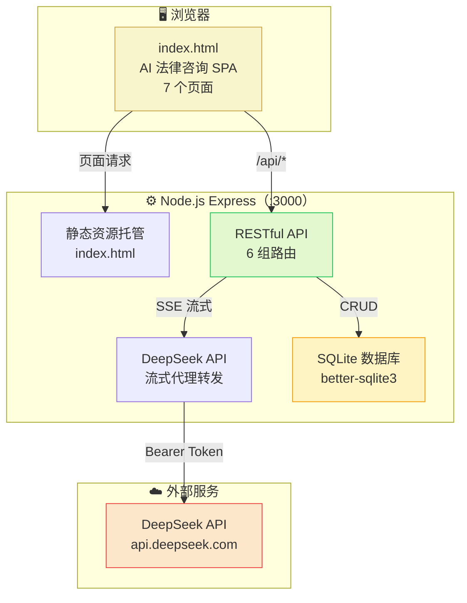
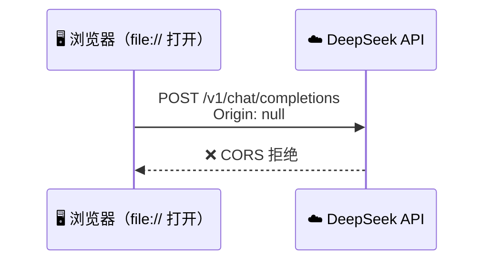
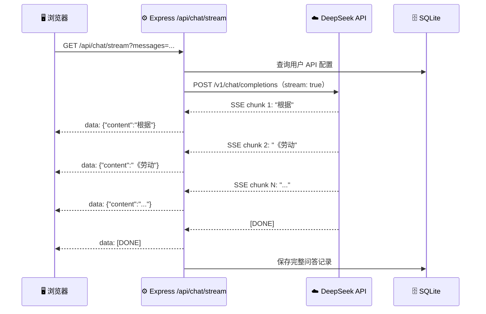

# ⚖️ AI 法律咨询系统实战 —— 从零到全栈

> **课程定位**：本课程是「大数据与 AI 应用实训」的第三个模块。带领学生**从零开始**，通过 AI 提示词驱动开发，逐步构建一个完整的 **AI 法律咨询系统**。课程遵循「简单页面 → 多页面应用 → 后端服务 → 数据库持久化 → AI 模型集成」的递进路径，每阶段均可独立运行和演示。

---

## 📋 目录

1. [项目概览与架构设计](#项目概览与架构设计)
2. [第一阶段：从零开始 —— 纯前端页面](#第一阶段从零开始--纯前端页面)
3. [第二阶段：Node.js 托管前端页面](#第二阶段nodejs-托管前端页面)
4. [第三阶段：后端服务 + 数据库](#第三阶段后端服务--数据库)
5. [第四阶段：AI 模型集成](#第四阶段ai-模型集成)
6. [补充：Puppeteer MCP 自动化测试](#补充puppeteer-mcp-自动化测试)
7. [课后作业](#课后作业)
8. [环境验证清单](#环境验证清单)

---

# 项目概览与架构设计

## 项目目标

学完本模块后，你将能够**独立完成**：

| 序号 | 能力目标 |
|:---:|------|
| 1 | 使用 AI 提示词**从头生成完整的前端页面**（非玩具代码） |
| 2 | 理解 **SPA（单页应用）** 的路由、状态管理和组件化思想 |
| 3 | 搭建 **Node.js + Express** 后端服务 |
| 4 | 使用 **SQLite（better-sqlite3）** 实现数据持久化 |
| 5 | 在后端**集成 DeepSeek API**，实现流式 AI 法律问答 |
| 6 | 理解**前后端分离**架构的完整开发流程 |

## 系统架构总览



> 📌 **架构关键点**：Express 同时托管前端静态文件和 API 服务，无需额外的 Web 服务器。

## 技术栈一览

| 层级 | 技术 | 用途 |
|------|------|------|
| **前端** | HTML5 + CSS3 + Vanilla JS | 单页面应用（SPA），7 个视图页面 |
| **后端** | Node.js + Express | RESTful API + DeepSeek 代理 + 静态资源托管 |
| **数据库** | SQLite（better-sqlite3） | 用户 / 配置 / 模板 / 咨询记录 持久化 |
| **AI 模型** | DeepSeek V4（API） | 流式法律问答，支持思考模式 |
| **认证** | JWT（jsonwebtoken） | 无状态令牌认证，7 天有效期 |
| **密码安全** | bcryptjs | 密码哈希存储 |

> 💡 **为什么选 SQLite 而不是 MySQL？**
> - SQLite 是**零配置嵌入式数据库**，无需单独安装数据库服务
> - 对于单机部署的法律咨询系统，并发量不高，SQLite 完全够用
> - 数据存储为单一 `.db` 文件，备份和迁移极为方便
> - `better-sqlite3` 是 Node.js 中最快的 SQLite 驱动（同步 API，性能极高）

## 项目完整目录结构

```
D:\law02\
├── index.html               ← 前端单页应用（约 2005 行）
├── data\
│   └── law.db               ← SQLite 数据库文件
└── server\                  ← 后端项目目录
    ├── package.json         ← Node.js 依赖配置
    ├── server.js            ← Express 主入口
    ├── .env                 ← 环境变量（JWT 密钥等）
    ├── db\
    │   ├── database.js      ← 数据库初始化 + 表创建
    │   └── seed.js          ← 种子数据（管理员 + 33 个模板）
    ├── routes\
    │   ├── auth.js          ← 登录 / 注册
    │   ├── chat.js          ← AI 对话（流式代理）
    │   ├── config.js        ← 用户 API 配置
    │   ├── users.js         ← 用户管理（管理员）
    │   ├── templates.js     ← 提示词模板管理
    │   └── consultations.js ← 咨询记录管理
    └── middleware\
        └── auth.js          ← JWT 认证中间件
```

---

# 第一阶段：从零开始 —— 纯前端页面

> 🎯 **本阶段目标**：不写一行后端代码，用 AI 提示词生成一个**可直接在浏览器中打开**的法律咨询页面。先让页面"看起来像那么回事"，功能可以先用模拟数据凑合。

## 核心方法论：如何用 AI 写出生产级前端代码

> **核心理念**：你不需要手写每一行 HTML/CSS/JS，而是通过**精心设计的提示词**，让 AI 帮你生成高质量代码。你的角色从"码农"升级为"架构师 + 代码审查员"。

### 高效提示词公式

```
角色设定 + 需求描述 + 技术约束 + 输出格式 + 质量标准
```

**示例对比**：

| ❌ 低质量提示词 | ✅ 高质量提示词 |
|---|---|
| "帮我写一个聊天页面" | "你是一个资深前端工程师。请创建一个 AI 法律咨询聊天界面，要求：① 左侧法律分类侧边栏（8个分类）；② 中间对话区域支持 Markdown 渲染；③ 支持流式输出模拟；④ 包含登录/注册功能；⑤ 管理员后台（用户管理+提示词模板管理）；⑥ 纯 CSS 变量主题系统；⑦ 响应式布局。输出为单个 index.html，包含内联 CSS 和 JS。" |

## 第一步：一个最简单的法律问答页面

> 🎯 **从最简单的开始**：只有一个输入框和一个回复区域，点击发送后显示模拟的法律建议。

### 提示词模板

```
你是一个前端工程师。请帮我创建一个最简单的"AI 法律咨询"页面，
要求：
1. 页面标题为"AI 法律咨询"
2. 顶部一个标题栏
3. 中间一个对话显示区域（先显示一条欢迎消息）
4. 底部一个输入框和一个发送按钮
5. 用户输入问题后点击发送，在对话区显示用户的问题
6. 用 setTimeout 模拟 AI 回复：1 秒后显示一段预设的法律建议文本
7. 页面使用柔和的配色（法律金色 #c9a84c 作为主题色）
8. 输出为单个 index.html 文件，CSS 和 JS 都写在文件内
```

### 预期结果

- 一个约 100 行的 `index.html`
- 能用 `file://` 协议直接在浏览器中打开
- 输入 → 发送 → 显示问题 → 1 秒后显示模拟回复

> ✅ **检查点**：双击 `index.html` 能在浏览器中正常打开，能够输入文字并看到模拟回复。

## 第二步：加上法律分类侧边栏

现在页面太简陋了。我们要加上**左侧分类导航**，让用户可以选择不同的法律领域。

### 提示词模板

```
请在现有页面的基础上，增加左侧的法律分类侧边栏。
要求：
1. 侧边栏宽度约 260px，包含以下 8 个法律分类：
   - 🚗 交通事故
   - 💑 婚姻家庭
   - 🏢 劳动争议
   - 📜 合同纠纷
   - 💠 刑事辩护
   - 🏠 房产纠纷
   - 🔍 知识产权
   - 🛒 消费维权
2. 每个分类可点击，点击后高亮选中
3. 点击不同分类时，模拟回复的内容要与该分类相关
4. 侧边栏在移动端可折叠（用汉堡菜单按钮控制）
5. 使用 CSS 变量统一管理主题色
```

### 关键代码结构

```css
:root {
  --bg-primary: #f5f7fa;
  --accent: #c9a84c;           /* 法律金色主题 */
  --accent-hover: #d4b85a;
  --primary: #2563eb;
  --shadow: 0 4px 24px rgba(0,0,0,0.08);
  --radius: 12px;
  --transition: 0.2s ease;
}
```

> 💡 **设计思考**：使用 CSS 变量统一管理主题色和间距，后期换肤只需修改变量值。

## 第三步：加入登录/注册功能

现在任何人都能使用页面。我们要加上**用户系统**——但暂时用 `localStorage` 模拟，不连后端。

### 提示词模板

```
请为法律咨询页面增加登录和注册功能。
要求：
1. 页面初始显示登录表单（用户名 + 密码）
2. 可以切换到注册表单（用户名 + 密码 + 确认密码 + 显示名称）
3. 注册数据存储在 localStorage 中（用 JSON 序列化）
4. 登录时从 localStorage 读取验证
5. 登录成功后进入主界面（聊天页）
6. 顶部导航栏显示当前用户名和退出按钮
7. 管理员账号（admin / admin123）预置在代码中
8. 密码至少 4 位，两次输入需一致
```

### localStorage 数据模拟层

```javascript
const Store = {
  get(key, def) {
    try { const d = localStorage.getItem('law_'+key);
          return d ? JSON.parse(d) : def; }
    catch { return def; }
  },
  set(key, val) {
    try { localStorage.setItem('law_'+key, JSON.stringify(val)); }
    catch (e) { console.error('Store.set error:', e); }
  }
};
```

> ⚠️ **当前问题**：数据存储在浏览器 localStorage 中，存在以下缺陷：
> - 换浏览器/清除缓存后数据丢失
> - 无法多端共享（手机/PC 数据不同步）
> - 密码明文存储，安全性差
> - **→ 这就是第三阶段要解决的问题！**

## 第四步：升级为多页面 SPA

现在页面只有登录和聊天两个状态。我们要把它升级为**完整的单页应用**，包含多个视图。

### 项目现有前端页面结构

本项目最终版 `index.html`（约 2005 行）包含 **7 个视图页面**：

```
index.html
├── <style>              # CSS 变量系统 + 响应式布局（~650 行）
├── <body>
│   ├── #page-home       # ① 首页：Hero 区域 + 8 个分类卡片 + 热门问题
│   ├── #page-login      # ② 登录页
│   ├── #page-register   # ③ 注册页
│   ├── #page-chat       # ④ 在线咨询：侧边栏 + 对话区 + 流式输出
│   ├── #page-history    # ⑤ 历史记录：咨询记录列表 + 详情弹窗
│   ├── #page-settings   # ⑥ 设置：个人信息 + API 密钥配置
│   └── #page-admin      # ⑦ 管理后台：数据概览 + 用户管理 + 模板管理 + 记录管理
└── <script>
    ├── Store            # localStorage 数据层
    ├── Auth             # 认证模块
    ├── Router           # SPA 路由
    ├── Chat             # 聊天核心逻辑
    ├── Admin            # 后台管理逻辑
    └── App              # 应用入口 + 全局事件
```

### SPA 路由实现

```javascript
const Router = {
  currentView: 'home',

  navigate(view, params) {
    this.currentView = view;
    // 1. 隐藏所有页面
    document.querySelectorAll('[id^="page-"]').forEach(p => {
      p.style.display = 'none';
    });
    // 2. 显示目标页面
    const target = document.getElementById('page-' + view);
    if (target) target.style.display = 'block';
    // 3. 更新导航高亮
    this.updateNav(view);
  },

  updateNav(view) {
    // 根据登录状态和角色显示/隐藏导航项
    document.querySelectorAll('.nav-link').forEach(link => {
      link.classList.toggle('active', link.dataset.view === view);
    });
  }
};
```

> 💡 **SPA 的核心思想**：所有页面都在一个 HTML 文件中，通过 JS 切换显示/隐藏，**不刷新浏览器**。用户体验更流畅。

## 第一阶段小结

| 步骤 | 你做到了什么 | 技术点 |
|:--:|------|------|
| 1 | 一个能对话的静态页面 | HTML 基础结构、事件监听 |
| 2 | 带分类侧边栏的聊天界面 | CSS 变量、Flexbox 布局、响应式 |
| 3 | 登录/注册用户系统 | localStorage、表单验证 |
| 4 | 7 页完整 SPA 应用 | 客户端路由、状态管理、组件化思维 |

> 🎯 **关键认知**：第一阶段全程只用了一个 `index.html` 文件，用 `file://` 协议打开就能运行。这不是"玩具"——最终版约 2005 行代码，是一个真正可用的前端应用。

---

# 第二阶段：Node.js 托管前端页面

> 🎯 **本阶段目标**：解决 `file://` 协议导致的跨域问题，用 HTTP 服务器正确托管前端页面。

## 问题的根源：浏览器的同源策略

在第一阶段，我们通过**文件协议（`file://`）**直接在浏览器中打开 `index.html`。当你配置了 DeepSeek API Key 后尝试调用 API，会发现：

```
❌ Access to fetch at 'https://api.deepseek.com/v1/chat/completions'
   from origin 'null' has been blocked by CORS policy
```



### 核心概念：同源策略

| 场景 | 协议 | 域名 | 端口 | 是否同源？ |
|------|:---:|------|:---:|:---:|
| 你的页面 | `file://` | — | — | ❌ `null` 源 |
| DeepSeek API | `https://` | `api.deepseek.com` | `443` | ❌ 完全不同 |

> ⚠️ **关键认知**：跨域不是 Bug，是浏览器的安全机制。解决方案是用 HTTP 服务器托管页面，让浏览器拿到合法的 `http://` 源。

## 方案：Express 静态服务器

直接在 `server/` 目录下创建一个 Express 服务，既能托管静态文件，又为后续后端开发做铺垫。

### 当前项目的 server.js

```javascript
// server/server.js — Express 主入口
require('dotenv').config();
const express = require('express');
const cors = require('cors');
const path = require('path');
const { initDatabase } = require('./db/database');

initDatabase();

const app = express();
const PORT = process.env.PORT || 3000;

// ============ 中间件 ============
app.use(cors({
  origin: process.env.FRONTEND_URL || '*',
  credentials: true
}));
app.use(express.json());

// 请求日志
app.use((req, res, next) => {
  const start = Date.now();
  res.on('finish', () => {
    const duration = Date.now() - start;
    if (req.url !== '/api/health') {
      console.log(`[${new Date().toLocaleTimeString()}] ${req.method} ${req.url} ${res.statusCode} ${duration}ms`);
    }
  });
  next();
});

// ============ 静态资源托管 ============
const frontendPath = path.join(__dirname, '..');
app.use(express.static(frontendPath));

// ============ 路由（后续阶段添加）============
app.use('/api/auth', require('./routes/auth'));
app.use('/api/chat', require('./routes/chat'));
app.use('/api/config', require('./routes/config'));
app.use('/api/users', require('./routes/users'));
app.use('/api/templates', require('./routes/templates'));
app.use('/api/consultations', require('./routes/consultations'));

// 健康检查
app.get('/api/health', (req, res) => {
  res.json({ status: 'ok', timestamp: new Date().toISOString() });
});

// SPA 回退：所有非 /api/ 路径返回 index.html
app.get('*', (req, res) => {
  if (!req.path.startsWith('/api/')) {
    res.sendFile(path.join(frontendPath, 'index.html'));
  }
});

// ============ 全局错误处理 ============
app.use((err, req, res, next) => {
  console.error('[Error]', err.message);
  res.status(err.status || 500).json({ error: err.message || '服务器内部错误' });
});

app.listen(PORT, () => {
  console.log('═══════════════════════════════════════');
  console.log('  ⚖️  AI 法律咨询平台后端已启动');
  console.log(`  地址: http://localhost:${PORT}`);
  console.log(`  健康检查: http://localhost:${PORT}/api/health`);
  console.log('═══════════════════════════════════════');
});
```

### 启动验证

```bash
cd D:\law02\server
npm install
node server.js

# 期望输出：
# ═══════════════════════════════════════
#   ⚖️  AI 法律咨询平台后端已启动
#   地址: http://localhost:3000
#   健康检查: http://localhost:3000/api/health
# ═══════════════════════════════════════
```

打开 `http://localhost:3000`，浏览器控制台中不再有 CORS 错误。

### 验证清单

| 检查项 | 预期结果 |
|------|------|
| 浏览器地址栏 | `http://localhost:3000`（不再是 `file://`） |
| 页面功能 | 登录/注册/分类切换/对话 全部正常 |
| 控制台 Network | API 请求状态码正常 |

---

# 第三阶段：后端服务 + 数据库

> 🎯 **核心转变**：从"纯前端 localStorage 应用"升级为"前后端分离架构"。数据持久化到 SQLite，API Key 存于后端。

## 为什么需要后端？

| 问题 | localStorage 方案 | 后端方案 |
|------|:---:|:---:|
| 数据持久性 | ❌ 清缓存即丢失 | ✅ SQLite 持久存储 |
| 多端共享 | ❌ 浏览器隔离 | ✅ 统一数据库 |
| API Key 安全 | ❌ 暴露在前端代码 | ✅ 仅存于后端 |
| 密码安全 | ❌ 明文存储 | ✅ bcrypt 哈希 |
| 用户管理 | ❌ 无法跨设备 | ✅ 中心化管理 |

> ⚠️ **安全关键点**：DeepSeek API Key **绝对不能**放在前端代码中！迁移到后端后，Key 只存在于服务器的 `user_config` 表中。

## 步骤一：数据库设计

### ER 图

```mermaid
erDiagram
    users ||--o| user_config : "配置"
    users ||--o{ consultations : "咨询"
    prompt_templates ||--o{ consultations : "分类参考"

    users {
        TEXT id PK "UUID"
        TEXT username UK "用户名"
        TEXT password "bcrypt 哈希"
        TEXT role "admin | user"
        TEXT created_at "创建时间"
    }

    user_config {
        TEXT user_id PK_FK "用户 ID"
        TEXT api_key "API 密钥（明文存储）"
        TEXT api_base "API 地址"
        TEXT model "模型名称"
        TEXT thinking "思考模式"
    }

    prompt_templates {
        TEXT id PK "UUID"
        TEXT category "法律分类"
        TEXT title "模板标题"
        TEXT prompt "AI 角色设定提示词"
        TEXT created_at "创建时间"
    }

    consultations {
        TEXT id PK "UUID"
        TEXT user_id FK "用户 ID"
        TEXT username "用户名"
        TEXT question "用户问题"
        TEXT answer "AI 回复"
        TEXT created_at "创建时间"
    }
```

> 📌 **与课程概览中 shop_db 的星型模型不同**，本项目采用**扁平化设计**：表之间关系简单，适合 SQLite 轻量场景。

### 数据库初始化代码（db/database.js）

```javascript
const Database = require('better-sqlite3');
const path = require('path');
const fs = require('fs');

const DB_PATH = path.join(__dirname, '..', '..', 'data', 'law.db');

const dataDir = path.dirname(DB_PATH);
if (!fs.existsSync(dataDir)) {
  fs.mkdirSync(dataDir, { recursive: true });
}

const db = new Database(DB_PATH);
db.pragma('journal_mode = WAL');
db.pragma('foreign_keys = ON');

function initDatabase() {
  db.exec(`
    CREATE TABLE IF NOT EXISTS users (
      id TEXT PRIMARY KEY,
      username TEXT NOT NULL UNIQUE,
      password TEXT NOT NULL,
      role TEXT NOT NULL DEFAULT 'user' CHECK(role IN ('admin', 'user')),
      created_at TEXT NOT NULL DEFAULT (datetime('now', 'localtime'))
    );

    CREATE TABLE IF NOT EXISTS user_config (
      user_id TEXT PRIMARY KEY,
      api_key TEXT DEFAULT '',
      api_base TEXT DEFAULT 'https://api.deepseek.com',
      model TEXT DEFAULT 'deepseek-v4-flash',
      thinking TEXT DEFAULT 'disabled',
      FOREIGN KEY (user_id) REFERENCES users(id) ON DELETE CASCADE
    );

    CREATE TABLE IF NOT EXISTS prompt_templates (
      id TEXT PRIMARY KEY,
      category TEXT NOT NULL,
      title TEXT NOT NULL,
      prompt TEXT NOT NULL,
      created_at TEXT NOT NULL DEFAULT (datetime('now', 'localtime'))
    );

    CREATE TABLE IF NOT EXISTS consultations (
      id TEXT PRIMARY KEY,
      user_id TEXT NOT NULL,
      username TEXT NOT NULL,
      question TEXT NOT NULL,
      answer TEXT NOT NULL,
      created_at TEXT NOT NULL DEFAULT (datetime('now', 'localtime')),
      FOREIGN KEY (user_id) REFERENCES users(id) ON DELETE CASCADE
    );

    CREATE INDEX IF NOT EXISTS idx_consultations_user ON consultations(user_id);
    CREATE INDEX IF NOT EXISTS idx_consultations_created ON consultations(created_at DESC);
    CREATE INDEX IF NOT EXISTS idx_templates_category ON prompt_templates(category);
  `);

  console.log('[DB] 数据库表初始化完成');
}

module.exports = { db, initDatabase };
```

> 📖 **WAL 模式**：Write-Ahead Logging，允许读写并发，写入不阻塞读取，是 Web 应用的推荐配置。

### 种子数据（db/seed.js）

种子数据包括：
- **默认管理员**：`admin` / `admin123`
- **默认用户**：`user` / `user123`
- **33 个法律提示模板**，覆盖 8 个类别

| 类别 | 模板数 | 示例 |
|------|:--:|------|
| 🏢 劳动纠纷 | 5 | 拖欠工资、无故辞退、工伤认定、加班费、合同到期 |
| 💑 婚姻家庭 | 4 | 离婚条件、财产分割、子女抚养权、家庭暴力 |
| 🏠 房产物业 | 4 | 买房合同纠纷、租房押金、房屋质量、物业纠纷 |
| 📜 合同纠纷 | 4 | 借钱不还、合同违约、担保责任、合同无效 |
| 🚗 交通事故 | 4 | 赔偿标准、责任认定、保险理赔、肇事逃逸 |
| 💠 刑事法律 | 4 | 刑事拘留、辩护律师、被害人维权、取保候审 |
| 🛒 消费维权 | 4 | 假货索赔、消费欺诈、退换货、预付卡纠纷 |
| 🔍 知识产权 | 4 | 商标侵权、著作权、专利申请、商业秘密 |

## 步骤二：API 路由一览

| 方法 | 路径 | 说明 | 认证 |
|:---:|------|------|:---:|
| `GET` | `/api/health` | 健康检查 | 否 |
| `POST` | `/api/auth/register` | 注册 | 否 |
| `POST` | `/api/auth/login` | 登录 | 否 |
| `GET` | `/api/auth/me` | 当前用户信息 | 是 |
| `GET` | `/api/chat/stream` | AI 对话（SSE 流式） | 是 |
| `GET` | `/api/config` | 获取用户 API 配置 | 是 |
| `PUT` | `/api/config` | 更新用户 API 配置 | 是 |
| `GET` | `/api/users` | 用户列表 | 管理员 |
| `POST` | `/api/users` | 创建用户 | 管理员 |
| `PUT` | `/api/users/:id` | 更新用户角色 | 管理员 |
| `DELETE` | `/api/users/:id` | 删除用户 | 管理员 |
| `GET` | `/api/templates` | 模板列表 | 是 |
| `POST` | `/api/templates` | 新增模板 | 管理员 |
| `PUT` | `/api/templates/:id` | 编辑模板 | 管理员 |
| `DELETE` | `/api/templates/:id` | 删除模板 | 管理员 |
| `GET` | `/api/consultations` | 咨询记录列表 | 是 |
| `POST` | `/api/consultations` | 保存咨询记录 | 是 |
| `DELETE` | `/api/consultations/:id` | 删除记录 | 是 |

### 用 curl 测试 API

```bash
# 1. 健康检查
curl http://localhost:3000/api/health

# 2. 注册新用户
curl -X POST http://localhost:3000/api/auth/register \
  -H "Content-Type: application/json" \
  -d '{"username":"test","password":"test123","display_name":"测试用户"}'

# 3. 登录获取 Token
curl -X POST http://localhost:3000/api/auth/login \
  -H "Content-Type: application/json" \
  -d '{"username":"admin","password":"admin123"}'
# 复制返回的 token

# 4. 查看模板列表
curl http://localhost:3000/api/templates \
  -H "Authorization: Bearer <YOUR_TOKEN>"
```

## 步骤三：JWT 认证中间件

```javascript
// middleware/auth.js
const jwt = require('jsonwebtoken');
const JWT_SECRET = process.env.JWT_SECRET || 'law-ai-platform-secret-2024';

function generateToken(user) {
  return jwt.sign(
    { id: user.id, username: user.username, role: user.role },
    JWT_SECRET,
    { expiresIn: '7d' }  // 7 天过期
  );
}

function requireAuth(req, res, next) {
  const authHeader = req.headers.authorization;
  if (!authHeader || !authHeader.startsWith('Bearer ')) {
    return res.status(401).json({ error: '请先登录' });
  }
  const token = authHeader.split(' ')[1];
  try {
    req.user = jwt.verify(token, JWT_SECRET);
    next();
  } catch (err) {
    return res.status(401).json({ error: '登录已过期，请重新登录' });
  }
}

function requireAdmin(req, res, next) {
  requireAuth(req, res, () => {
    if (req.user.role !== 'admin') {
      return res.status(403).json({ error: '仅管理员可访问' });
    }
    next();
  });
}

module.exports = { generateToken, requireAuth, requireAdmin };
```

> 🔐 **JWT 流程**：登录成功 → 服务端签发 Token → 客户端存储 Token → 后续请求带 `Authorization: Bearer <token>` → 服务端验证。

---

# 第四阶段：AI 模型集成

> 🎯 **本阶段目标**：在后端集成 DeepSeek API，实现真正的流式 AI 法律问答。

## 核心：SSE 流式代理



## 流式聊天路由（routes/chat.js 核心逻辑）

```javascript
// GET /api/chat/stream
router.get('/stream', requireAuth, async (req, res) => {
  const { messages } = req.query;

  // 1. 获取用户 API 配置
  const config = db.prepare(
    'SELECT * FROM user_config WHERE user_id = ?'
  ).get(req.user.id);

  if (!config || !config.api_key) {
    return res.status(400).json({ error: '请先在设置中配置 API Key' });
  }

  // 2. 设置 SSE 响应头
  res.setHeader('Content-Type', 'text/event-stream');
  res.setHeader('Cache-Control', 'no-cache');
  res.setHeader('Connection', 'keep-alive');

  // 3. 解析历史消息 + 构建请求
  const chatMessages = JSON.parse(messages || '[]');
  const systemPrompt = {
    role: 'system',
    content: '你是一位专业的中国法律顾问。请根据中国法律法规，为用户提供专业、准确的法律咨询建议...'
  };

  // 4. 调用 DeepSeek API（流式）
  const response = await fetch(`${config.api_base}/v1/chat/completions`, {
    method: 'POST',
    headers: {
      'Content-Type': 'application/json',
      'Authorization': `Bearer ${config.api_key}`
    },
    body: JSON.stringify({
      model: config.model || 'deepseek-v4-flash',
      messages: [systemPrompt, ...chatMessages],
      stream: true,
      max_tokens: 4096,
      temperature: 0.7
    })
  });

  // 5. 逐块转发 SSE 数据
  const reader = response.body.getReader();
  const decoder = new TextDecoder();
  let fullContent = '';

  while (true) {
    const { done, value } = await reader.read();
    if (done) break;
    const chunk = decoder.decode(value, { stream: true });
    // 原样转发给前端
    res.write(chunk);
  }

  res.end();
});
```

> 📖 **SSE vs WebSocket**：
> - **SSE（Server-Sent Events）**：单向推送（服务器→客户端），基于 HTTP，实现简单，适合 AI 流式输出
> - **WebSocket**：双向通信，需要协议升级，适合聊天室等双向实时场景
> - 本系统选择 **SSE**，因为 AI 回复是单向流式推送，无需双向通信

---

# 补充：Puppeteer MCP 自动化测试

## Puppeteer MCP 是什么？

通过**自然语言提示词**驱动 Chrome 浏览器，自动完成页面操作和截图验证。

```bash
# 一键安装
claude mcp add puppeteer -- npx -y @modelcontextprotocol/server-puppeteer
```

### 常用工具

| 工具名 | 功能 | 典型用法 |
|------|------|------|
| `puppeteer_navigate` | 导航到 URL | 打开页面 |
| `puppeteer_screenshot` | 截取页面截图 | 验证 UI 显示 |
| `puppeteer_click` | 点击元素 | 点击按钮/链接 |
| `puppeteer_fill` | 填写输入框 | 填写表单 |
| `puppeteer_evaluate` | 执行 JS | 读取页面数据 |

### 测试示例

```
请使用 puppeteer 打开 http://localhost:3000，执行以下测试：
1. 用 admin / admin123 登录
2. 截图确认进入主界面
3. 点击"劳动争议"分类
4. 输入"被公司无故辞退如何维权？"并发送
5. 等待 AI 回复完成后截图
```

---

# 课后作业

> 🎯 **以下功能点尚未在项目中实现，请同学们自行完成。**

## 作业一：对话上下文记忆（⭐⭐）

**当前状态**：每次发送消息都是独立请求，AI 不记得你上一句说了什么。

**要求**：修改前端和后端，使 AI 能够记住同一会话中的历史对话。

**提示**：
- 前端在发送请求时带上历史消息数组
- 后端将历史消息拼接在 `messages` 参数中传给 DeepSeek
- 限制历史消息数量（最近 20 条），避免 token 超限

## 作业二：会话管理功能（⭐⭐⭐）

**当前状态**：没有多会话概念，所有对话混在一起。

**要求**：实现完整的会话管理系统。
- 用户可以创建/切换/删除多个会话
- 每个会话绑定一个法律分类
- 会话列表显示标题和最后更新时间
- 后端增加 `chat_sessions` 和 `chat_messages` 表

**提示**：
- 新增路由：`POST /api/chat/sessions`、`GET /api/chat/sessions`、`DELETE /api/chat/sessions/:id`
- 首条消息的前 22 字自动作为会话标题
- 数据库使用 CASCADE 删除：删会话时自动删消息

## 作业三：对话历史搜索（⭐⭐）

**当前状态**：历史记录页只是简单列表，没有搜索功能。

**要求**：为历史记录页添加关键词搜索功能。
- 前端添加搜索输入框
- 后端 `GET /api/consultations` 支持 `?search=关键词` 参数
- 搜索结果按时间倒序排列

**提示**：SQLite 使用 `WHERE question LIKE '%关键词%' OR answer LIKE '%关键词%'`

## 作业四：密码修改功能（⭐⭐）

**当前状态**：设置页面只能查看账户信息，无法修改密码。

**要求**：实现密码修改功能。
- 在设置页面添加"修改密码"区域
- 需要输入旧密码验证
- 新密码需输入两次确认
- 后端新增 `PUT /api/auth/password` 接口
- 密码用 bcrypt 哈希后更新

## 作业五：响应式布局优化（⭐）

**当前状态**：移动端有基础适配，但部分页面体验不佳。

**要求**：
- 管理后台在移动端使用卡片式布局替代表格
- 聊天页面在移动端隐藏侧边栏，用顶部下拉菜单选择分类
- 测试 375px / 768px / 1024px / 1440px 四个断点

## 作业六：导出咨询报告（⭐⭐⭐）

**当前状态**：咨询记录只能在网页中查看。

**要求**：实现在线导出功能。
- 支持导出单条咨询记录为 Markdown 或 PDF
- 支持批量导出选中记录
- 导出内容包括：问题、AI 回复、咨询时间、法律分类

**提示**：前端生成内容后使用 `Blob` 下载，或后端生成文件返回。

---

# 环境验证清单

完成全部课程后，请逐项检查：

```bash
# ========== 后端启动 ==========
cd D:\law02\server
npm install            # ✅ 依赖安装成功
npm run seed           # ✅ 种子数据初始化完成
node server.js         # ✅ 服务启动在 :3000

# ========== 功能验证 ==========
# ✅ 浏览器访问 http://localhost:3000 正常显示首页
# ✅ 注册新用户成功
# ✅ 用 admin / admin123 登录成功
# ✅ 管理后台可查看用户列表和模板
# ✅ 设置页面可配置 API Key
# ✅ 配置 API Key 后，AI 对话正常流式输出

# ========== API 验证 ==========
curl http://localhost:3000/api/health
# ✅ {"status":"ok","timestamp":"..."}

curl -X POST http://localhost:3000/api/auth/login \
  -H "Content-Type: application/json" \
  -d '{"username":"admin","password":"admin123"}'
# ✅ 返回 JWT Token
```

---

> 📌 **课程总结**：通过本项目，你亲手构建了一个完整的 AI 法律咨询系统——从最初一个简陋的 HTML 页面，到包含 7 个视图的 SPA 应用，再到 Express + SQLite + DeepSeek 的全栈系统。这套「从简单到复杂、逐步迭代」的开发方法论，适用于任何 AI 应用项目的开发。
