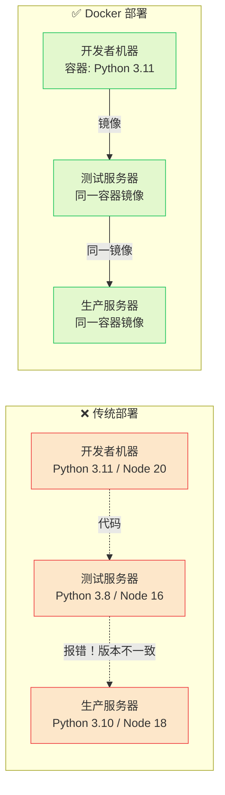
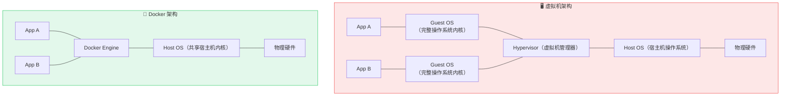
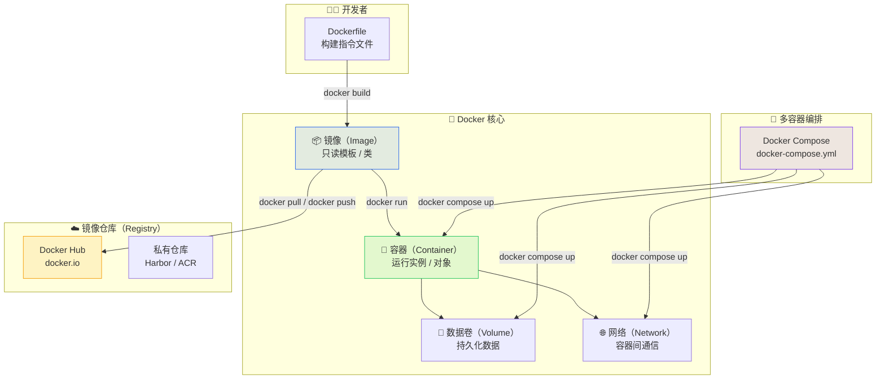
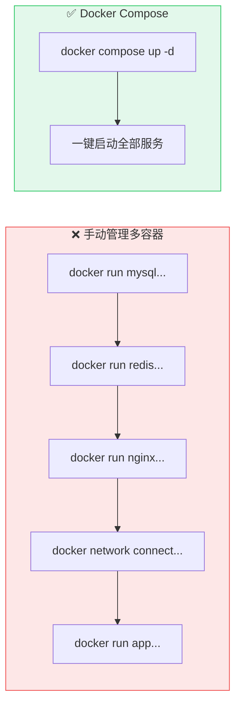
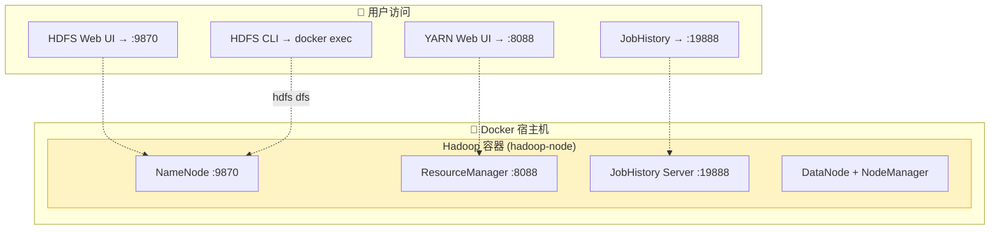

# 🐳 Docker 容器技术实战 — 从概念到生产部署

> **课程定位**：本课程是「大数据与 AI 应用实训」的第四个模块，系统讲解 Docker 容器技术的核心概念、环境搭建、基本命令与 Docker Compose 编排，并通过 Nginx 和 Hadoop 两个实战案例将理论知识落地。学完本模块后，学生将具备**独立容器化部署各类服务**的能力。

## 📋 目录

[Docker 概述与核心概念](#docker-概述与核心概念)
[Docker Desktop 在 Windows 上的安装](#docker-desktop-在-windows-上的安装)
[Docker 基本命令实战](#docker-基本命令实战)
[Docker Compose 编排入门](#docker-compose-编排入门)
[Docker 实战一：部署 Nginx](#docker-实战一部署-nginx)
[Docker 实战二：部署 Hadoop 单机环境](#docker-实战二部署-hadoop-单机环境)
[综合练习与检查点](#综合练习与检查点)

---

# Docker 概述与核心概念

## 🎯 学习目标

学完本模块后，你将能够**独立完成**：

| 序号 | 能力目标 |
|:---:|------|
| 1 | 解释 Docker 的核心概念：镜像、容器、仓库、Dockerfile、Docker Compose |
| 2 | 在 Windows 上成功安装 Docker Desktop 并配置国内镜像加速 |
| 3 | 熟练使用 Docker CLI 管理镜像和容器的完整生命周期 |
| 4 | 编写 Dockerfile 构建自定义镜像 |
| 5 | 使用 Docker Compose 编排多容器应用 |
| 6 | 在 Docker 中部署和配置 Nginx Web 服务器 |
| 7 | 使用 Docker Compose 部署 Hadoop 单机数据处理环境 |

## 为什么需要 Docker？—— 从"在我机器上能跑"到"到处都能跑"

> 每一个开发者都遇到过这样的场景：本地开发一切正常，部署到服务器上却报错——"在我机器上能跑啊！"Docker 的出现就是为了终结这个魔咒。



> 📖 **核心认知**：Docker 将应用程序及其所有依赖（运行时、系统库、环境变量等）打包成一个标准化的单元——**容器镜像**。无论在哪个环境中运行，容器内的环境完全相同。

## 虚拟机 vs Docker 容器

> 为什么不用虚拟机（VMware / VirtualBox）来做环境隔离？Docker 和虚拟机有本质区别。



| 维度 | 虚拟机（VM） | Docker 容器 |
|------|:---:|:---:|
| **启动速度** | 分钟级（需启动完整 OS） | **秒级**（共享宿主机内核） |
| **磁盘占用** | GB 级别（每个 VM 含完整 OS） | **MB 级别**（仅应用 + 依赖） |
| **内存开销** | 每个 VM 独立分配内存 | **共享内核，按需分配** |
| **隔离级别** | 完全隔离（独立内核） | 进程级隔离（共享一个内核） |
| **迁移部署** | 复杂（需导出整个 VM） | **简单**（推送/拉取镜像即可） |
| **适用场景** | 需要完整 OS 隔离 | **微服务、CI/CD、快速扩缩容** |

> 💡 **一句话总结**：虚拟机是"物理硬件的抽象"，在一台机器上跑多个 OS；Docker 容器是"应用层的抽象"，应用及其依赖打包在一起，共享同一个 OS 内核。

## Docker 核心概念全景图



### 五大核心概念速查

| 概念 | 类比 | 说明 |
|------|------|------|
| **镜像（Image）** | 📀 安装光盘 ISO | 包含应用 + 依赖的**只读模板**；分层构建，可复用 |
| **容器（Container）** | 💻 运行中的电脑 | 镜像的**运行实例**；可启动/停止/删除；各容器相互隔离 |
| **仓库（Registry）** | ☁️ GitHub | 存储和分发镜像的服务器；Docker Hub 是最大的公共仓库 |
| **Dockerfile** | 📝 菜谱 / 配方 | 构建镜像的**文本指令文件**；定义如何一步步组装镜像 |
| **Docker Compose** | 🎼 交响乐总谱 | 定义和运行**多容器**应用；一键启动/停止整套服务 |

> 📖 **镜像 vs 容器的经典类比**：
> - **镜像 = 类（Class）**，定义了属性和行为
> - **容器 = 对象（Instance）**，是类的具体实例
> - 一个镜像可以启动无数个容器，就像类可以实例化无数个对象

---

# Docker Desktop 在 Windows 上的安装

## 安装方式选择

| 方式 | 适用场景 | 推荐度 |
|------|------|:---:|
| **Docker Desktop**（推荐） | Windows 10/11 专业版/企业版 | ⭐⭐⭐⭐⭐ |
| Docker Toolbox | Windows 7/8/10 家庭版（无 Hyper-V） | ⭐⭐（已过时） |
| WSL 2 + Docker Engine | 纯命令行环境 | ⭐⭐⭐⭐（进阶） |

> 📌 **本课程推荐 Docker Desktop**，它集成了 WSL 2 后端、图形化管理界面，对初学者最友好。

## 步骤一：启用 WSL 2

> ⚠️ **前置条件**：Docker Desktop 依赖 WSL 2（Windows Subsystem for Linux 2）。如果你的 Windows 版本较低（Windows 10 1903 之前），请先升级系统。

### 以管理员身份打开 PowerShell，执行：

```powershell
# 1. 启用 WSL 功能
dism.exe /online /enable-feature /featurename:Microsoft-Windows-Subsystem-Linux /all /norestart

# 2. 启用虚拟机平台功能
dism.exe /online /enable-feature /featurename:VirtualMachinePlatform /all /norestart

# 3. 重启计算机
Restart-Computer
```

### 下载并安装 WSL 2 内核更新包

1. 访问：[https://learn.microsoft.com/zh-cn/windows/wsl/install-manual#step-4---download-the-linux-kernel-update-package](https://learn.microsoft.com/zh-cn/windows/wsl/install-manual#step-4---download-the-linux-kernel-update-package)
2. 下载 **WSL2 Linux kernel update package**（`wsl_update_x64.msi`）
3. 双击安装

```powershell
# 设置 WSL 2 为默认版本
wsl --set-default-version 2

# 验证 WSL 状态
wsl --status
# 期望输出：默认版本: 2
```

## 步骤二：安装 Docker Desktop

### 下载 Docker Desktop

1. 访问 Docker 官方下载页：[https://www.docker.com/products/docker-desktop/](https://www.docker.com/products/docker-desktop/)
2. 下载 **Docker Desktop for Windows**（`Docker Desktop Installer.exe`）
3. 双击运行安装程序
4. 安装选项：✅ 勾选 **"Use WSL 2 instead of Hyper-V"**（推荐）
5. 安装完成后**重启计算机**

### 验证安装

```bash
# 打开终端（CMD/PowerShell/Git Bash），执行：
docker --version
# 期望输出：Docker version 27.x.x, build xxxxx

docker compose version
# 期望输出：Docker Compose version v2.x.x

# 运行官方测试镜像
docker run hello-world

# 期望输出：
# Hello from Docker!
# This message shows that your installation appears to be working correctly.
# ✅ 安装成功！
```

> 🎉 看到 "Hello from Docker!" 即表示 Docker 安装完成！

## 步骤三：配置国内镜像加速器（关键步骤！）

> ⚠️ **为什么必须配加速器？** Docker Hub 的服务器在国外，直接拉取镜像速度极慢（几十 KB/s）甚至超时。配置国内镜像源后可达 10+ MB/s。

### 方法一：Docker Desktop 图形界面配置

1. 打开 Docker Desktop → 右上角**齿轮图标（设置）**
2. 左侧菜单选择 **"Docker Engine"**
3. 在右侧 JSON 配置中，添加 `registry-mirrors` 字段：

```json
{
  "builder": {
    "gc": {
      "defaultKeepStorage": "20GB",
      "enabled": true
    }
  },
  "experimental": false,
  "registry-mirrors": [
    "https://docker.1ms.run",
    "https://docker.xuanyuan.me",
    "https://docker.m.daocloud.io"
  ]
}
```

4. 点击 **"Apply & Restart"** — Docker Desktop 会自动重启

### 方法二：WSL 2 配置文件（备选）

```bash
# 如果使用 WSL 2 后端，也可以直接编辑 Docker 配置文件
sudo mkdir -p /etc/docker
sudo tee /etc/docker/daemon.json <<-'EOF'
{
  "registry-mirrors": [
    "https://docker.1ms.run",
    "https://docker.xuanyuan.me"
  ]
}
EOF

# 重启 Docker 服务
sudo service docker restart
```

### 国内可用镜像加速器速查

| 加速器地址 | 提供方 | 备注 |
|------|------|------|
| `https://docker.1ms.run` | 1ms | 推荐，稳定 |
| `https://docker.xuanyuan.me` | 轩辕 | 备选 |
| `https://docker.m.daocloud.io` | DaoCloud | 备选 |

> ⚠️ **避坑指南**：
> ```bash
> # 验证加速器是否生效：
> docker info | findstr "Mirror"
> # 或在 Docker Desktop → Settings → Docker Engine 中查看已保存的配置
>
> # 如果配置后依然下载缓慢：
> # 1. 确认 Apply & Restart 已执行（Docker Desktop 图标会短暂变灰）
> # 2. 尝试更换不同的加速器地址
> # 3. 部分公司网络可能限制 Docker，使用手机热点测试
> ```

---

# Docker 基本命令实战

> 🎯 **本节目标**：通过动手实操，掌握 Docker CLI 的常用命令。**请全程跟着敲命令**，不要只看不练。

## 一、镜像操作命令

> 镜像（Image）是容器的基础，先学会管理镜像。

```bash
# ========== 镜像拉取 ==========
# 从仓库下载镜像（默认从 Docker Hub）
docker pull nginx                    # 拉取最新版 nginx
docker pull nginx:1.25               # 拉取指定版本
docker pull python:3.11-slim         # 拉取轻量版 Python 3.11

# ========== 镜像查看 ==========
docker images                        # 查看本地所有镜像
docker images nginx                  # 过滤特定镜像
docker image ls -a                   # 完整列表（含中间层）

# ========== 镜像详情 ==========
docker inspect nginx                 # 查看镜像详细信息（JSON 格式）
docker history nginx                 # 查看镜像构建历史（分层信息）

# ========== 镜像删除 ==========
docker rmi nginx:1.25               # 删除指定镜像
docker rmi <IMAGE_ID>               # 通过镜像 ID 删除
docker image prune                   # 清理无标签的悬空镜像（dangling）
docker image prune -a                # 清理所有未使用的镜像

# ========== 镜像导出 / 导入 ==========
docker save -o nginx.tar nginx       # 导出镜像为 tar 文件
docker load -i nginx.tar             # 从 tar 文件导入镜像
```

> 📖 **镜像的分层结构**：
> ```bash
> docker history nginx
> # 输出示例：
> # IMAGE          CREATED BY                                      SIZE
> # 39286d8f5e7e   CMD ["nginx" "-g" "daemon off;"]                0B
> # <missing>      COPY dir:abcdef... # buildkit                   156MB
> # <missing>      /bin/sh -c #(nop)  ENV NGINX_VERSION=1.27.0     0B
> # <missing>      /bin/sh -c #(nop) ADD file:abcd... in /         103MB
> ```
> 每一行是一个**只读层**，Docker 通过 UnionFS 将这些层叠加，形成完整的文件系统视图。拉取镜像时你会发现多个层并行下载，这就是镜像复用机制——如果两个镜像共享基础层（如 Debian），只需下载一次。

## 二、容器生命周期命令

> 容器（Container）是镜像的运行实例。以下是你日常使用频率最高的命令。

```bash
# ========== 创建并启动容器 ==========
# docker run = docker create + docker start
docker run nginx                      # 前台运行（Ctrl+C 停止）
docker run -d nginx                   # 后台运行（-d = detached）
docker run -d --name web nginx        # 命名容器（方便后续操作）
docker run -d -p 8080:80 nginx        # 端口映射（主机8080→容器80）

# ========== 容器状态查看 ==========
docker ps                            # 查看运行中的容器
docker ps -a                         # 查看所有容器（含已停止的）
docker ps -a --format "table {{.ID}}\t{{.Names}}\t{{.Status}}\t{{.Ports}}"  # 格式化输出

# ========== 容器控制 ==========
docker stop web                      # 停止容器（发送 SIGTERM → 等待 10s → SIGKILL）
docker start web                     # 启动已停止的容器
docker restart web                   # 重启容器（= stop + start）
docker pause web                     # 暂停容器进程（冻结，不释放内存）
docker unpause web                   # 恢复暂停的容器

# ========== 容器删除 ==========
docker rm web                        # 删除已停止的容器
docker rm -f web                     # 强制删除（即使正在运行）
docker rm $(docker ps -aq)           # 删除所有容器（危险！）
docker container prune               # 清理所有已停止的容器

# ========== 容器日志 ==========
docker logs web                      # 查看全部日志
docker logs -f web                   # 实时跟踪日志（Ctrl+C 退出）
docker logs --tail 50 web            # 查看最后 50 行日志
docker logs --since 10m web          # 查看最近 10 分钟的日志

# ========== 容器内执行命令 ==========
docker exec web ls /usr/share/nginx/html   # 在容器内执行命令
docker exec -it web bash                  # 进入容器的 Bash 终端（交互模式）
# -i：保持 STDIN 打开（interactive）
# -t：分配伪终端（tty）
```

### docker run 常用参数速查表

| 参数 | 说明 | 示例 |
|------|------|------|
| `-d` | 后台运行（detached） | `docker run -d nginx` |
| `--name` | 给容器命名 | `docker run -d --name my-web nginx` |
| `-p` | 端口映射（主机:容器） | `docker run -d -p 8080:80 nginx` |
| `-v` | 挂载数据卷/目录 | `docker run -v /data:/usr/share/nginx/html nginx` |
| `-e` | 设置环境变量 | `docker run -e MYSQL_ROOT_PASSWORD=123456 mysql` |
| `--rm` | 容器停止后自动删除 | `docker run --rm nginx` |
| `--restart` | 重启策略 | `docker run --restart=always nginx` |
| `-m` | 限制内存 | `docker run -m 512m nginx` |
| `--network` | 指定网络 | `docker run --network=my-net nginx` |

## 三、容器与宿主机数据交互

> 容器的文件系统是临时的——容器删除后，内部数据全部丢失。数据持久化需要通过**数据卷**或**绑定挂载**。

```bash
# ========== 方式一：数据卷（Volume）—— 推荐 ==========
# 数据卷由 Docker 管理，存储在宿主机的特定目录
docker volume ls                                      # 查看所有数据卷
docker volume create my-data                          # 创建数据卷
docker run -d -v my-data:/data --name db nginx        # 挂载数据卷

# ========== 方式二：绑定挂载（Bind Mount）—— 开发常用 ==========
# 将宿主机目录直接映射到容器内
docker run -d -v D:/my-html:/usr/share/nginx/html --name web nginx

# 当前目录挂载（Linux/Mac）
docker run -d -v $(pwd):/usr/share/nginx/html --name web nginx

# ========== 文件复制 ==========
docker cp D:/index.html web:/usr/share/nginx/html/     # 从宿主机复制到容器
docker cp web:/usr/share/nginx/html/index.html D:/     # 从容器复制到宿主机
```

> 💡 **Volume vs Bind Mount**：
> | 方式 | 管理方 | 路径 | 适用场景 |
> |------|------|------|------|
> | **Volume** | Docker 管理 | `/var/lib/docker/volumes/` | 数据库数据、生产环境 |
> | **Bind Mount** | 宿主机文件系统 | 任意绝对路径 | 开发环境、配置文件热更新 |

## 四、Docker 网络

```bash
# ========== 网络查看 ==========
docker network ls                        # 查看所有网络
# bridge  — 默认网络（容器间通过 IP 通信）
# host    — 直接使用宿主机网络（性能最高，无隔离）
# none    — 无网络（完全隔离）

# ========== 创建自定义网络 ==========
docker network create my-net             # 创建桥接网络

# ========== 容器联网 ==========
docker run -d --name app-a --network my-net nginx
docker run -d --name app-b --network my-net nginx

# 在同一自定义网络中的容器可以通过**容器名**互相访问：
docker exec app-a curl http://app-b     # ✅ 容器名即为 hostname
```

> 📖 **默认 bridge vs 自定义 network**：
> - 默认 bridge 网络中的容器**只能通过 IP 通信**，不支持容器名 DNS 解析
> - 自定义网络中容器可以通过**容器名**互相访问（内置 DNS 解析）
> - **最佳实践**：始终创建自定义网络，不要依赖默认 bridge

---

# Docker Compose 编排入门

## 为什么需要 Docker Compose？

> 现实中的应用通常由多个容器组成——Web 服务器、数据库、缓存、消息队列……如果每个容器都要手动执行 `docker run`，还要管理网络和依赖顺序，那将是灾难。



> 📖 **一句话解释**：Docker Compose 让你用一个 YAML 文件定义整个应用栈（多个服务），一条命令启动/停止所有服务。类似"乐队的指挥"，协调所有容器协作运行。

## Docker Compose 文件结构

```yaml
# docker-compose.yml — 标准 Compose 文件
version: '3.8'                          # Compose 文件版本（可选，已弃用但保留兼容）

services:                               # 服务定义（每个服务 = 一个容器）
  web:                                  # 服务名（自定义，作为容器名和 hostname）
    image: nginx:latest                 # 使用的镜像
    container_name: my-web              # 容器名称
    ports:
      - "8080:80"                       # 端口映射（主机:容器）
    volumes:
      - ./html:/usr/share/nginx/html    # 数据卷挂载
      - ./nginx.conf:/etc/nginx/nginx.conf  # 配置文件挂载
    environment:                        # 环境变量
      - NGINX_HOST=localhost
      - NGINX_PORT=80
    restart: always                     # 重启策略
    networks:
      - app-net                         # 加入的网络
    depends_on:                         # 依赖声明（启动顺序）
      - api

  api:                                  # 第二个服务
    image: node:20-alpine
    container_name: my-api
    ports:
      - "3000:3000"
    volumes:
      - ./app:/app
    working_dir: /app                   # 工作目录
    command: npm start                  # 启动命令
    networks:
      - app-net

  db:                                   # 第三个服务
    image: mysql:8.0
    container_name: my-db
    environment:
      MYSQL_ROOT_PASSWORD: root123
      MYSQL_DATABASE: mydb
    volumes:
      - db-data:/var/lib/mysql          # 命名数据卷（持久化）
    networks:
      - app-net

networks:                               # 网络定义
  app-net:
    driver: bridge

volumes:                                # 数据卷定义
  db-data:
```

## Docker Compose 常用命令

```bash
# ========== 启动与停止 ==========
docker compose up                       # 前台启动所有服务（Ctrl+C 停止）
docker compose up -d                    # 后台启动所有服务
docker compose up -d --build            # 重新构建镜像后启动
docker compose down                     # 停止并删除容器、网络
docker compose down -v                  # 同时删除数据卷（⚠️ 数据丢失！）
docker compose stop                     # 仅停止容器（不删除）
docker compose start                    # 启动已停止的容器
docker compose restart                  # 重启所有服务

# ========== 查看状态 ==========
docker compose ps                       # 查看 Compose 管理的容器
docker compose logs                     # 查看所有服务日志
docker compose logs -f                  # 实时跟踪日志
docker compose logs web                 # 查看指定服务日志

# ========== 对单个服务执行命令 ==========
docker compose exec web bash            # 进入指定服务的容器终端
docker compose exec api npm test        # 在指定服务中执行命令
docker compose pull web                 # 拉取指定服务的最新镜像
docker compose build --no-cache web     # 重新构建指定服务
```

> ⚠️ **关键区别**：
> - `docker compose`（无横线）是 Docker Desktop 内置的 `docker compose` 子命令（新版，推荐）
> - `docker-compose`（有横线）是独立的 Python 工具（旧版，逐步被取代）

---

# Docker 实战一：部署 Nginx

> 🎯 **实战目标**：使用 Docker 官方 Nginx 镜像，通过一个 `docker-compose.yml` 文件一键部署 Web 服务器，挂载自定义静态页面，理解端口映射和数据卷挂载。

## 项目文件总览

```
D:\docker-nginx-demo\
├── docker-compose.yml     # ← 核心：一键启动配置
├── html\
│   └── index.html         # 自定义静态网页
└── conf\
    └── nginx.conf         # （可选）自定义 Nginx 配置
```

## 第一步：创建 docker-compose.yml（一键启动）

> 📌 **你只需要这一个文件即可启动 Nginx**。我们直接使用 Docker Hub 上 **Nginx 官方镜像** `nginx:latest`，无需任何构建。

```yaml
# docker-compose.yml — 一行命令启动 Nginx
services:
  nginx:
    image: nginx:latest                 # 官方镜像，自动从 Docker Hub 拉取
    container_name: nginx-demo
    ports:
      - "8080:80"                       # 宿主机 8080 → 容器 80
    volumes:
      - ./html:/usr/share/nginx/html    # 挂载静态页面目录
    restart: unless-stopped
```

> 💡 **已经可以启动了**——即使没有 `html/` 目录，Nginx 也会显示默认欢迎页。

## 第二步：（可选）添加自定义首页

```bash
mkdir html
```

创建 `html/index.html`：

```html
<!DOCTYPE html>
<html lang="zh-CN">
<head><meta charset="UTF-8"><title>Nginx on Docker</title></head>
<body style="font-family: 'Microsoft YaHei',sans-serif;text-align:center;padding-top:100px;">
    <h1>🐳 Nginx 运行在 Docker 容器中</h1>
    <p>如果你看到这个页面，说明 Docker Nginx 部署成功！</p>
</body>
</html>
```

## 第三步：（可选）自定义 Nginx 配置

> 如果需要自定义配置（如 Gzip、健康检查接口），可以挂载 `nginx.conf`。

```bash
mkdir conf
```

在 `docker-compose.yml` 中添加配置挂载：

```yaml
services:
  nginx:
    image: nginx:latest
    container_name: nginx-demo
    ports:
      - "8080:80"
    volumes:
      - ./html:/usr/share/nginx/html
      - ./conf/nginx.conf:/etc/nginx/nginx.conf:ro   # ← 新增：自定义配置（只读）
    restart: unless-stopped
```

`conf/nginx.conf`（关键配置片段）：

```nginx
http {
    # ... 省略默认配置 ...
    gzip on;                              # 开启 Gzip 压缩
    gzip_types text/plain text/css application/javascript;

    server {
        listen 80;
        location / {
            root /usr/share/nginx/html;
            index index.html;
        }
        location /health {                # 健康检查接口
            return 200 '{"status":"ok"}';
            add_header Content-Type application/json;
        }
    }
}
```

> 📌 完整版 `nginx.conf` 可从一个运行的 Nginx 容器中复制出来：`docker run --rm nginx cat /etc/nginx/nginx.conf > conf/nginx.conf`

## 第四步：启动与验证

```bash
# 在 docker-nginx-demo 目录下执行
docker compose up -d

# 期望输出：
# [+] Running 2/2
#  ✔ Network docker-nginx-demo_default  Created
#  ✔ Container nginx-demo               Started

# 浏览器访问 http://localhost:8080 → 看到自定义首页 ✅

# 如果添加了健康检查接口：
curl http://localhost:8080/health
# {"status":"ok"}
```

### 热更新演示

```bash
# 修改 html/index.html 任意文字 → 保存 → 刷新浏览器
# 页面立即生效！无需重启容器（Bind Mount 的热更新特性）

# 如果修改了 nginx.conf，需要重载：
docker compose exec nginx nginx -s reload
```

## 常用操作速查

```bash
docker compose up -d           # 启动
docker compose down            # 停止并删除容器
docker compose restart         # 重启
docker compose logs -f         # 实时日志
docker compose exec nginx bash # 进入容器
docker stats nginx-demo        # 资源占用
```

---

# Docker 实战二：部署 Hadoop 单机环境

> 🎯 **实战目标**：使用 Apache 官方 `apache/hadoop:3` 镜像 + 自定义配置文件，一键启动 Hadoop 单节点伪分布式环境（HDFS + YARN + MapReduce + JobHistory），为后续数据仓库实训提供本地开发环境。

## Hadoop 部署架构



## 直接使用现成镜像

> 💡 本教程使用 **Apache 官方 `apache/hadoop:3`** 镜像（Hadoop 3.3.6 + Java 8）。注意：该镜像的 XML 配置文件默认为空，需要通过 Volume 挂载自定义配置。

## 项目文件总览

```
D:\docker-hadoop-demo\
├── docker-compose.yml        # 一键启动编排
├── start-hadoop.sh           # 容器启动脚本
└── config\
    ├── core-site.xml         # HDFS 默认文件系统 + 临时目录
    ├── hdfs-site.xml         # NameNode/DataNode 目录 + 副本数
    ├── yarn-site.xml         # ResourceManager + Web UI 绑定 + Shuffle
    └── mapred-site.xml       # YARN 调度 + MR 环境变量
```

## 第一步：编写 Hadoop 配置文件

> ⚠️ `apache/hadoop:3` 镜像的 `core-site.xml` 等内容为**空 `<configuration></configuration>`**，必须自行挂载配置。

### config/core-site.xml

```xml
<?xml version="1.0" encoding="UTF-8"?>
<configuration>
    <property>
        <name>fs.defaultFS</name>
        <value>hdfs://localhost:9000</value>
    </property>
    <property>
        <name>hadoop.tmp.dir</name>
        <value>/data/hadoop/tmp</value>
    </property>
</configuration>
```

### config/hdfs-site.xml

```xml
<?xml version="1.0" encoding="UTF-8"?>
<configuration>
    <property>
        <name>dfs.replication</name>
        <value>1</value>
    </property>
    <property>
        <name>dfs.namenode.name.dir</name>
        <value>/data/hadoop/namenode</value>
    </property>
    <property>
        <name>dfs.datanode.data.dir</name>
        <value>/data/hadoop/datanode</value>
    </property>
    <property>
        <name>dfs.permissions.enabled</name>
        <value>false</value>
    </property>
</configuration>
```

### config/yarn-site.xml

```xml
<?xml version="1.0" encoding="UTF-8"?>
<configuration>
    <property>
        <name>yarn.resourcemanager.hostname</name>
        <value>localhost</value>
    </property>
    <!-- ⚠️ 必须绑到 0.0.0.0，否则 Docker 端口映射失效 -->
    <property>
        <name>yarn.resourcemanager.webapp.address</name>
        <value>0.0.0.0:8088</value>
    </property>
    <property>
        <name>yarn.nodemanager.aux-services</name>
        <value>mapreduce_shuffle</value>
    </property>
    <property>
        <name>yarn.nodemanager.aux-services.mapreduce.shuffle.class</name>
        <value>org.apache.hadoop.mapred.ShuffleHandler</value>
    </property>
</configuration>
```

### config/mapred-site.xml

```xml
<?xml version="1.0" encoding="UTF-8"?>
<configuration>
    <property>
        <name>mapreduce.framework.name</name>
        <value>yarn</value>
    </property>
    <!-- ⚠️ 以下三个环境变量必须设置，否则 MR 任务报 ClassNotFoundException: MRAppMaster -->
    <property>
        <name>yarn.app.mapreduce.am.env</name>
        <value>HADOOP_MAPRED_HOME=/opt/hadoop</value>
    </property>
    <property>
        <name>mapreduce.map.env</name>
        <value>HADOOP_MAPRED_HOME=/opt/hadoop</value>
    </property>
    <property>
        <name>mapreduce.reduce.env</name>
        <value>HADOOP_MAPRED_HOME=/opt/hadoop</value>
    </property>
</configuration>
```

## 第二步：编写启动脚本

> ⚠️ 不建议在 `docker-compose.yml` 中用 `command` 内联大段 shell 脚本——YAML 多行字符串在 Compose 中可能导致**容器静默退出无日志**。使用独立脚本文件更可靠。

```bash
#!/bin/bash
# start-hadoop.sh — Hadoop 单节点启动脚本
set -e

echo ">>> 配置 workers 文件..."
echo 'localhost' > /opt/hadoop/etc/hadoop/workers

echo ">>> 创建数据目录..."
mkdir -p /data/hadoop/tmp /data/hadoop/namenode /data/hadoop/datanode

# 首次启动时格式化 NameNode
if [ ! -d /data/hadoop/namenode/current ]; then
  echo ">>> 首次启动，格式化 NameNode..."
  hdfs namenode -format -force
  echo ">>> NameNode 格式化完成"
else
  echo ">>> 检测到已有数据，跳过格式化"
fi

echo ">>> 启动 HDFS..."
hdfs --daemon start namenode
hdfs --daemon start datanode

echo ">>> 启动 YARN..."
yarn --daemon start resourcemanager
yarn --daemon start nodemanager

echo ">>> 启动 JobHistory Server..."
mapred --daemon start historyserver

echo ">>> 等待服务就绪..."
sleep 5

# 等待安全模式退出（否则后续操作被拒绝）
hdfs dfsadmin -safemode wait

echo ">>> 创建 HDFS 基础目录..."
hdfs dfs -mkdir -p /user/root 2>/dev/null || true
hdfs dfs -mkdir -p /tmp 2>/dev/null || true

echo ""
echo "=========================================="
echo "  ✅ Hadoop 单节点启动成功！"
echo "  NameNode  Web UI:    http://localhost:9870"
echo "  ResourceManager UI:  http://localhost:8088"
echo "  JobHistory Server:   http://localhost:19888"
echo "=========================================="

exec tail -f /dev/null
```

## 第三步：编写 docker-compose.yml

```yaml
# docker-compose.yml — 一键启动 Hadoop 单节点伪分布式
services:
  hadoop:
    image: apache/hadoop:3
    container_name: hadoop-node
    hostname: localhost
    ports:
      - "9870:9870"        # NameNode Web UI
      - "8088:8088"        # ResourceManager Web UI
      - "9000:9000"        # NameNode RPC
      - "19888:19888"      # JobHistory Server Web UI
    environment:
      - HADOOP_HOME=/opt/hadoop
      - HADOOP_CONF_DIR=/opt/hadoop/etc/hadoop
    volumes:
      - hadoop-data:/data
      - ./config/core-site.xml:/opt/hadoop/etc/hadoop/core-site.xml:ro
      - ./config/hdfs-site.xml:/opt/hadoop/etc/hadoop/hdfs-site.xml:ro
      - ./config/yarn-site.xml:/opt/hadoop/etc/hadoop/yarn-site.xml:ro
      - ./config/mapred-site.xml:/opt/hadoop/etc/hadoop/mapred-site.xml:ro
      - ./start-hadoop.sh:/start-hadoop.sh:ro
    command: [ "/bin/bash", "/start-hadoop.sh" ]

volumes:
  hadoop-data:
    driver: local
```

## 第四步：启动

```bash
# 创建目录，放入所有文件
mkdir D:\docker-hadoop-demo
cd D:\docker-hadoop-demo

# 启动（首次自动拉取 apache/hadoop:3 镜像，约 800MB）
docker compose up -d

# 查看启动日志
docker compose logs -f
# 看到 "✅ Hadoop 单节点启动成功！" 即完成

docker compose ps
# 期望：hadoop-node Up，4 个端口全部映射
```

## 第五步：验证 Hadoop 服务

### Web UI

| 服务 | 地址 | 说明 |
|------|------|------|
| **NameNode** | http://localhost:9870 | HDFS 状态、DataNode 信息、浏览文件 |
| **ResourceManager** | http://localhost:8088 | YARN 集群状态、运行中的任务 |
| **JobHistory** | http://localhost:19888/jobhistory | 已完成任务的历史日志 |

### HDFS 文件操作

```bash
docker compose exec hadoop bash

hdfs dfs -ls /                            # 查看根目录
echo "Hello Hadoop!" > /tmp/test.txt
hdfs dfs -put /tmp/test.txt /tmp/         # 上传文件
hdfs dfs -cat /tmp/test.txt               # 读取文件
hdfs dfsadmin -report                     # 集群状态报告

exit
```

### 运行 WordCount（MapReduce 经典示例）

```bash
docker compose exec hadoop bash

# 创建英文测试数据（WordCount 按空格分词，中文需额外分词工具）
cat > /tmp/words.txt << 'EOF'
Hadoop is a distributed computing framework
Hadoop core includes HDFS and MapReduce
Spark is faster than MapReduce for iterative computing
Flink supports real time stream processing
Big data technology is developing rapidly
Hadoop ecosystem is rich and Spark ecosystem is also rich
Flink and Spark are excellent big data computing engines
Hadoop MapReduce is suitable for batch offline processing
Spark supports in memory computing making it faster than Hadoop
EOF

# 上传到 HDFS
hdfs dfs -mkdir -p /user/root/input
hdfs dfs -put -f /tmp/words.txt /user/root/input/

# 运行 WordCount
hadoop jar /opt/hadoop/share/hadoop/mapreduce/hadoop-mapreduce-examples-3.3.6.jar \
    wordcount /user/root/input /user/root/output

# 查看结果
hdfs dfs -cat /user/root/output/part-r-00000

# 期望输出：
# Hadoop  5
# is      6
# Spark   4
# computing 4
# MapReduce 3
# ...

exit
```

> 🎉 `Job job_xxx completed successfully` 且输出词频统计 = 环境完全就绪！
> 运行后可在 JobHistory UI 查看任务执行详情（Map/Reduce 时间线、计数器等）。

## 避坑指南（实际部署中遇到的问题）

| 问题现象 | 根因 | 解决方案 |
|------|------|------|
| 镜像拉取 `short read: unexpected EOF` | Docker Hub 大文件下载被墙/中断 | 重试 `docker compose up -d`；确认加速器已配 |
| 容器启动后立即退出 (exit 0)，**无日志** | YAML `command` 数组中的多行 shell 脚本未正确传递给 bash | 改用**独立启动脚本文件** `start-hadoop.sh` |
| `http://localhost:8088` 无法访问，但 9870 正常 | RM Web UI 默认绑在 `127.0.0.1`，Docker 端口映射只能转发 `0.0.0.0` | `yarn-site.xml` 加 `yarn.resourcemanager.webapp.address=0.0.0.0:8088` |
| MR 任务报 `ClassNotFoundException: MRAppMaster` | Container 内未设 `HADOOP_MAPRED_HOME` 环境变量| `mapred-site.xml` 加 `yarn.app.mapreduce.am.env` / `mapreduce.map.env` / `mapreduce.reduce.env` |
| 重启后 `put` 报 `Name node is in safe mode` | NameNode 重启后需要等待 DataNode 上报数据块，默认 30s | 脚本中加入 `hdfs dfsadmin -safemode wait` 等待退出 |
| `http://localhost:19888` 无法访问 | JobHistory Server 是独立守护进程，默认不启动 | 启动脚本中加入 `mapred --daemon start historyserver`，compose 中暴露 `19888:19888` |

## 常用操作速查

```bash
# 启动与停止
docker compose up -d                        # 后台启动
docker compose down                         # 停止（保留 HDFS 数据）
docker compose down -v                      # 停止 + 清除全部数据

# 查看状态
docker compose ps                           # 容器状态
docker compose logs -f                      # 实时日志
docker stats hadoop-node                    # CPU / 内存监控

# 进入容器操作
docker compose exec hadoop bash             # 进入终端
hdfs dfs -mkdir -p /user/root/mydata        # 创建目录
hdfs dfs -ls -R /                           # 递归列出文件
hdfs dfsadmin -report                       # HDFS 集群报告
yarn node -list                             # YARN 节点列表
```

---

# 综合练习与检查点

## ✅ 检查点清单

请逐一确认以下每个步骤是否完成：

### 第一部分：Docker 概念理解
- [ ] 能用一句话解释 Docker 与虚拟机的区别
- [ ] 能说出 Docker 五大核心概念（镜像、容器、仓库、Dockerfile、Compose）
- [ ] 能解释镜像分层结构的优势

### 第二部分：环境安装
- [ ] Docker Desktop 安装成功，`docker --version` 正常输出
- [ ] WSL 2 已启用并设为默认版本
- [ ] 国内镜像加速器配置完成，`docker pull nginx` 速度正常
- [ ] `docker run hello-world` 成功运行

### 第三部分：基本命令
- [ ] 能独立完成镜像的拉取、查看、删除操作
- [ ] 能独立完成容器的启动、停止、删除、日志查看
- [ ] 理解 `-p`（端口映射）和 `-v`（数据卷挂载）的作用
- [ ] 能使用 `docker exec -it` 进入容器内部

### 第四部分：Docker Compose
- [ ] 能读懂 `docker-compose.yml` 文件的完整结构
- [ ] 能使用 `docker compose up -d` 和 `docker compose down`
- [ ] 理解 `depends_on` 和 `volumes` 的作用

### 第五部分：Nginx 实战
- [ ] Nginx 服务通过 `docker compose up -d` 成功启动
- [ ] 浏览器访问 `http://localhost:8080` 能看到自定义页面
- [ ] `http://localhost:8080/health` 返回健康检查 JSON
- [ ] 修改 `html/index.html` 保存后刷新浏览器立即生效（验证热更新）

### 第六部分：Hadoop 实战
- [ ] `apache/hadoop:3` 官方镜像拉取成功，`docker compose up -d` 启动成功
- [ ] 启动日志显示 "✅ Hadoop 单节点启动成功"
- [ ] NameNode Web UI（`http://localhost:9870`）可正常访问
- [ ] ResourceManager Web UI（`http://localhost:8088`）可正常访问
- [ ] JobHistory Server（`http://localhost:19888/jobhistory`）可正常访问
- [ ] 通过 `hdfs dfs -ls /` 能查看 HDFS 文件系统
- [ ] WordCount 示例程序运行成功（`Job completed successfully`），输出正确词频统计

## 🎯 综合练习

### 练习 1：自定义 Nginx 多站点部署

**要求**：
- 在同一台 Docker 宿主机上部署两个 Nginx 实例
- 实例 A：监听 `8081` 端口，显示"站点 A - 管理员后台"页面
- 实例 B：监听 `8082` 端口，显示"站点 B - 用户前端"页面
- 每个站点有自己的 `html/` 目录和配置文件
- 使用**同一个 docker-compose.yml** 编排两个服务

**提示**：参考实战一的配置，定义 `nginx-a` 和 `nginx-b` 两个 service。

### 练习 2：HDFS 文件操作实战

**要求**：
1. 在 HDFS 中创建目录结构：`/data/input/`, `/data/output/`, `/data/backup/`
2. 准备一个 CSV 文件（至少 10 行数据），上传到 `/data/input/`
3. 使用 `hdfs dfs -cp` 备份到 `/data/backup/`
4. 执行 WordCount 程序对 CSV 文件进行分析
5. 下载分析结果到宿主机

### 练习 3：Dockerfile 编写练习

**要求**：
编写一个 Dockerfile，构建一个**Python 数据处理环境**镜像，要求：
- 基于 `python:3.11-slim`
- 安装 `pandas`, `numpy`, `matplotlib`, `jupyter` 包
- 设置工作目录为 `/workspace`
- 暴露 Jupyter 的 8888 端口
- 启动时自动运行 Jupyter Notebook（允许无密码访问）

最后通过 Docker Compose 启动该镜像，挂载宿主机目录到 `/workspace`，在浏览器中打开 Jupyter。

### 练习 4：数据持久化验证

**要求**：
1. 启动 Hadoop 容器，上传几个文件到 HDFS
2. 执行 `docker compose stop` 停止容器
3. 执行 `docker compose start` 重新启动
4. 验证之前上传的 HDFS 文件**仍然存在**
5. 执行 `docker compose down -v`（⚠️ 注意：这会删除数据卷！）
6. 重新启动后，验证 HDFS 数据**已被清空**（需要重新格式化）

> 💡 **这个练习让你直观理解 Volume 数据持久化的作用**。

### 练习 5：Nginx 反向代理 + 多后端容器

**要求**：
使用 Docker Compose 部署以下架构：

```
浏览器 → localhost:8080 (Nginx)
           ├── /        → 静态页面 (index.html)
           └── /api/    → Node.js API 服务 (Express, 端口 3000)
```

- Nginx 容器负责静态文件 + 反向代理
- Express API 容器提供 3 个接口：`GET /api/health`, `GET /api/info`, `GET /api/time`
- 两个容器在同一自定义网络中

> 💡 **提示**：结合模块三的 Node.js 知识和本模块的 Nginx Docker 部署。

---

> 📌 **本课小结**：Docker 是现代化开发和部署的基石技术。通过本模块的学习，你已经掌握了从概念理解、环境搭建、命令行操作到 Docker Compose 编排的完整技能链。Nginx 和 Hadoop 两个实战案例覆盖了 Web 服务和大数据平台两大典型场景，这些经验可以直接应用到后续的 Dify 智能体部署和数据仓库实训中。

> 🚀 **下节课预告**：我们将把 Docker 技能应用到 Dify 工作流智能体平台的部署中，开启 AI 应用编排的新篇章。
