# 🤖 Dify 工作流智能体开发 — 从零到企业级 AI 应用

> **课程定位**：本课程是「大数据与 AI 应用实训」的第五个模块，总计 **12 课时**。从智能体平台横向对比开始，到 Docker 部署 Dify 开源版，再到工作流编排、RAG 知识库、Agent 工具调用，最终完成两个企业级实战项目。

## 📋 目录

[第一部分：智能体平台概览（课时 1-2）](#第一部分智能体平台概览课时-1-2)
[第二部分：Dify 环境搭建（课时 3-4）](#第二部分dify-环境搭建课时-3-4)
[第三部分：Dify Studio 基础入门（课时 5-6）](#第三部分dify-studio-基础入门课时-5-6)
[第四部分：知识库与 RAG 管线（课时 7-8）](#第四部分知识库与-rag-管线课时-7-8)
[第五部分：Agent 策略与工具调用（课时 9-10）](#第五部分agent-策略与工具调用课时-9-10)
[第六部分：发布部署与综合实战（课时 11-12）](#第六部分发布部署与综合实战课时-11-12)

---

# 第一部分：智能体平台概览（课时 1-2）

## 🎯 课时目标

学完本部分后，你将能够：
- 解释 AI Agent（智能体）的核心概念与架构
- 从多个维度对比 Dify、Coze、n8n 三大平台
- 根据实际需求选择合适的智能体开发平台
- 了解 Dify 的核心功能模块全景

## AI Agent 是什么？

> **Agent（智能体）** = LLM（大语言模型） + 规划（Planning） + 工具（Tools） + 记忆（Memory）

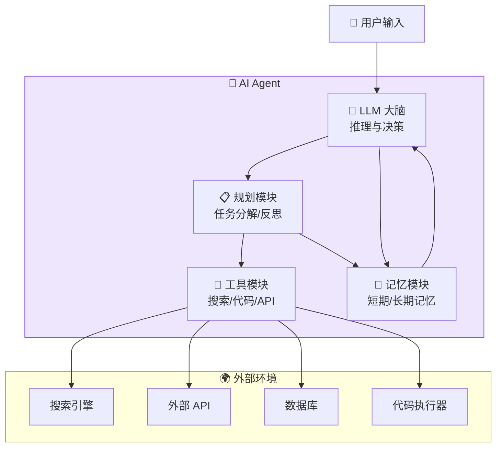

> 📖 **一句话理解**：Agent 让 AI 从「一问一答」进化为「能规划、能调用工具、能记住上下文的自主任务执行者」。

## 三大智能体平台横向对比

> 🔍 通过 Puppeteer MCP 访问各平台官网，获取实际体验数据。

### Dify vs Coze vs n8n 对比

| 维度 | Dify | Coze（扣子） | n8n |
|------|------|:---:|:---:|
| **定位** | 开源 LLM 应用开发平台 | 字节跳动 AI Bot 平台 | 开源工作流自动化引擎 |
| **开源** | ✅ 完全开源（Apache 2.0） | ❌ 闭源 SaaS | ✅ 开源（Sustainable Use） |
| **部署方式** | 云服务 / Docker / K8s | 仅云服务 | Docker / K8s / 云 |
| **核心能力** | 工作流 + RAG + Agent | Bot 对话 + 插件 | 通用自动化 + API 编排 |
| **AI 能力** | ⭐⭐⭐⭐⭐ 深度集成 LLM | ⭐⭐⭐⭐ LLM 对话优化 | ⭐⭐ 需外接 AI |
| **知识库/RAG** | ✅ 完整 RAG 管线 | ✅ 知识库 | ⚠️ 需手动接入 |
| **Agent 工具** | ✅ 50+ 内置工具 | ✅ 插件市场 | ✅ 400+ 节点 |
| **可视化编排** | 拖拽画布 + DSL 导出 | 拖拽画布 | 拖拽画布 |
| **API 发布** | ✅ REST + MCP Server | ✅ REST API | ✅ REST + Webhook |
| **适用场景** | AI 应用、智能客服、RAG | 社交 Bot、营销对话 | 非 AI 自动化、数据管道 |
| **社区活跃度** | ⭐⭐⭐⭐⭐ (80k+ Stars) | ⭐⭐⭐ | ⭐⭐⭐⭐⭐ (60k+ Stars) |

### 选型决策树

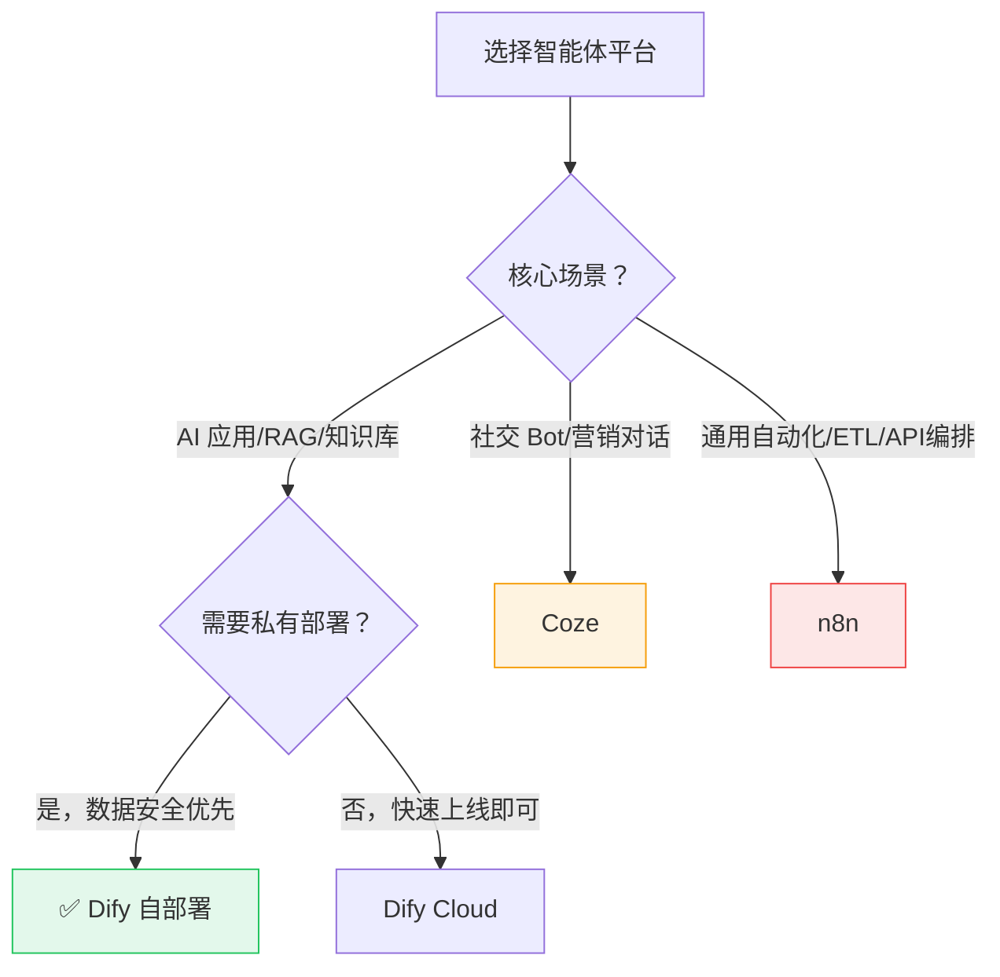

> 💡 **本课程选择 Dify**：开源可控、AI 能力最强、适合教学与企业级应用。

## Dify 核心功能全景

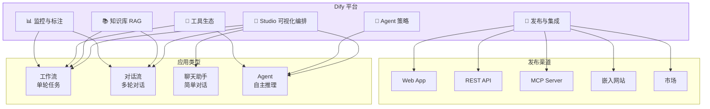

### Dify 四大应用类型速查

| 类型 | 适用场景 | 关键特性 |
|------|------|------|
| **工作流** | 单轮任务（报告生成、数据提取、批量处理） | 开始节点→编排节点→结束，可批量运行 |
| **对话流** | 多轮对话（客服、咨询、助手） | 每轮触发，内置记忆，流式输出 |
| **聊天助手** | 简单对话（问答、闲聊） | 最简模式，Prompt IDE，快速原型 |
| **Agent** | 自主任务（信息搜集、代码执行） | Function Calling / ReAct，工具调用 |

---

# 第二部分：Dify 环境搭建（课时 3-4）

## 🎯 课时目标

- 从 GitHub 克隆 Dify 源码
- 使用 Docker Compose 一键启动完整 Dify 服务栈
- 完成初始化配置向导
- 接入 DeepSeek 等模型供应商

## 步骤一：从 GitHub 获取 Dify 源码

```bash
# 克隆 Dify 仓库（如果 GitHub 访问慢，可使用镜像加速）
git clone https://github.com/langgenius/dify.git

# 或使用 ghproxy 加速
git clone https://ghproxy.com/https://github.com/langgenius/dify.git

# 进入项目目录
cd dify
cd docker

# 查看目录结构
ls -la
# 关键文件：
#   docker-compose.yml    — 主编排文件
#   .env.example          — 环境变量模板
#   nginx/                — Nginx 反向代理配置
#   volumes/              — 持久化数据目录
```

> 📖 **Dify Docker 服务架构**：`docker-compose.yml` 默认启动 6 个服务——API Server、Worker、Web 前端、PostgreSQL、Redis、Weaviate（向量数据库）。

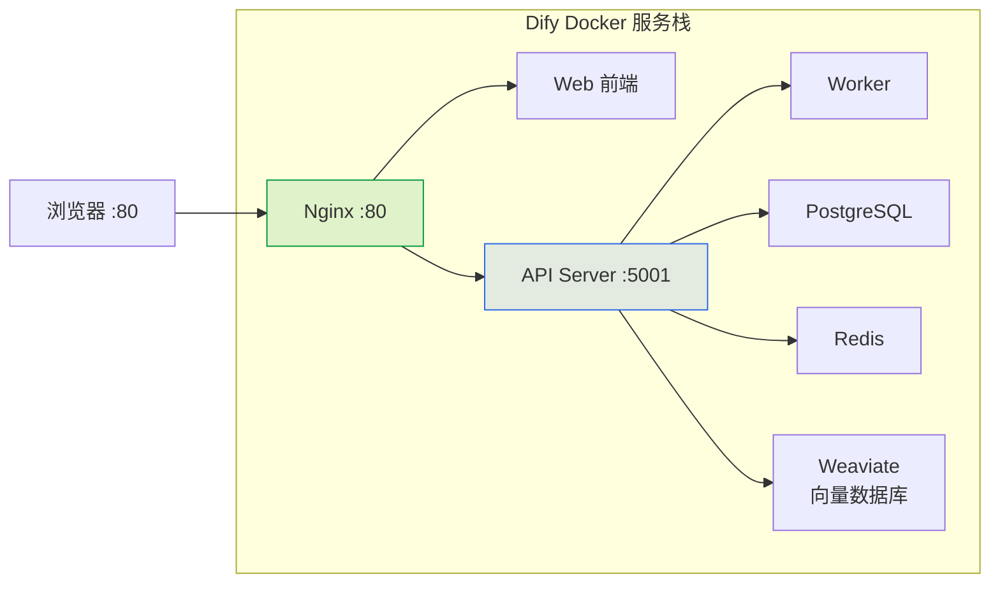

## 步骤二：配置环境变量

```bash
cd dify/docker

# 复制环境变量模板
cp .env.example .env

# 编辑 .env 文件（核心配置项如下）
```

### .env 关键配置项

```bash
# ========== 基础配置 ==========
# Dify 访问端口
EXPOSE_NGINX_PORT=80

# 确保 Nginx 端口与你期望的一致
# 如果 80 端口被占用，改为 8080：
# EXPOSE_NGINX_PORT=8080

# ========== 模型供应商 API Key ==========
# DeepSeek（推荐）
DEEPSEEK_API_KEY=sk-your-deepseek-api-key

# 如果你有其他模型供应商，也在这里配置
# OPENAI_API_KEY=sk-xxxxx
# MOONSHOT_API_KEY=sk-xxxxx

# ========== 数据库密码（生产环境务必修改） ==========
DB_PASSWORD=difyai123456
REDIS_PASSWORD=difyai123456

# ========== 存储配置 ==========
# 默认使用本地文件存储，如需 S3/OSS 在此配置
STORAGE_TYPE=local
```

> ⚠️ **避坑指南**：
> - Docker 主程序默认绑定 80 端口，如果 Windows 上 80 被 IIS/Skype 占用，修改 `EXPOSE_NGINX_PORT=8080`
> - API Key 先配 DeepSeek 即可，其他供应商按需添加
> - 首次启动会下载多个镜像（约 3~5GB），确保磁盘空间 ≥ 10GB

## 步骤三：Docker Compose 启动

```bash
cd dify/docker

# 启动所有服务（后台运行，首次需拉取镜像约 3~5 分钟）
docker compose up -d

# 查看服务启动状态
docker compose ps

# 期望输出：
# NAME              STATUS
# docker-api-1      Up
# docker-worker-1   Up
# docker-web-1      Up
# docker-db-1       Up
# docker-redis-1    Up
# docker-weaviate-1 Up
# docker-nginx-1    Up

# 查看实时日志（排查启动问题）
docker compose logs -f
```

### 无法访问时使用 Puppeteer 验证

> 由于部分环境 `curl`/浏览器可能受限，可使用 **Puppeteer MCP** 验证页面：

```
请使用 puppeteer 打开 http://localhost/install 检查 Dify 初始化页面是否正常加载，然后截图。
```

## 步骤四：初始化配置向导

访问 `http://localhost/install`（如果改了端口则对应调整），完成以下步骤：

1. **设置管理员账号**：邮箱 + 密码
2. **模型供应商接入**：在「设置 → 模型供应商」中添加 DeepSeek
3. **创建第一个应用**：验证平台可用性

```bash
# 如果安装页面显示异常，检查 Nginx 端口
docker compose logs nginx

# 重新启动所有服务
docker compose restart
```

### Dify 中配置 DeepSeek 模型

| 配置项 | 值 |
|--------|-----|
| **模型供应商** | DeepSeek |
| **API Key** | `sk-xxxxxxxx`（平台获取的 Key） |
| **可用模型** | `deepseek-v4-flash`（日常）/ `deepseek-v4-pro`（复杂推理） |

> 💡 Dify 支持 **100+ 模型供应商**：DeepSeek、OpenAI、Claude、Kimi、通义千问、文心一言、GLM 等均可接入。

## Dify Docker 常用管理命令

```bash
# 启动 / 停止
docker compose up -d            # 后台启动
docker compose down             # 停止所有服务
docker compose restart          # 重启

# 查看状态
docker compose ps               # 服务状态
docker compose logs -f api      # API 服务日志
docker compose logs -f worker   # Worker 日志

# 升级 Dify
git pull                        # 拉取最新代码
docker compose down
docker compose up -d            # 重新启动（自动拉取新镜像）

# 重置 Dify（清除所有数据）
docker compose down -v
```

---

# 第三部分：Dify Studio 基础入门（课时 5-6）

> 📖 参考文档：[https://docs.dify.ai/zh/cloud/use-dify/getting-started/introduction](https://docs.dify.ai/zh/cloud/use-dify/getting-started/introduction)

## 🎯 课时目标

- 熟悉 Dify Studio 可视化画布操作
- 掌握核心节点类型：开始、LLM、条件分支、代码执行、HTTP 请求、变量聚合
- 理解变量系统：输入变量、输出变量、环境变量、会话变量
- 独立完成一个**简单聊天机器人**和**文本生成器**

## Dify Studio 界面总览

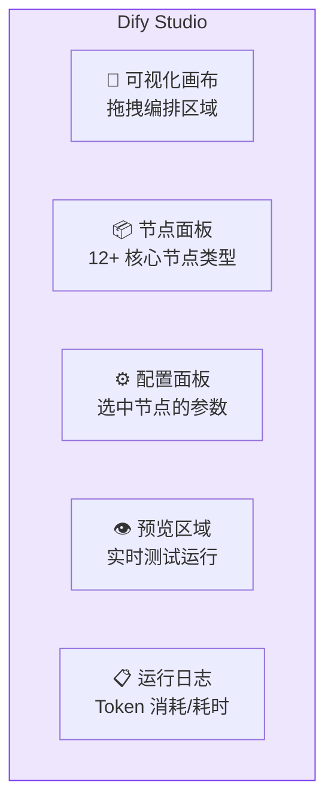

## 核心节点类型速查

| 节点 | 图标 | 功能 | 典型用法 |
|------|:---:|------|------|
| **开始** | ▶️ | 定义输入变量，触发工作流 | 接收用户问题、上传文件 |
| **LLM** | 🧠 | 调用大模型生成回复 | 文本生成、翻译、摘要 |
| **知识检索** | 📚 | 从知识库检索相关文档 | RAG 问答、文档分析 |
| **条件分支** | 🔀 | 根据条件执行不同路径 | 意图识别、分类路由 |
| **代码执行** | 💻 | 执行 Python/JS 代码 | 数据处理、格式转换 |
| **HTTP 请求** | 🌐 | 调用外部 API | 天气查询、新闻获取 |
| **模板转换** | 📝 | Jinja2 模板处理文本 | 格式化输出、拼接 Prompt |
| **变量聚合** | 🔗 | 合并多个变量 | 汇总多个 LLM 输出 |
| **迭代** | 🔄 | 遍历数组处理 | 批量处理列表数据 |
| **参数提取** | 📤 | 从文本中提取结构化数据 | 提取姓名、日期、金额 |
| **结束** | ⏹️ | 定义输出变量 | 返回最终结果 |
| **答案** | 💬 | 流式输出文本 | 对话流中输出 Markdown |

## 变量系统详解


| 变量类型 | 作用域 | 可变性 | 用途 |
|------|------|:---:|------|
| **输入变量** | 单次运行 | ❌ 只读 | 接收用户输入、文件 |
| **节点输出** | 下游节点 | ❌ 只读 | 传递 LLM 结果、代码返回值 |
| **环境变量** | 全局 | ❌ 常量 | 存储 API Key、密钥 |
| **会话变量** | 对话期间 | ✅ 可更新 | 记忆用户偏好、累计计数 |

### 变量引用方式

在节点配置中输入 `{` 或 `/` 即可调出变量选择器，选中后自动插入。支持复杂引用如：

```
{{#llm1.text#}}           — 引用 LLM 节点 1 的 text 输出
{{#sys.query#}}           — 引用系统输入变量 query
```

## 动手实操 1：构建第一个聊天助手

> 🎯 目标：创建一个简单的 AI 聊天助手，部署后可通过公开 URL 访问。

### 步骤

1. 登录 Dify → 点击「创建应用」→ 选择「**聊天助手**」
2. 在 Prompt IDE 中编写系统提示词：

```
你是一个友好的 AI 助手。请用中文回答用户问题。
回答风格：简洁、清晰、有礼貌。
```

3. 选择模型：`deepseek-v4-flash`
4. 点击「发布」→ 获得一个公开的 Web App URL
5. 测试对话

### 使用 Puppeteer 验证应用

```
请使用 puppeteer 打开我刚发布的 Dify 聊天助手页面 [URL]，发送"你好，请介绍一下自己"，观察 AI 回复内容，然后截图。
```

## 动手实操 2：构建第一个工作流 — 文本翻译器

> 🎯 目标：创建一个单轮工作流，用户输入文本 + 目标语言 → LLM 翻译 → 返回结果。

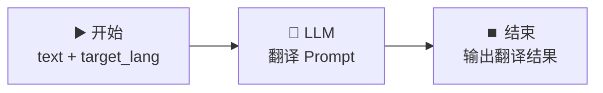

### 步骤

1. 创建应用 → 选择「**工作流**」
2. **开始节点**：添加 2 个输入变量
   - `text`（文本类型，必填）
   - `target_lang`（下拉选择，选项：英语/日语/韩语/法语）
3. **LLM 节点**：编写翻译 Prompt

```
将以下文本翻译为 {{#target_lang#}}：
---
{{#text#}}
---
只输出翻译结果，不要解释。
```

4. **结束节点**：输出变量引用 `{{#llm.text#}}`
5. 点击「运行」测试
6. 输入：`"你好世界"` + `"英语"` → 期望输出：`"Hello World"`

---

# 第四部分：知识库与 RAG 管线（课时 7-8）

> 📖 参考文档：[https://docs.dify.ai/zh/cloud/use-dify/knowledge/readme](https://docs.dify.ai/zh/cloud/use-dify/knowledge/readme)

## 🎯 课时目标

- 理解 RAG（检索增强生成）的原理与架构
- 创建和管理 Dify 知识库
- 掌握文档导入、分段策略、检索配置
- 在工作流和对话流中集成知识库

## RAG 架构原理

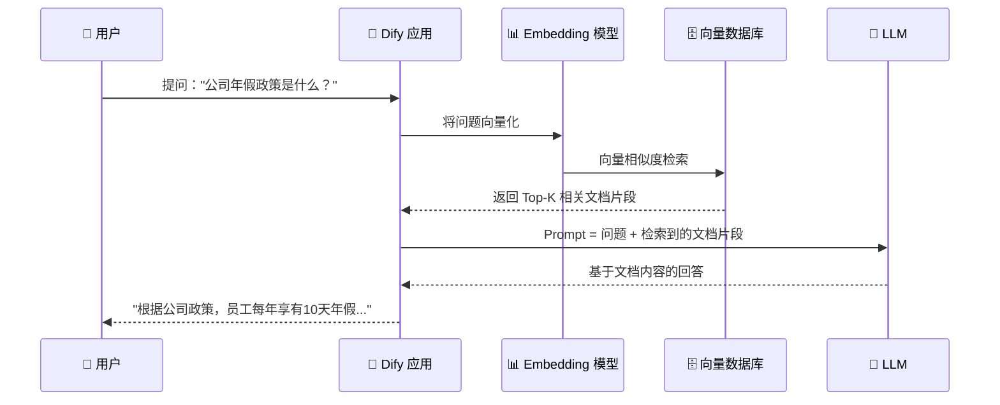

> 📖 **RAG 的核心价值**：让 LLM 能「引用」你的私有数据回答问题，解决 LLM 的知识截止和幻觉问题。

## 知识库创建流程

### 第一步：创建知识库

1. Dify 顶部导航 → 「知识库」→ 「创建知识库」
2. 填写名称、描述
3. 选择 Embedding 模型（推荐 DeepSeek 或 OpenAI 的 embedding 模型）

### 第二步：导入文档

| 导入方式 | 适用场景 |
|------|------|
| **上传文件** | PDF、Word、Excel、PPT、TXT、Markdown、HTML 等 |
| **网页抓取** | 在线文档、Wiki 页面、帮助中心 |
| **API 同步** | 编程批量导入，与现有系统对接 |
| **手动输入** | 少量自定义文本 |

### 第三步：分段策略

| 策略 | 说明 | 适用场景 |
|------|------|------|
| **自动分段** | Dify 自动识别段落边界 | 通用场景，推荐默认使用 |
| **自定义分隔符** | 指定分隔符（如 `\n\n`, `###`） | Markdown 文档、结构化文本 |
| **固定长度** | 按字符数/Token 数切分 | 代码、日志等非自然语言文本 |

> ⚠️ **分段大小建议**：一般设为 500-1000 tokens，块间重叠 50-100 tokens。太小则上下文不足，太大则检索精度下降。

### 第四步：检索配置

| 配置项 | 说明 | 建议值 |
|------|------|:---:|
| **检索方式** | 向量检索 / 混合检索 / 关键词检索 | 混合检索（Hybrid Search） |
| **Top-K** | 每次检索返回的文档片段数 | 3-8 |
| **相似度阈值** | 低于此阈值的结果丢弃 | 0.5-0.7 |
| **Rerank** | 二次精排提升相关性 | 开启（如有 Rerank 模型） |

## 动手实操 3：构建智能客服知识库机器人

> 🎯 目标：创建一个对话流应用，上传产品手册 PDF，实现基于知识库的智能客服。

### 步骤

1. **创建知识库**：上传产品手册/FAQ 文档（PDF）
2. **创建对话流应用**：选择「对话流」类型
3. **编排对话流**：

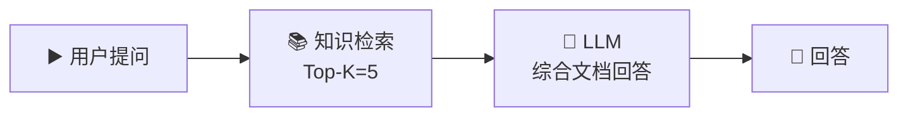

4. **LLM Prompt 模板**：

```
你是一个专业的客服助手。请根据以下参考文档回答用户问题。

【参考文档】
{{#knowledge.text#}}

【用户问题】
{{#sys.query#}}

要求：
1. 如果文档中有答案，准确引用
2. 如果文档中没有相关答案，回复"抱歉，我目前没有关于这个问题的信息"
3. 回答简洁专业，不超过 200 字
```

5. **测试**：询问文档中的问题，验证回答准确性
6. 测试「文档外」的问题，验证拒答策略

### 使用 Puppeteer 验证

```
请使用 puppeteer 打开知识库客服机器人页面，分别提问两个问题：
1. 一个在文档中能找到答案的问题
2. 一个文档中没有的问题
截图验证两种情况的回复是否正确。
```

## 知识库调试技巧

```bash
# 在知识库页面右上角 → 「调试」
# 可单独测试检索质量，不经过 LLM：

# 输入测试问题 → 查看返回了哪些文档片段
# → 检查检索相关性 → 调整 Top-K 和阈值
```

---

# 第五部分：Agent 策略与工具调用（课时 9-10）

> 📖 参考文档：[https://docs.dify.ai/zh/cloud/use-dify/workspace/tools](https://docs.dify.ai/zh/cloud/use-dify/workspace/tools)

## 🎯 课时目标

- 理解 Agent 的两种核心策略：Function Calling 与 ReAct
- 熟练使用 Dify 内置工具（搜索、代码执行、图片生成等）
- 创建自定义 API 工具
- 构建能自主规划并调用工具的 Agent 应用

## Agent 策略对比

| 策略 | 原理 | 优点 | 缺点 |
|------|------|------|------|
| **Function Calling** | LLM 原生能力，直接输出函数调用 JSON | 速度快、Token 省 | 仅支持原生 FC 的模型 |
| **ReAct** | 思考→行动→观察→思考...的循环 | 推理能力强、可解释 | Token 消耗大、速度慢 |

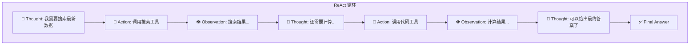

## Dify 内置工具一览

| 工具类别 | 工具名称 | 用途 |
|------|------|------|
| **搜索** | Google Search、Bing Search、DuckDuckGo | 网络信息检索 |
| **代码** | Code Interpreter（Python） | 数据分析、图表生成 |
| **图像** | DALL·E、Stable Diffusion | AI 图片生成 |
| **知识** | Wikipedia、WolframAlpha | 百科全书/数学计算 |
| **文件** | File Upload、Excel 处理 | 文件读取与处理 |
| **通讯** | Email、Slack | 消息通知 |

## 动手实操 4：构建数据分析 Agent

> 🎯 目标：创建一个 Agent，接收 CSV 数据，自动进行统计分析并生成图表。

### 步骤

1. 创建应用 → 选择「**Agent**」
2. 选择 Agent 策略：**Function Calling**（推荐）
3. 添加工具：**Code Interpreter**
4. Agent 系统提示词：

```
你是一个数据分析 Agent。当用户上传数据文件时：
1. 使用 Python 读取和解析数据
2. 进行描述性统计分析（均值、中位数、分布等）
3. 生成可视化图表（柱状图、饼图等）
4. 用中文给出分析结论和建议

处理完成后输出 Markdown 格式的报告。
```

5. 测试：上传测试 CSV → Agent 自动分析并生成报告

## 动手实操 5：自定义 API 工具

> 🎯 目标：创建自定义天气查询工具，让 Agent 能查询实时天气。

### 步骤

1. Dify → 「工具」→ 「创建自定义工具」
2. 定义 API Schema（OpenAPI 格式）：

```yaml
openapi: 3.0.0
info:
  title: 天气查询 API
  version: 1.0.0
servers:
  - url: https://api.weather.com
paths:
  /v1/current:
    get:
      summary: 获取城市当前天气
      parameters:
        - name: city
          in: query
          required: true
          schema:
            type: string
      responses:
        '200':
          description: 成功返回天气数据
```

3. 在 Agent 中引入该工具
4. 测试："北京今天天气怎么样？"

---

# 第六部分：发布部署与综合实战（课时 11-12）

## 🎯 课时目标

- 掌握 Dify 应用的四种发布方式
- 完成两个企业级综合实战项目
- 理解 Dify 在生产环境中的最佳实践

## 发布方式对比

| 方式 | 适用场景 | 技术门槛 |
|------|------|:---:|
| **Web App** | 内部使用、快速分享 | ⭐ 零代码 |
| **嵌入网站** | 官网客服、产品帮助 | ⭐⭐ 粘贴 script |
| **REST API** | 后端集成、自定义 UI | ⭐⭐⭐ 开发能力 |
| **MCP Server** | AI 编程工具直接调用 | ⭐⭐ Claude Code 等 |

### MCP Server 发布（重点）

```bash
# Dify 工作流/Agent 可发布为 MCP Server
# 在 Claude Code 中直接调用！

# 1. 在 Dify 中发布应用为 MCP Server
# 2. 获取 MCP Endpoint URL
# 3. 在 Claude Code 中配置为 MCP 工具
```

## 综合实战一：智能法律咨询助手（复习联动）

> 🎯 结合模块三的「AI 法律咨询系统」，用 Dify 重新实现后端智能体。

### 架构

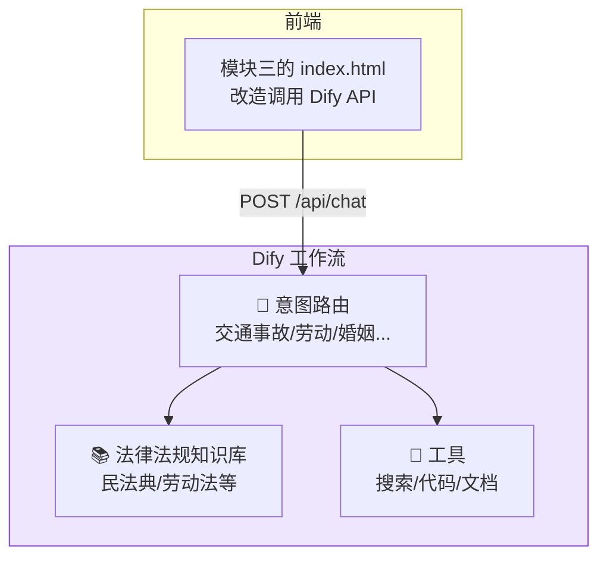

### 实施步骤

1. 在 Dify 中创建「法律咨询对话流」
2. 导入法律法规文档到知识库（8 个分类）
3. 添加意图路由条件分支
4. 配置 DeepSeek V4-Pro 作为后端模型
5. 发布为 REST API
6. 改造模块三的 `index.html`，将 DeepSeek API 直连替换为 Dify API

## 综合实战二：智能问数数据分析 Agent

> 🎯 结合本课程数据仓库场景，构建可对话式数据查询 Agent。

### 需求

用户用自然语言询问：
> "上个月哪个渠道的销售额最高？"
> "给我今年各产品类别的销量排名"

Agent 自动将自然语言转为 SQL → 执行查询 → 返回结果并可视化。

### 架构

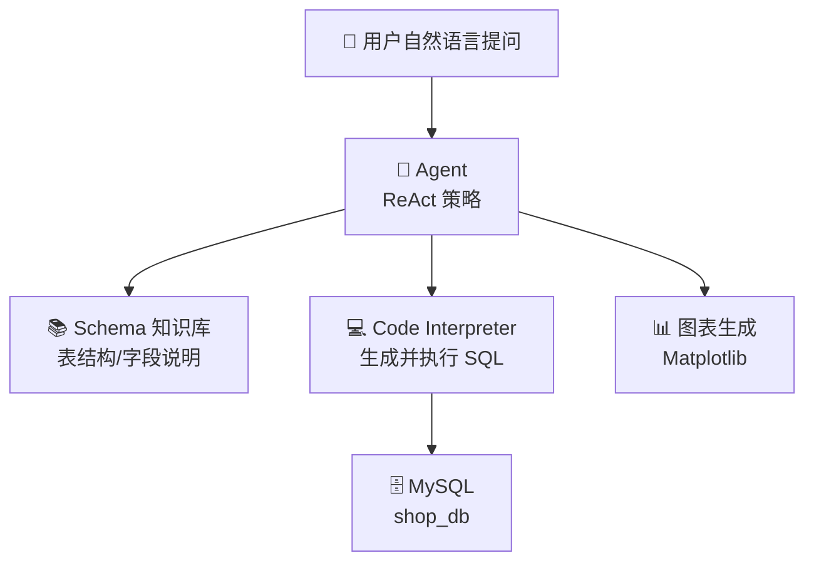

### 实施步骤

1. 将 `shop_db` 的表结构文档导入知识库（参考 CLAUDE.md 中的星型模型 Schema）
2. 创建 Agent 策略应用，添加 Code Interpreter 工具
3. 编写 Agent 系统提示词，描述表关系和字段含义
4. 测试自然语言查询 → SQL 生成 → 结果返回

---

## 📋 12 课时分配总览

| 课时 | 内容 | 关键词 |
|:---:|------|------|
| 1 | 智能体概念 + 平台横向对比 | Agent 架构、Dify vs Coze vs n8n |
| 2 | Dify 核心功能全景 + 应用类型 | 工作流、对话流、Agent、知识库 |
| 3 | GitHub 克隆 + Docker Compose 部署 | 环境变量、服务栈、初始化 |
| 4 | 模型供应商接入 + 管理配置 | DeepSeek、PostgreSQL、Redis、Weaviate |
| 5 | Studio 画布 + 核心节点类型 | 开始、LLM、条件、代码、HTTP |
| 6 | 变量系统 + 实操：聊天助手 + 工作流翻译器 | 输入/输出/环境/会话变量 |
| 7 | RAG 原理 + 知识库创建与文档导入 | Embedding、向量检索、分段策略 |
| 8 | 知识库检索配置 + 实操：智能客服机器人 | Top-K、混合检索、调试 |
| 9 | Agent 策略（FC vs ReAct）+ 内置工具 | Function Calling、Code Interpreter |
| 10 | 自定义 API 工具 + 实操：数据分析 Agent | OpenAPI Schema、天气查询 |
| 11 | 发布方式（Web App/API/MCP）+ 综合实战一 | 法律咨询助手、前后端联动 |
| 12 | 综合实战二（智能问数 Agent）+ 课程总结 | SQL 生成、图表可视化、期末展示 |

## ✅ 检查点清单

### 环境搭建
- [ ] Dify 源码从 GitHub 拉取成功
- [ ] `docker compose up -d` 所有 7 个服务正常运行
- [ ] 初始化向导完成，管理员账号创建
- [ ] DeepSeek 模型供应商接入成功

### 基础入门
- [ ] 能独立创建「聊天助手」并发布为 Web App
- [ ] 能独立创建「工作流」并完成 LLM 节点配置
- [ ] 理解 12 种核心节点的用途
- [ ] 理解 4 种变量类型的作用域和引用方式

### 知识库与 RAG
- [ ] 成功创建知识库并导入文档
- [ ] 理解分段策略并能根据文档类型选择合适方案
- [ ] 能调试检索质量并调整参数
- [ ] 智能客服机器人能基于知识库准确回答

### Agent 与工具
- [ ] 理解 Function Calling 和 ReAct 的区别
- [ ] 至少使用过 3 种内置工具
- [ ] 能创建自定义 API 工具
- [ ] 数据分析 Agent 能读取 CSV 并生成分析报告

### 发布与实战
- [ ] 至少发布过一个 App（Web App / API / MCP 任一种）
- [ ] 智能法律咨询助手（综合实战一）功能完整
- [ ] 智能问数 Agent（综合实战二）能正确生成 SQL 并执行

---

> 📌 **本课小结**：Dify 是目前最成熟的开源 LLM 应用开发平台。通过 12 课时的系统学习，你已掌握从环境部署、工作流编排、知识库构建到 Agent 开发和发布的完整技能栈。这些能力直接对标企业 AI 应用开发工程师的核心要求。

