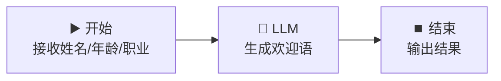

# ▶️ 开始节点 — 用户信息收集器

> **核心作用**：开始节点是每个工作流的入口，负责定义输入变量、接收用户数据，并触发整个工作流的执行。

---

## 🎯 学习目标

学完本案例后，你将能够：
- 独立配置开始节点，定义各类输入变量
- 理解文本、数字、下拉选择、文件等输入类型
- 掌握输入变量的引用方式

---

## 📚 案例描述

构建一个「**用户信息收集器**」工作流，用户输入姓名、年龄、职业后，由 LLM 生成个性化欢迎语。



---

## 🔧 手把手实操

### 步骤 1：创建工作流

1. 登录 Dify → 点击「创建应用」
2. 选择「**工作流**」类型
3. 命名为：`用户信息收集器`

### 步骤 2：配置开始节点（核心）

点击「开始」节点，在右侧配置面板中添加以下输入变量：

| 字段名 | 类型 | 必填 | 说明 |
|:---|:---|:---:|------|
| `name` | 文本 | ✅ | 用户姓名 |
| `age` | 数字 | ✅ | 用户年龄 |
| `occupation` | 下拉选项 | ✅ | 职业：学生/程序员/教师/设计师/其他 |
| `hobby` | 文本 | ❌ | 兴趣爱好（可选） |

**关键配置截图指引**：
- 点击 `+ 添加变量`
- 分别设置字段名、类型
- 下拉选项需手动输入选项列表，每行一个

### 步骤 3：添加 LLM 节点

1. 从左侧节点面板拖入「**LLM**」节点
2. 连接：`开始` → `LLM`
3. 选择模型：`deepseek-v4-flash`
4. 编写 System Prompt：

```
你是一个热情友好的接待助手。根据用户提供的信息，生成一段个性化的欢迎语。

要求：
1. 称呼用户的姓名
2. 根据年龄给出合适的语气（年轻人活泼，中老年稳重）
3. 提到职业并表示理解
4. 如果有兴趣爱好，也顺带提及
5. 欢迎语长度：50-100 字
```

5. 在 User Prompt 中引用变量（输入 `{` 调出变量选择器）：

```
用户信息：
- 姓名：{{#start.name#}}
- 年龄：{{#start.age#}}
- 职业：{{#start.occupation#}}
- 爱好：{{#start.hobby#}}
```

### 步骤 4：配置结束节点

1. 点击「结束」节点
2. 输出变量引用：`{{#llm.text#}}`

### 步骤 5：测试运行

点击右上角「运行」，输入测试数据：

| 字段 | 测试值 |
|------|------|
| name | 张三 |
| age | 25 |
| occupation | 程序员 |
| hobby | 打篮球 |

> **期望输出**：类似 "你好张三！25岁正是程序员奋斗的黄金时期，写代码之余打打篮球，劳逸结合，太棒了！欢迎你的到来！"

---

## 💡 避坑指南

| 常见问题 | 原因 | 解决方案 |
|------|------|------|
| 变量引用报红 | 变量名拼写错误 | 用 `{` 选择器插入，不手打 |
| 可选项不显示 | 下拉选项格式错误 | 每行一个选项，不要加引号 |
| LLM 收不到某字段 | 未在 Prompt 中引用 | 所有需要的变量都要在 Prompt 中写 `{{#start.xxx#}}` |

---

## 🏆 独立练习

在开始节点中新增一个 `language` 下拉选项（中文/English/日本語），修改 LLM Prompt，让生成的欢迎语根据选择输出对应语言。

---

> 📌 **一句话总结**：开始节点 = 工作流的「入口大门」，所有外部输入都通过它进入编排流程。变量定义清晰，后续节点才能正确引用。
