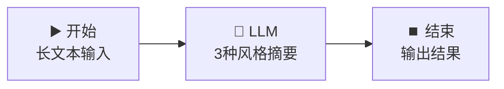

# 🧠 LLM 节点 — 智能文本摘要器

> **核心作用**：LLM 节点是工作流的「大脑」，负责调用大语言模型完成文本生成、翻译、摘要、分类等智能任务。它是整个工作流中最核心的节点。

---

## 🎯 学习目标

学完本案例后，你将能够：
- 独立配置 LLM 节点，理解 System Prompt 与 User Prompt 的区别
- 掌握模型选择策略（快模型 vs 强模型）
- 学会控制 LLM 输出质量（Temperature、最大 Token）

---

## 📚 案例描述

构建一个「**智能文本摘要器**」，用户输入一段长文本，LLM 自动生成 3 种不同风格的摘要：一句话摘要、要点摘要、详细摘要。



---

## 🔧 手把手实操

### 步骤 1：创建工作流

1. 创建应用 → 选择「**工作流**」
2. 命名为：`智能文本摘要器`

### 步骤 2：配置开始节点

在开始节点添加一个输入变量：

| 字段名 | 类型 | 必填 | 说明 |
|:---|:---|:---:|------|
| `long_text` | 段落文本 | ✅ | 需要摘要的长文本 |

### 步骤 3：配置 LLM 节点（核心）

拖入 LLM 节点，连接 `开始` → `LLM`。

#### 3.1 模型选择

| 场景 | 推荐模型 | 原因 |
|------|------|------|
| 日常使用 | `deepseek-v4-flash` | 速度快、成本低 |
| 复杂摘要 | `deepseek-v4-pro` | 推理能力更强 |

#### 3.2 参数配置

| 参数 | 建议值 | 说明 |
|------|:---:|------|
| **Temperature** | 0.3 | 摘要类任务用低温度，确保稳定准确 |
| **最大 Token** | 1024 | 足够输出 3 段摘要 |
| **上下文窗口** | 默认 | 大部分文本无需调整 |

#### 3.3 Prompt 编写

**System Prompt**：
```
你是一个专业的文本摘要专家。你的任务是对用户提供的长文本生成 3 种不同风格的摘要。
严格按照指定格式输出，不要添加额外内容。
```

**User Prompt**：
```
请对以下文本生成 3 种风格的摘要，严格按格式输出：

【原始文本】
{{#start.long_text#}}

【输出格式要求】
📌 一句话摘要（≤30字）：
（在此输出）

📋 要点摘要（3-5个要点，每点≤20字）：
- 
- 
- 

📝 详细摘要（100-150字）：
（在此输出）
```

### 步骤 4：配置结束节点

输出变量引用：`{{#llm.text#}}`

### 步骤 5：测试运行

点击「运行」，输入测试文本：

```
人工智能（AI）正在深刻改变我们的生活方式。从智能手机中的语音助手，
到自动驾驶汽车，再到医疗诊断中的影像识别，AI 技术已经渗透到各行各业。
在教育领域，AI 可以提供个性化学习方案，根据每个学生的进度调整教学内容。
在金融行业，AI 算法能够实时检测欺诈交易，保护用户资产安全。
然而，AI 的快速发展也带来了隐私、就业和伦理方面的挑战。
各国政府正在制定相关法规，以确保 AI 技术的健康发展。
```

> **期望输出**：包含一句话摘要、要点摘要、详细摘要的完整 Markdown 文本。

---

## 🎛️ 参数深度解析

### Temperature（温度）与 Top-P 的搭配

| Temperature | Top-P | 效果 | 适用场景 |
|:---:|:---:|------|------|
| 0.1 ~ 0.3 | 0.9 | 输出稳定、可复现 | 摘要、翻译、代码生成 |
| 0.5 ~ 0.7 | 0.9 | 平衡创造性与稳定性 | 通用对话 |
| 0.8 ~ 1.0 | 0.95 | 创意丰富、风格多样 | 创意写作、头脑风暴 |

> 💡 **经验法则**：先调整 Temperature，效果不满意再调整 Top-P。

### System Prompt vs User Prompt

| 类型 | 位置 | 作用 | 示例 |
|------|------|------|------|
| **System Prompt** | 上方输入框 | 定义角色、规则、输出格式 | "你是一个专业翻译..." |
| **User Prompt** | 下方输入框 | 具体任务和变量引用 | "翻译：{{#start.text#}}" |

---

## 💡 避坑指南

| 常见问题 | 原因 | 解决方案 |
|------|------|------|
| 输出被截断 | 最大 Token 设置太小 | 增大「最大 Token」值 |
| 输出不稳定每次不同 | Temperature 太高 | 降低到 0.1-0.3 |
| 模型不遵循格式 | Prompt 描述不够明确 | 用「严格按格式」+ 示例引导 |
| 响应太慢 | 选了 Pro 模型 | 日常任务用 Flash 模型 |

---

## 🏆 独立练习

修改 User Prompt，让 LLM 额外输出一个「🔑 关键词提取」部分（5-8 个关键词），并保持其他摘要部分不变。

---

> 📌 **一句话总结**：LLM 节点 = 工作流的「大脑」，Prompt 写得好不好直接决定输出质量。掌握 System/User Prompt 分工 + Temperature 调参 = 驾驭 LLM 的核心技能。
