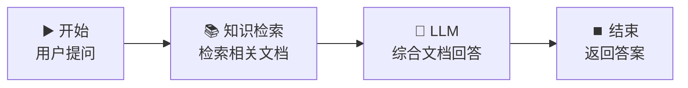

# 📚 知识检索节点 — 产品文档智能问答

> **核心作用**：知识检索节点将用户问题向量化后在知识库中检索最相关的文档片段，是实现 RAG（检索增强生成）的关键节点。它让 LLM 能够「引用」你的私有数据作答。

---

## 🎯 学习目标

学完本案例后，你将能够：
- 创建知识库并上传文档
- 配置知识检索节点，理解 Top-K、相似度阈值等参数
- 将检索结果传递给 LLM 生成可靠回答
- 在回答中附上来文档引用

---

## 📚 案例描述

构建一个「**产品文档智能问答**」工作流，上传一份产品说明书到知识库，用户提问后，系统从文档中检索相关内容并回答。



---

## 🔧 手把手实操

### 步骤 1：创建知识库

1. Dify 顶部导航 → 「**知识库**」→ 「创建知识库」
2. 命名：`产品说明书库`
3. Embedding 模型：选择 DeepSeek 的 Embedding 模型
4. 上传文档：准备一份产品说明书（PDF/Word/Markdown 均可）

> 💡 **没有真实文档？** 创建一个 `product_manual.txt`，内容如下：

```
# XX 智能音箱产品说明书

## 产品参数
- 型号：Smart-Speaker Pro X1
- 尺寸：120mm × 120mm × 200mm
- 重量：1.2kg
- 功率：20W
- 连接方式：Wi-Fi 6 / 蓝牙 5.3

## 使用说明
1. 长按顶部电源键 3 秒开机，指示灯变蓝
2. 说出"你好小X"唤醒语音助手
3. 首次使用需下载 XX 智能 App 完成配网
4. 复位：同时按住音量+和音量-键 5 秒

## 保修政策
- 自购买日起享 1 年免费保修
- 人为损坏不包含在保修范围内
- 保修需出示购买凭证
- 客服热线：400-XXX-XXXX
```

### 步骤 2：创建知识检索工作流

1. 创建应用 → 「工作流」
2. 命名为：`产品文档问答`

### 步骤 3：配置开始节点

| 字段名 | 类型 | 必填 | 说明 |
|:---|:---|:---:|------|
| `question` | 文本 | ✅ | 用户提问 |

### 步骤 4：配置知识检索节点（核心）

1. 从节点面板拖入「**知识检索**」节点
2. 连接：`开始` → `知识检索`

#### 参数配置

| 参数 | 建议值 | 说明 |
|------|:---:|------|
| **知识库** | 产品说明书库 | 选择步骤 1 创建的知识库 |
| **检索方式** | 混合检索 | 向量 + 关键词双重匹配 |
| **Top-K** | 3 | 返回最相关的 3 个文档片段 |
| **相似度阈值** | 0.5 | 低于 0.5 的结果丢弃 |
| **查询变量** | `{{#start.question#}}` | 对用户问题做检索 |

> ⚠️ **关键理解**：知识检索节点 **不做生成**，它只负责「查找」相关文档片段。生成回答需要下游的 LLM 节点。

### 步骤 5：将检索结果传给 LLM

1. 拖入 LLM 节点，连接：`知识检索` → `LLM`
2. 模型选择：`deepseek-v4-flash`
3. **System Prompt**：

```
你是一个专业的产品客服助手。严格根据提供的参考文档回答用户问题。

规则：
1. 如果文档中有答案，准确引用并注明依据
2. 如果文档中没有相关信息，回复"抱歉，文档中没有找到相关信息"
3. 回答简洁专业，不超过 150 字
```

4. **User Prompt**（引用知识检索节点的输出）：

```
【参考文档内容】
{{#knowledge.text#}}

【用户问题】
{{#start.question#}}

请回答：
```

### 步骤 6：结束节点

输出变量引用：`{{#llm.text#}}`

### 步骤 7：测试

| 测试问题 | 期望结果 |
|------|------|
| "音箱怎么开机？" | 基于文档回答：长按电源键 3 秒 |
| "保修多久？" | 基于文档回答：1 年免费保修 |
| "音箱是什么颜色？" | 回复：文档中没有找到相关信息 |

---

## ⚙️ 参数深度解析

### Top-K 的选择

| Top-K 值 | 效果 | 适用场景 |
|:---:|------|------|
| 1-2 | 只取最相关片段，精简准确 | 简单事实性问答 |
| 3-5 | 平衡覆盖面和精度 | ✅ 通用推荐 |
| 6-8 | 覆盖面广，但可能引入噪声 | 需要综合多个来源的问题 |

### 检索方式对比

| 方式 | 原理 | 优点 | 缺点 |
|------|------|------|------|
| **向量检索** | 语义相似度匹配 | 同义词、近义词也能命中 | 专有名词可能不准 |
| **关键词检索** | BM25 关键词匹配 | 专有名词精确匹配 | 同义词无法命中 |
| **混合检索** | 向量 + 关键词融合 | ✅ 兼顾两者优点 | 略慢 |

---

## 💡 避坑指南

| 常见问题 | 原因 | 解决方案 |
|------|------|------|
| 检索不到内容 | 相似度阈值太高 | 降低阈值到 0.3-0.5 |
| 检索结果不相关 | 文档分段过大/过小 | 调整分段大小为 500-1000 tokens |
| 回答中有幻觉 | LLM 忽略了文档 | Prompt 中强调「严格根据文档」 |
| 混检效果差 | 向量与关键词权重失衡 | 尝试纯向量或纯关键词对比效果 |

---

## 🏆 独立练习

1. 在知识库中多上传一份不同的文档（如公司介绍）
2. 修改 Top-K = 5
3. 测试问题："XX 公司是做什么的？"，观察两个文档源是否都被检索到

---

> 📌 **一句话总结**：知识检索节点 = RAG 的「检索引擎」，负责从知识库中找到最相关的文档片段。它不生成答案，需要配合 LLM 节点做「增强生成」。
