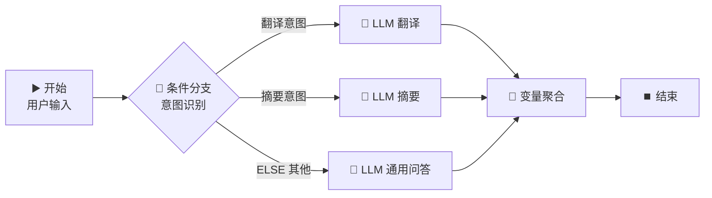

# 🔀 条件分支节点 — 智能意图路由

> **核心作用**：条件分支节点根据预设条件自动判断，将工作流导向不同的执行路径。它是实现「智能路由」的核心，让一个工作流能处理多种不同类型的问题。

---

## 🎯 学习目标

学完本案例后，你将能够：
- 配置条件分支节点，理解 IF/ELIF/ELSE 的匹配逻辑
- 使用变量比较、关键词匹配、空值判断等条件
- 设计多分支工作流，实现意图分类和路由

---

## 📚 案例描述

构建一个「**智能意图路由**」工作流：用户输入一句话，系统自动识别意图（翻译 / 摘要 / 问答），然后路由到不同的 LLM 处理分支。



---

## 🔧 手把手实操

### 步骤 1：创建工作流

1. 创建应用 → 「工作流」
2. 命名为：`智能意图路由`

### 步骤 2：配置开始节点

| 字段名 | 类型 | 必填 | 说明 |
|:---|:---|:---:|------|
| `user_input` | 文本 | ✅ | 用户输入的内容 |

### 步骤 3：配置条件分支节点（核心）

1. 从节点面板拖入「**条件分支**」节点
2. 连接：`开始` → `条件分支`

#### 分支条件配置

点击「添加条件」设置以下 3 个分支：

| 分支 | 条件类型 | 配置 | 说明 |
|------|------|------|------|
| **IF** | 关键词匹配 | `{{#start.user_input#}}` **包含** `翻译` | 检测到「翻译」关键词 |
| **ELIF 1** | 关键词匹配 | `{{#start.user_input#}}` **包含** `摘要` 或 `总结` 或 `概括` | 检测到摘要相关关键词 |
| **ELSE** | — | 以上条件都不满足时 | 兜底分支，通用问答 |

> 💡 **条件类型速查**：
> - `包含`：文本中包含指定关键词（支持多个，用英文逗号分隔）
> - `等于`：精确匹配
> - `为空`：判断变量是否为空
> - `大于/小于`：数字比较

### 步骤 4：配置三个 LLM 分支

#### 分支 1：翻译 LLM

拖入 LLM 节点，命名为 `翻译处理`，连接到 IF 分支出口。

**System Prompt**：
```
你是一个专业翻译。将用户输入翻译为英文。
如果用户输入中包含"翻译"，请提取翻译目标文本并翻译。
只输出翻译结果。
```

**User Prompt**：`{{#start.user_input#}}`

#### 分支 2：摘要 LLM

拖入 LLM 节点，命名为 `摘要处理`，连接到 ELIF 1 分支出口。

**System Prompt**：
```
你是一个文本摘要专家。对用户输入的内容生成 3 个要点的摘要。
只输出摘要结果。
```

**User Prompt**：`{{#start.user_input#}}`

#### 分支 3：通用问答 LLM（ELSE）

拖入 LLM 节点，命名为 `通用问答`，连接到 ELSE 分支出口。

**System Prompt**：
```
你是一个友好的 AI 助手。用中文简洁回答用户问题。
```

**User Prompt**：`{{#start.user_input#}}`

### 步骤 5：使用变量聚合节点合并分支

> 三个分支只有一个会被执行，但需要统一输出。使用「变量聚合」节点合并三个出口。

1. 拖入「**变量聚合**」节点
2. 将三个 LLM 节点的输出都连接到变量聚合节点
3. 变量聚合节点的输出变量自动合并
4. 用 `{{#aggregator.output#}}` 引用最终输出

### 步骤 6：结束节点

输出变量引用：`{{#aggregator.output#}}`

### 步骤 7：测试三类输入

| 测试输入 | 命中分支 | 期望行为 |
|------|:---:|------|
| "请翻译：今天天气真好" | IF → 翻译 | 输出英文翻译 |
| "帮我总结一下AI的发展趋势" | ELIF 1 → 摘要 | 输出要点摘要 |
| "今天星期几？" | ELSE → 通用问答 | 正常回答 |

---

## 🧠 条件逻辑深度解析

### 条件匹配优先级

```
IF 条件 1  （优先级最高）
  ↓ 不匹配
ELIF 条件 2
  ↓ 不匹配
ELIF 条件 3
  ↓ 不匹配
ELSE  （兜底，优先级最低）
```

> ⚠️ **重要**：一旦某个条件匹配成功，后续条件**不再判断**。请将最具体的条件放在前面。

### 多条件组合

一个分支可以添加多个条件，支持 AND / OR 逻辑：

| 组合方式 | 含义 | 示例 |
|------|------|------|
| **AND** | 所有条件同时满足 | 关键词含「翻译」AND 文本长度 > 50 |
| **OR** | 任一条件满足即可 | 关键词含「翻译」OR 「转化」OR 「转换」 |

---

## 💡 避坑指南

| 常见问题 | 原因 | 解决方案 |
|------|------|------|
| 所有分支都没执行 | ELSE 分支未配置 | 确保 ELSE 分支有处理节点 |
| 命中了错误分支 | 条件顺序不当 | 将更具体的条件放在前面 |
| 关键词匹配失败 | 大小写/空格差异 | 关键词尽量简洁，覆盖核心词 |
| 分支出口忘记连接 | 拖入节点后没连线 | 确保每个分支出口都有连线 |

---

## 🏆 独立练习

新增一个 ELIF 分支，当用户输入中包含「写代码」或「编程」时，路由到一个专门用于代码生成的 LLM 分支（System Prompt 设定为代码专家）。

---

> 📌 **一句话总结**：条件分支节点 = 工作流的「决策中枢」，实现 IF/ELIF/ELSE 逻辑。关键词匹配做意图路由是最常见的用法，配合变量聚合统一多分支输出。
