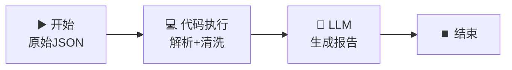

# 💻 代码执行节点 — JSON 数据清洗与转换

> **核心作用**：代码执行节点在工作流中运行 Python 或 JavaScript 代码，用于数据处理、格式转换、数学计算等 LLM 不擅长的精确任务。它让工作流具备了「编程能力」。

---

## 🎯 学习目标

学完本案例后，你将能够：
- 在代码执行节点中编写 Python 代码
- 理解输入变量如何传入代码、输出变量如何传出
- 用代码执行节点做 JSON 解析、数据清洗、格式转换

---

## 📚 案例描述

构建一个「**JSON 数据清洗器**」，用户输入一段不规范的 JSON 日志数据，代码执行节点将其解析、清洗、转换，最后交给 LLM 生成可读的文本报告。



---

## 🔧 手把手实操

### 步骤 1：创建工作流

1. 创建应用 → 「工作流」
2. 命名为：`JSON 数据清洗器`

### 步骤 2：配置开始节点

| 字段名 | 类型 | 必填 | 说明 |
|:---|:---|:---:|------|
| `raw_json` | 段落文本 | ✅ | 原始 JSON 字符串 |

### 步骤 3：配置代码执行节点（核心）

1. 拖入「**代码执行**」节点
2. 连接：`开始` → `代码执行`
3. 语言选择：**Python 3**

#### 3.1 输入变量

| 变量名 | 来源 | 类型 |
|------|------|------|
| `raw_json` | `{{#start.raw_json#}}` | string |

#### 3.2 Python 代码

```python
import json
from datetime import datetime

def main(raw_json: str) -> dict:
    """
    解析原始 JSON 日志，清洗并提取关键信息
    
    raw_json: 用户输入的原始 JSON 字符串
    返回: 包含清洗后数据的字典
    """
    
    # 1. 尝试解析 JSON（容错处理）
    try:
        data = json.loads(raw_json)
    except json.JSONDecodeError:
        # 如果解析失败，返回错误信息
        return {
            "status": "error",
            "message": "JSON 格式无效，请检查输入",
            "record_count": 0,
            "clean_data": [],
            "error_count": 0
        }
    
    # 2. 如果 data 是单个对象，转为列表统一处理
    if isinstance(data, dict):
        data = [data]
    
    # 3. 数据清洗逻辑
    clean_records = []
    error_count = 0
    
    for record in data:
        clean = {}
        # 提取并清洗字段
        clean["name"] = str(record.get("name", "")).strip()
        clean["email"] = str(record.get("email", "")).strip().lower()
        clean["amount"] = float(record.get("amount", 0))
        clean["timestamp"] = record.get("timestamp", "")
        
        # 数据验证
        errors = []
        if not clean["name"]:
            errors.append("姓名为空")
        if "@" not in clean["email"]:
            errors.append("邮箱格式异常")
        if clean["amount"] < 0:
            errors.append("金额为负")
        
        if errors:
            clean["validation_errors"] = errors
            error_count += 1
        else:
            clean["validation_errors"] = []
        
        clean_records.append(clean)
    
    # 4. 返回清洗结果
    return {
        "status": "success",
        "message": f"处理完成，共 {len(clean_records)} 条记录，{error_count} 条异常",
        "record_count": len(clean_records),
        "clean_data": clean_records,
        "error_count": error_count
    }
```

> 💡 **代码要点**：
> - 函数名必须是 `main`，参数名对应输入变量名
> - 返回值必须是 `dict` 类型（会自动转为 JSON 传给下游节点）
> - 善用 `try/except` 做容错，避免工作流因代码报错而中断

#### 3.3 输出变量

代码执行后自动生成以下输出变量：

| 输出变量 | 类型 | 说明 |
|------|------|------|
| `status` | string | 执行状态 |
| `message` | string | 处理消息 |
| `record_count` | number | 记录总数 |
| `error_count` | number | 异常记录数 |
| `clean_data` | array | 清洗后的数据数组 |

### 步骤 4：配置 LLM 节点生成报告

1. 拖入 LLM 节点，连接：`代码执行` → `LLM`
2. 模型：`deepseek-v4-flash`

**User Prompt**：
```
请根据以下数据清洗结果生成一份简洁的中文报告：

- 处理状态：{{#code.status#}}
- 处理消息：{{#code.message#}}
- 记录总数：{{#code.record_count#}} 条
- 异常数量：{{#code.error_count#}} 条
- 清洗数据：{{#code.clean_data#}}

报告格式：
📊 数据清洗报告
- 状态：xxx
- 数据处理概况
- 异常记录列表（如有）
```

### 步骤 5：结束节点

输出变量引用：`{{#llm.text#}}`

### 步骤 6：测试运行

输入测试数据：

```json
[
  {"name": "张三", "email": "zhangsan@example.com", "amount": 150.00, "timestamp": "2026-06-28 10:30:00"},
  {"name": "", "email": "bad-email", "amount": -50.00, "timestamp": ""},
  {"name": "李四", "email": "lisi@example.com", "amount": 200.00, "timestamp": "2026-06-28 11:00:00"}
]
```

> **期望行为**：
> - 代码节点：第 2 条记录被标记异常（姓名空 + 邮箱异常 + 金额为负）
> - LLM 节点：生成包含异常告警的报告

---

## 🧠 代码执行节点深度解析

### 输入变量类型映射

| Dify 变量类型 | Python 参数类型 |
|------|------|
| 文本 / 段落文本 | `str` |
| 数字 | `int` / `float` |
| 数组 | `list` |
| 对象（JSON） | `dict` |
| 文件 | `BinaryIO` 对象 |

### return 值的下游引用

代码中 `return` 的字典，每个 key 在下游节点的变量选择器中可以直接引用：

```python
return {
    "total": 100,       # 下游用 {{#code.total#}} 引用
    "items": [...]      # 下游用 {{#code.items#}} 引用
}
```

### Python 可用库

代码执行节点内置了常用 Python 库：

```python
import json          # JSON 处理 ✅
import re            # 正则表达式 ✅
import math          # 数学运算 ✅
import datetime      # 日期时间 ✅
import random        # 随机数 ✅
import collections   # 数据结构 ✅
import itertools     # 迭代工具 ✅
# numpy / pandas 不可用（无网络优先用纯 Python）
```

---

## 💡 避坑指南

| 常见问题 | 原因 | 解决方案 |
|------|------|------|
| 代码执行超时 | 死循环或处理的数据量太大 | 限制输入数据量，避免无限循环 |
| 变量引用报红 | 代码未运行，输出变量未知 | 先运行一次，输出变量自动注册 |
| JSON 解析失败 | 输入不是合法 JSON | 用 try/except 容错，返回错误提示 |
| 输出变量类型错误 | print() 不会输出给下游 | 必须用 `return`，不能用 `print()` |

---

## 🏆 独立练习

修改代码执行节点，增加一个功能：对清洗后的 `amount` 字段计算**总和**和**平均值**，并在返回的字典中增加 `total_amount` 和 `avg_amount` 两个字段。同时修改 LLM Prompt 在报告中显示统计数据。

---

> 📌 **一句话总结**：代码执行节点 = 工作流的「编程工具」，弥补 LLM 在精确计算、格式解析上的不足。数据清洗、格式转换、数学运算交给代码节点，文本理解交给 LLM——各取所长。
