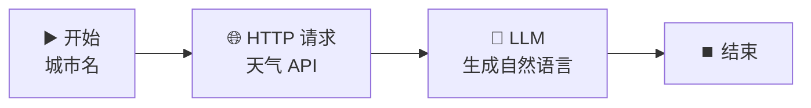

# 🌐 HTTP 请求节点 — 公网天气查询

> **核心作用**：HTTP 请求节点让工作流能调用外部 API，获取实时数据或触发外部服务。它是工作流连接外部世界的「网卡」，让应用不再局限于 LLM 的静态知识。

---

## 🎯 学习目标

学完本案例后，你将能够：
- 配置 HTTP 请求节点，设置请求方法、URL、Header、Body
- 处理 API 返回的 JSON 数据
- 将 API 返回结果传给 LLM 生成自然语言回答
- 掌握 API Key 的环境变量管理方式

---

## 📚 案例描述

构建一个「**天气查询助手**」，用户输入城市名称 → 调用免费天气 API → LLM 将天气数据转为友好的自然语言回答。



---

## 🔧 手把手实操

### 步骤 1：准备工作 — 获取免费天气 API

本案例使用 **wttr.in** 免费天气 API（无需注册、无需 API Key）：

| 项目 | 值 |
|------|------|
| 接口地址 | `https://wttr.in/{city}?format=j1` |
| 请求方式 | GET |
| 返回格式 | JSON |
| 无需认证 | ✅ |

> 💡 **wttr.in 特点**：免费、无需 API Key、支持全球城市，非常适合教学演示。

### 步骤 2：创建工作流

1. 创建应用 → 「工作流」
2. 命名为：`天气查询助手`

### 步骤 3：配置开始节点

| 字段名 | 类型 | 必填 | 说明 |
|:---|:---|:---:|------|
| `city` | 文本 | ✅ | 城市名称（中文或英文均可） |

### 步骤 4：配置 HTTP 请求节点（核心）

1. 拖入「**HTTP 请求**」节点
2. 连接：`开始` → `HTTP 请求`

#### 请求参数配置

| 参数 | 配置值 | 说明 |
|------|------|------|
| **请求方法** | GET | 获取数据用 GET |
| **URL** | `https://wttr.in/{{#start.city#}}?format=j1` | 变量拼接城市名 |

> ⚠️ **URL 中的变量引用**：在 URL 输入框中输入 `{` 调出变量选择器，选择 `start.city`，会自动插入 `{{#start.city#}}`。

#### 高级配置（可选）

| 参数 | 值 | 说明 |
|------|------|------|
| **超时时间** | 10 秒 | 防止 API 不响应拖死工作流 |
| **请求头 (Header)** | 留空即可 | wttr.in 无需额外 Header |

#### 返回数据预览

API 返回 JSON 结构（核心字段）：

```json
{
  "current_condition": [{
    "temp_C": "25",
    "humidity": "60",
    "weatherDesc": [{"value": "Sunny"}],
    "windspeedKmph": "15"
  }],
  "nearest_area": [{
    "areaName": [{"value": "Beijing"}],
    "country": [{"value": "China"}]
  }]
}
```

### 步骤 5：配置 LLM 节点生成自然语言回答

1. 拖入 LLM 节点，连接：`HTTP 请求` → `LLM`
2. 模型：`deepseek-v4-flash`

**User Prompt**：
```
请根据以下天气数据生成一段友好的天气播报：

- 城市：{{#start.city#}}
- 天气数据（JSON）：{{#http.body#}}

要求：
1. 提取温度、湿度、天气状况、风速
2. 用自然语言播报，如「今天北京晴朗，气温25℃，湿度60%，风速15km/h」
3. 根据天气给出一个简短的生活建议（如带伞、防晒等）
4. 如果 API 返回异常，友好提示「暂无法获取天气」
```

> 💡 `{{#http.body#}}` 是 HTTP 请求节点的 **响应体输出变量**。

### 步骤 6：结束节点

输出变量参考：`{{#llm.text#}}`

### 步骤 7：测试运行

依次测试以下城市，观察返回：

| 输入城市 | 期望行为 |
|------|------|
| `Beijing` | 返回北京的实时天气播报 |
| `上海` | wttr.in 支持中文城市名 |
| `Tokyo` | 返回东京天气 |
| `Mars` | API 返回错误，LLM 应友好提示 |

---

## 🌐 HTTP 请求节点深度解析

### 请求方法选择

| 方法 | 用途 | 参数位置 |
|------|------|------|
| **GET** | 获取数据 | URL Query String |
| **POST** | 提交数据 | Request Body (JSON/Form) |
| **PUT** | 更新数据 | Request Body |
| **DELETE** | 删除数据 | URL |

### 变量输出速查

HTTP 请求节点执行后，下游节点可用的输出变量：

| 输出变量 | 类型 | 说明 |
|------|------|------|
| `{{#http.body#}}` | string | 响应体（通常是 JSON 字符串） |
| `{{#http.status_code#}}` | number | HTTP 状态码（200/404/500...） |
| `{{#http.headers#}}` | object | 响应头信息 |

### 如何处理带 API Key 的请求

对于需要认证的 API（如 OpenAI、天气预报付费 API），**使用环境变量存储密钥**：

1. 在工作流配置 → 「环境变量」中添加：`WEATHER_API_KEY = sk-xxxxx`
2. 在 HTTP 请求节点的 Header 中设置：

```
Authorization: Bearer {{#env.WEATHER_API_KEY#}}
```

> ⚠️ **安全原则**：永远不要把 API Key 硬编码在 Prompt 或 URL 中，始终使用环境变量。

---

## 💡 避坑指南

| 常见问题 | 原因 | 解决方案 |
|------|------|------|
| 请求超时 | 网络不可达或 API 挂了 | 增大超时时间，或换一个 API 测试 |
| body 为空 | URL 拼写错误 | 先用浏览器访问 URL 验证 API 可用 |
| 变量解析失败 | URL 中变量引用格式错误 | 用 `{` 选择器插入，不要手写 |
| JSON 解析失败 | API 返回了 HTML 或错误页 | 检查 status_code，非 200 时做容错 |

---

## 🏆 独立练习

1. 修改案例，使用 JSONPlaceholder（`https://jsonplaceholder.typicode.com/posts/1`）获取一篇示例文章
2. 将获取到的文章标题和内容传给 LLM，生成 100 字以内的摘要
3. 验证：输入任意触发词 → 系统自动从 API 获取文章 → 生成摘要

---

> 📌 **一句话总结**：HTTP 请求节点 = 工作流的「网卡」，让应用能实时获取外部数据。URL 变量拼接 + 返回 body 传给 LLM = 动态数据驱动的 AI 应用。
