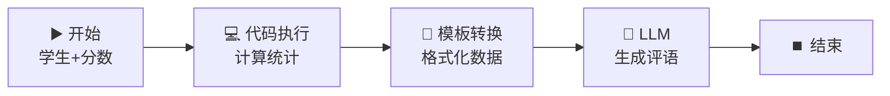

# 📝 模板转换节点 — 格式化报告生成

> **核心作用**：模板转换节点使用 Jinja2 模板引擎对文本进行格式化处理，适合做 Prompt 拼接、输出格式化、数据模板化等任务。它比直接在 LLM Prompt 中拼接变量更灵活、更易维护。

---

## 🎯 学习目标

学完本案例后，你将能够：
- 使用 Jinja2 模板语法编写模板
- 在模板中引用上游节点的输出变量
- 用模板转换节点拼接复杂 Prompt 和格式化输出
- 理解模板转换与直接在 LLM 中拼接的区别

---

## 📚 案例描述

构建一个「**学生成绩报告生成器**」，代码节点处理分数 → 模板转换节点格式化报告数据 → LLM 节点生成最终评语。



---

## 🔧 手把手实操

### 步骤 1：创建工作流

1. 创建应用 → 「工作流」
2. 命名为：`学生成绩报告生成器`

### 步骤 2：配置开始节点

| 字段名 | 类型 | 必填 | 说明 |
|:---|:---|:---:|------|
| `student_name` | 文本 | ✅ | 学生姓名 |
| `scores` | 段落文本 | ✅ | 各科成绩（JSON 数组） |

### 步骤 3：配置代码执行节点

1. 拖入「代码执行」节点（Python）
2. 输入变量：`scores` ← `{{#start.scores#}}`

```python
import json

def main(scores: str) -> dict:
    """计算成绩统计数据"""
    try:
        data = json.loads(scores)
    except json.JSONDecodeError:
        return {"error": "数据格式错误，请提供 JSON 数组"}
    
    subjects = []
    total = 0
    max_score = float('-inf')
    min_score = float('inf')
    
    for item in data:
        name = item.get("subject", "")
        score = float(item.get("score", 0))
        subjects.append({"subject": name, "score": score})
        total += score
        if score > max_score:
            max_score = score
            best = name
        if score < min_score:
            min_score = score
            worst = name
    
    avg = round(total / len(subjects), 1) if subjects else 0
    passed = sum(1 for s in subjects if s["score"] >= 60)
    
    return {
        "subjects": subjects,
        "total": total,
        "average": avg,
        "best_subject": best,
        "best_score": max_score,
        "worst_subject": worst,
        "worst_score": min_score,
        "passed_count": passed,
        "total_count": len(subjects)
    }
```

### 步骤 4：配置模板转换节点（核心）

1. 拖入「**模板转换**」节点
2. 连接：`代码执行` → `模板转换`

#### Jinja2 模板内容

```
## 📊 成绩报告 — {{#start.student_name#}}

| 科目 | 分数 | 等级 |
|------|:---:|:---:|

| {{ item.subject }} | {{ item.score }} | 优秀良好中等及格不及格 |


### 📈 统计概览
- **总分**：{{ code.total }} 分
- **平均分**：{{ code.average }} 分
- **最高分**：{{ code.best_subject }}（{{ code.best_score }} 分）🏅
- **最低分**：{{ code.worst_subject }}（{{ code.worst_score }} 分）📉
- **通过科目**：{{ code.passed_count }} / {{ code.total_count }}
- **整体状态**：✅ 全部通过⚠️ 有 {{ code.total_count - code.passed_count }} 门未通过
```

> 💡 **模板关键点**：
> - `` 遍历数组
> - `.........` 条件判断
> - `{{ variable }}` 输出变量值
> - 模板生成的是 **Markdown 格式的文本**

### 步骤 5：LLM 节点生成评语

1. 拖入 LLM 节点，连接：`模板转换` → `LLM`
2. **User Prompt**：

```
以下是学生成绩报告的数据：

{{#template.output#}}

请基于以上数据用中文写一段 80-120 字的个性化评语，包括：
1. 肯定优势科目
2. 指出薄弱科目
3. 给出改进建议
```

### 步骤 6：结束节点

输出变量：`{{#llm.text#}}`

### 步骤 7：测试

输入：
- `student_name`：`小明`
- `scores`：
```json
[
  {"subject": "语文", "score": 85},
  {"subject": "数学", "score": 92},
  {"subject": "英语", "score": 78},
  {"subject": "物理", "score": 55},
  {"subject": "化学", "score": 88}
]
```

> **期望输出**：先是格式化的 Markdown 成绩表格，然后是 LLM 生成的个性化评语。

---

## 🧠 Jinja2 核心语法速查

| 语法 | 功能 | 示例 |
|------|------|------|
| `{{ variable }}` | 输出变量 | `{{ name }}` |
| `` | 条件判断 | `及格` |
| `` | 循环遍历 | `...` |
| `` | 定义变量 | `` |
| `\| filter` | 过滤器 | `{{ name \| upper }}` 转大写 |

### 常用过滤器

| 过滤器 | 效果 | 示例 |
|------|------|------|
| `upper` | 转大写 | `{{ "hello" \| upper }}` → `HELLO` |
| `lower` | 转小写 | `{{ "HELLO" \| lower }}` → `hello` |
| `default("值")` | 默认值 | `{{ name \| default("未填写") }}` |
| `join(", ")` | 数组拼接 | `{{ tags \| join(", ") }}` |
| `first` / `last` | 取首/尾 | `{{ items \| first }}` |
| `length` | 长度 | `{{ items \| length }}` |

---

## 💡 避坑指南

| 常见问题 | 原因 | 解决方案 |
|------|------|------|
| 变量未定义报错 | Jinja2 严格模式 | 用 `default()` 过滤器兜底 |
| 循环输出异常 | 数组为 None | 用 `` 先判空 |
| 模板格式混乱 | 缩进空格混入 | Jinja2 标签不要随意缩进 |
| 输出不完整 | 漏了 `` 或 `` | 确保每个块标签有闭合 |

---

## 🏆 独立练习

修改模板转换节点，**新增一个「课程推荐」功能**：根据各科成绩自动生成推荐语句——
- 如果数学 ≥ 90，推荐「适合选择理工科方向」
- 如果语文 ≥ 85，推荐「适合选择文科方向」
- 如果英语 ≥ 80，推荐「具备国际方向潜力」

---

> 📌 **一句话总结**：模板转换节点 = 工作流的「格式化引擎」，用 Jinja2 模板将原始数据转换为结构化的 Markdown/文本。比直接在 Prompt 中拼接变量更优雅、更易维护，尤其适合复杂的报告生成场景。
