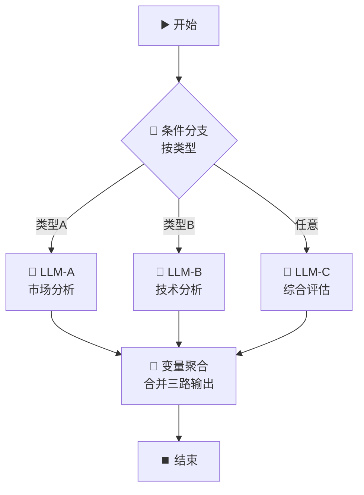
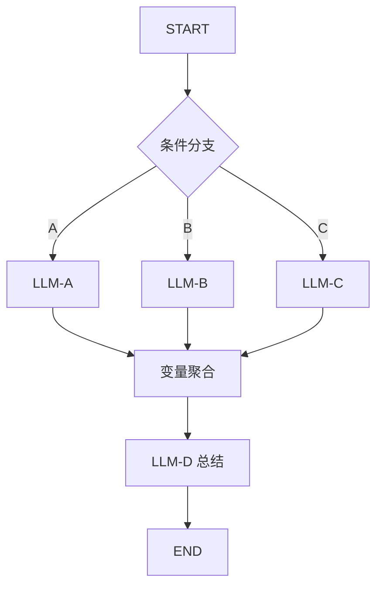

# 🔗 变量聚合节点 — 多源数据汇总

> **核心作用**：变量聚合节点将多个上游分支的输出变量合并到一处，解决「多条路径汇合」时的变量选择问题。条件分支的多出口、多路并行处理的汇合点都需要它。

---

## 🎯 学习目标

学完本案例后，你将能够：
- 理解变量聚合节点的使用场景
- 配置变量聚合节点合并多个上游输出
- 掌握变量聚合节点的输出引用方式
- 配合条件分支和迭代节点使用

---

## 📚 案例描述

构建一个「**多源信息汇总**」工作流：同时从 3 个不同来源获取数据（模拟），用变量聚合节点合并所有结果，最后交给 LLM 生成汇总报告。



> 💡 **为什么需要变量聚合？** 如果不用聚合节点，结束节点只能选择某一个 LLM 的输出，无法同时引用多个分支的结果。

---

## 🔧 手把手实操

### 步骤 1：创建工作流

1. 创建应用 → 「工作流」
2. 命名为：`多源信息汇总`

### 步骤 2：配置开始节点

| 字段名 | 类型 | 必填 | 说明 |
|:---|:---|:---:|------|
| `topic` | 文本 | ✅ | 分析主题 |
| `analysis_type` | 下拉选项 | ✅ | A=市场分析 / B=技术分析 / C=综合 |

### 步骤 3：配置条件分支

按 `analysis_type` 的值分支：

| 分支 | 条件 | 路由到 |
|------|------|------|
| IF | `{{#start.analysis_type#}}` **等于** `A` | LLM-A |
| ELIF | `{{#start.analysis_type#}}` **等于** `B` | LLM-B |
| ELSE | 其他 | LLM-C |

### 步骤 4：配置三个 LLM 节点

#### LLM-A（市场分析）

**System Prompt**：
```
你是市场分析专家。对以下主题进行市场分析：
- 市场规模
- 竞争格局
- 发展趋势
控制在 100 字以内。
```
**User Prompt**：`{{#start.topic#}}`

#### LLM-B（技术分析）

**System Prompt**：
```
你是技术分析专家。对以下主题进行技术分析：
- 核心技术
- 技术成熟度
- 技术挑战
控制在 100 字以内。
```
**User Prompt**：`{{#start.topic#}}`

#### LLM-C（综合评估）

**System Prompt**：
```
你是综合评估专家。对以下主题做 100 字以内的综合评估。
```
**User Prompt**：`{{#start.topic#}}`

### 步骤 5：配置变量聚合节点（核心）

1. 拖入「**变量聚合**」节点
2. 将三个 LLM 的输出**都连接到**变量聚合节点
3. 变量聚合节点**自动合并**所有上游输出变量

#### 聚合后的输出变量

| 输出变量 | 说明 |
|------|------|
| `{{#aggregator.output#}}` | 所有上游节点的输出合并后的结果 |
| `{{#aggregator.llm_a_text#}}` | LLM-A 的输出（按节点名引用） |
| `{{#aggregator.llm_b_text#}}` | LLM-B 的输出 |
| `{{#aggregator.llm_c_text#}}` | LLM-C 的输出 |

> 💡 **关键理解**：聚合节点就像一个「变量收纳盒」，把上游所有输出变量整理好，供下游统一引用。

### 步骤 6：配置结束节点

在结束节点的输出中同时展示三路结果：

**输出变量配置**：
```
## 🔍 分析结果汇总

### 📊 市场分析
{{#aggregator.llm_a_text#}}

### ⚙️ 技术分析
{{#aggregator.llm_b_text#}}

### 🎯 综合评估
{{#aggregator.llm_c_text#}}
```

> ⚠️ 如果某个分支因条件不满足而未执行，其对应输出变量值为空。

### 步骤 7：测试

| 测试 | 输入 | 期望 |
|------|------|------|
| 选择 A | topic = "AI教育" + type = A | 市场分析有内容，另两路为空 |
| 选择 B | topic = "AI教育" + type = B | 技术分析有内容，另两路为空 |
| 选择 C | topic = "AI教育" + type = C | 综合评估有内容，另两路为空 |

---

## 🔗 变量聚合 vs 直接在 Prompt 中引用

| 方式 | 适用场景 | 优点 | 缺点 |
|------|------|------|------|
| **变量聚合** | 多分支汇合 | 下游统一引用，结构清晰 | 需额外节点 |
| **直接引用** | 单路径流程 | 简单直接 | 分支多时引用混乱 |

---

## 💡 避坑指南

| 常见问题 | 原因 | 解决方案 |
|------|------|------|
| 聚合后引用不到变量 | 节点未正确连接 | 确保每个上游节点都有连线到聚合节点 |
| 某个分支输出为空 | 该分支未被触发 | 正常现象，用 `default()` 兜底 |
| 变量名冲突 | 多个上游有同名输出 | 聚合后自动加 `节点名_` 前缀区分 |

---

## 🏆 独立练习

修改当前案例：在 LLM 三个分支完成后，再增加一个独立的 LLM-D 节点（总结提炼，不经过条件分支），将变量聚合的输出传给 LLM-D 做二次加工，最终由结束节点输出。



---

> 📌 **一句话总结**：变量聚合节点 = 工作流的「汇合枢纽」，解决多分支/多路并行后的变量统一问题。条件分支 + 变量聚合是最经典的组合模式。
