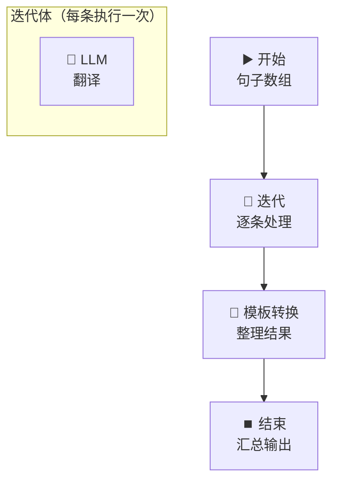
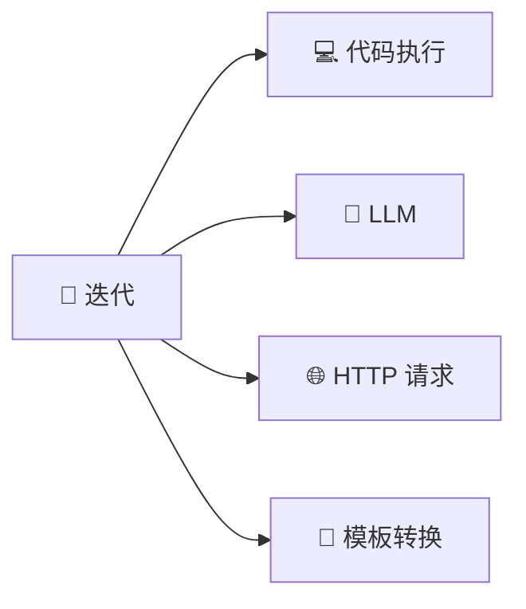

# 🔄 迭代节点 — 批量翻译处理

> **核心作用**：迭代节点遍历数组中的每一项，对每个元素执行相同的处理逻辑。它让工作流具备「批量处理」能力，一条数据和多条数据的处理逻辑完全一致。

---

## 🎯 学习目标

学完本案例后，你将能够：
- 配置迭代节点，正确设置输入数组和循环变量
- 在迭代体内放置 LLM/代码等节点
- 理解迭代节点的输出结构
- 使用模板转换节点整理迭代结果

---

## 📚 案例描述

构建一个「**批量翻译器**」，用户输入一组待翻译的中文句子（数组），迭代节点逐条翻译为英文，最后汇总所有翻译结果。



---

## 🔧 手把手实操

### 步骤 1：创建工作流

1. 创建应用 → 「工作流」
2. 命名为：`批量翻译器`

### 步骤 2：配置开始节点

| 字段名 | 类型 | 必填 | 说明 |
|:---|:---|:---:|------|
| `sentences` | 段落文本 | ✅ | 待翻译的中文句子（一行一句） |
| `target_lang` | 下拉选项 | ✅ | 目标语言：英语/日语/韩语 |

### 步骤 3：用代码节点将文本转为数组

在迭代之前，需要把用户的文本转为数组格式。

1. 拖入「代码执行」节点（Python），连接在开始节点后面
2. 输入变量：`sentences` ← `{{#start.sentences#}}`

```python
def main(sentences: str) -> dict:
    """将多行文本拆分为数组"""
    # 按换行分割，过滤空行
    lines = [line.strip() for line in sentences.strip().split('\n') if line.strip()]
    return {
        "sentence_list": lines,
        "count": len(lines)
    }
```

> 输出变量 `sentence_list` 是一个数组：`["你好", "今天天气真好", "谢谢你的帮助"]`

### 步骤 4：配置迭代节点（核心）

1. 拖入「**迭代**」节点
2. 连接：`代码执行` → `迭代`

#### 迭代参数配置

| 参数 | 配置值 | 说明 |
|------|------|------|
| **输入数组** | `{{#code.sentence_list#}}` | 要遍历的数组 |
| **循环变量名** | `item` | 每个元素的变量名（可自定义） |

> 在迭代体内引用当前元素：`{{#iteration.item#}}`

### 步骤 5：在迭代体内放置 LLM 节点

1. **点击迭代节点的内部区域**（进入迭代体编辑模式）
2. 拖入 LLM 节点
3. 模型：`deepseek-v4-flash`

**System Prompt**：
```
你是专业翻译。将输入的中文翻译为 {{#start.target_lang#}}。
只输出翻译结果，不要加任何解释。
```

**User Prompt**：`{{#iteration.item#}}`

> ⚠️ **重要**：`{{#iteration.item#}}` 是当前正在处理的**那条数据**，不是整个数组。

### 步骤 6：整理输出 — 模板转换节点

迭代结束后，需要将每条翻译结果整理为可读格式。

1. 在迭代节点**外部**拖入「模板转换」节点
2. 连接：`迭代` → `模板转换`

**Jinja2 模板**：

```
## 🌍 批量翻译结果

| 原文 | 译文 |
|------|------|

| {{ result.original }} | {{ result.translated }} |


---
共 {{ iteration.results | length }} 条翻译任务完成。
```

> 💡 `{{ iteration.results }}` 是迭代节点的输出数组，每个元素是每条记录的完整结果。

### 步骤 7：结束节点

输出变量：`{{#template.output#}}`

### 步骤 8：测试

输入 `sentences`：
```
你好
今天天气真好
谢谢你的帮助
```

选择 `target_lang`：`英语`

> **期望输出**：一个表格，每行显示原文和对应的英文翻译。

---

## 🔄 迭代节点深度解析

### 迭代体中可以放什么？

迭代体内支持放入**几乎所有节点**：



> ⚠️ **不能放入的节点**：条件分支、子工作流（嵌套复杂逻辑建议用其他方式）

### 迭代的并行模式

| 模式 | 说明 | 适用场景 |
|------|------|------|
| **串行** | 逐条执行 | 默认模式，结果有序 |
| **并行** | 同时执行多条 | 提高速度，但结果顺序不确定 |

> 在迭代节点的高级设置中可切换并行模式。建议：翻译类任务可开并行，但要注意 API 限流。

### 迭代节点的输出变量

| 输出变量 | 类型 | 说明 |
|------|------|------|
| `{{#iteration.results#}}` | array | 所有迭代结果的数组 |
| `{{#iteration.item#}}` | — | 仅在迭代体**内部**可用，当前循环元素 |

---

## 💡 避坑指南

| 常见问题 | 原因 | 解决方案 |
|------|------|------|
| 迭代体引用不到外部变量 | 作用域隔离 | 迭代体内用 `{{#start.xxx#}}` 引用外部变量 |
| 迭代结果为空 | 输入数组为空 | 迭代前用代码节点检查数组长度 |
| 并行模式结果乱序 | 各条任务耗时不同 | 切换为串行模式 |
| 迭代体 LLM 被限流 | 并发请求过多 | 关闭并行模式，或增加 API 调用间隔 |

---

## 🏆 独立练习

1. 修改案例：在迭代体内用**HTTP 请求节点**调用 `https://api.mymemory.translated.net/get?q={{item}}&langpair=zh|en`（免费翻译 API，无需 Key）
2. 对比 LLM 翻译和 MyMemory API 翻译的效果差异
3. 用变量聚合节点合并两者结果，在同一个表格中展示

---

> 📌 **一句话总结**：迭代节点 = 工作流的「批量处理引擎」，对数组中的每一项执行相同的处理逻辑。输入数组 → 迭代体内 LLM/代码/HTTP → 输出结果数组，常见于批量翻译、批量分析、批量生成等场景。
