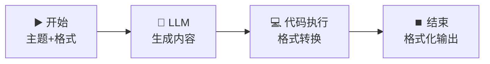

# ⏹️ 结束节点 — 多格式输出控制

> **核心作用**：结束节点是工作流的出口，负责定义最终输出给用户的变量和内容。它决定了用户看到什么、API 返回什么。巧用结束节点可以让同一个工作流输出多种格式的数据。

---

## 🎯 学习目标

学完本案例后，你将能够：
- 配置结束节点的输出变量
- 理解输出变量的类型（文本/数字/JSON/Markdown）
- 设计多格式输出（纯文本 vs Markdown vs JSON）
- 配合条件分支实现动态输出格式

---

## 📚 案例描述

构建一个「**灵活格式输出器**」，LLM 生成内容后，用户可以选择输出格式：纯文本、Markdown、JSON，结束节点根据选择输出不同格式的内容。



---

## 🔧 手把手实操

### 步骤 1：创建工作流

1. 创建应用 → 「工作流」
2. 命名为：`灵活格式输出器`

### 步骤 2：配置开始节点

| 字段名 | 类型 | 必填 | 说明 |
|:---|:---|:---:|------|
| `topic` | 文本 | ✅ | 文章主题 |
| `output_format` | 下拉选项 | ✅ | 输出格式：纯文本 / Markdown / JSON |

### 步骤 3：配置 LLM 节点

1. 拖入 LLM 节点，连接：`开始` → `LLM`
2. 模型：`deepseek-v4-flash`

**User Prompt**：
```
请写一篇关于「{{#start.topic#}}」的短文介绍，100-150 字。
```

### 步骤 4：配置代码执行节点做格式转换

1. 拖入「代码执行」节点，连接：`LLM` → `代码执行`
2. 输入变量：`content` ← `{{#llm.text#}}`，`format_type` ← `{{#start.output_format#}}`

```python
import json

def main(content: str, format_type: str) -> dict:
    """根据用户选择转换输出格式"""
    
    if format_type == "纯文本":
        # 去除 Markdown 标记，保留纯文本
        import re
        plain = re.sub(r'[#*_`>]', '', content)
        plain = re.sub(r'\n{3,}', '\n\n', plain)
        return {
            "formatted_content": plain.strip(),
            "content_type": "text/plain"
        }
    
    elif format_type == "Markdown":
        # 包装为更完整的 Markdown 格式
        md = f"""---
**主题**：{content[:20]}...

{content}
"""
        return {
            "formatted_content": md,
            "content_type": "text/markdown"
        }
    
    elif format_type == "JSON":
        # 转为 JSON 结构
        json_obj = {
            "status": "success",
            "data": {
                "content": content,
                "length": len(content),
                "format": "json"
            }
        }
        return {
            "formatted_content": json.dumps(json_obj, ensure_ascii=False, indent=2),
            "content_type": "application/json"
        }
    
    else:
        return {
            "formatted_content": content,
            "content_type": "text/plain"
        }
```

### 步骤 5：配置结束节点（核心）

1. 点击「**结束**」节点
2. 在右侧配置面板中**添加输出变量**：

| 输出变量名 | 类型 | 值来源 | 说明 |
|------|------|------|------|
| `result` | 文本 | `{{#code.formatted_content#}}` | 格式化后的内容 |
| `format` | 文本 | `{{#code.content_type#}}` | 内容类型标识 |
| `original_length` | 数字 | `{{#llm.usage.}}` | Token 消耗信息 |

#### 结束节点的其他配置

| 配置项 | 说明 |
|------|------|
| **输出变量名** | 每个变量可自定义名称，API 调用时按名称取值 |
| **变量类型** | 文本/数字/对象/数组，影响 API 返回格式 |
| **描述** | 给变量添加说明，方便 API 使用者理解 |

> 💡 **为什么要自定义输出变量？** API 调用方（如前端、其他系统）通过变量名获取数据：
> ```json
> // API 返回
> {
>   "result": "这是格式化后的内容...",
>   "format": "text/markdown",
>   "original_length": 42
> }
> ```

### 步骤 6：测试三种格式

| 输入 | 格式选择 | 期望输出 |
|------|:---:|------|
| topic = "人工智能" | 纯文本 | 无 Markdown 标记的纯文本 |
| topic = "人工智能" | Markdown | 带标题、加粗等格式的 Markdown |
| topic = "人工智能" | JSON | `{"status": "success", "data": {...}}` 结构 |

### 步骤 7：验证 API 返回

发布为 API 后调用：

```bash
curl -X POST "https://your-dify-api/v1/workflows/run" \
  -H "Authorization: Bearer YOUR_API_KEY" \
  -H "Content-Type: application/json" \
  -d '{
    "inputs": {
      "topic": "机器学习",
      "output_format": "JSON"
    },
    "response_mode": "blocking"
  }'
```

返回的 `data.outputs` 中会包含你定义的 `result`、`format`、`original_length` 三个变量。

---

## ⏹️ 结束节点 vs 答案节点

| 维度 | 结束节点 | 答案节点 |
|------|------|------|
| **适用应用类型** | 工作流 | 对话流 / Agent |
| **输出方式** | 定义输出变量后一次性返回 | 流式逐字输出 |
| **API 返回** | `data.outputs.变量名` | `answer` 字段 |
| **前端展示** | 按变量展示 | 打字机效果渲染 |

> 💡 工作流用「结束」节点，对话流用「答案」节点——二者不可混用。

---

## 💡 避坑指南

| 常见问题 | 原因 | 解决方案 |
|------|------|------|
| API 调用拿不到期望数据 | 输出变量名不匹配 | 确认结束节点定义的输出变量名 |
| JSON 格式输出多了引号 | 类型选了「文本」 | JSON 输出应选「对象」类型 |
| 输出内容被截断 | 未设置输出截断限制 | 结束节点高级设置中调整 |
| 多个输出变量但只返回一个 | API 调用模式问题 | blocking 模式返回全部，streaming 模式分开返回 |

---

## 🏆 独立练习

1. 新增一个输出格式选项：`HTML`
2. 在代码节点中实现 Markdown → HTML 的简单转换
3. 验证：选择 HTML 格式后，结束节点输出包含 HTML 标签的内容（如 `<h2>`、`<p>`、`<strong>` 等）

---

> 📌 **一句话总结**：结束节点 = 工作流的「出口收银台」，定义最终给用户/API 的数据格式。善用输出变量定义，配合代码节点做格式转换，让一个工作流支持多种输出格式。
