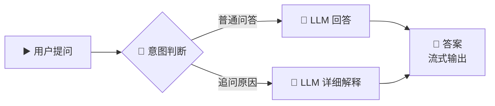
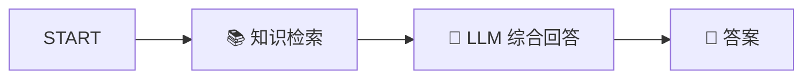

# 💬 答案节点 — 对话流流式输出

> **核心作用**：答案节点是对话流（Chatflow）和 Agent 的专属输出节点，支持流式逐字输出（打字机效果），让用户实时看到 AI 的生成过程。相比工作流的结束节点，答案节点更适合多轮对话场景。

---

## 🎯 学习目标

学完本案例后，你将能够：
- 理解工作流 vs 对话流的输出差异
- 配置答案节点实现流式输出
- 使用 Markdown 格式美化对话回复
- 在对话流中实现带引用的知识库回答

---

## 📚 案例描述

构建一个「**AI 学习助手对话机器人**」，支持多轮对话，流式输出回答，并且当用户追问「为什么」时能给出更详细的解释。



---

## 🔧 手把手实操

### 步骤 1：创建对话流应用

> ⚠️ **注意**：答案节点**只在对话流和 Agent 中可用**，工作流中请使用「结束」节点。

1. Dify → 创建应用 → 选择「**对话流**」（Chatflow）
2. 命名为：`AI 学习助手`

### 步骤 2：配置开始节点

对话流的开始节点与工作流略有不同，有内置的 `sys.query`（用户问题）和 `sys.conversation_id`（对话 ID）：

| 内置变量 | 说明 |
|------|------|
| `{{#sys.query#}}` | 用户当前输入的问题 |
| `{{#sys.conversation_id#}}` | 当前对话的唯一 ID |
| `{{#sys.app_id#}}` | 应用 ID |

> 可以额外添加自定义输入变量，如文件上传、选项等。

### 步骤 3：配置对话路由

1. 拖入「条件分支」节点
2. 判断用户意图：

| 分支 | 条件 | 场景 |
|------|------|------|
| IF | `{{#sys.query#}}` **包含** `为什么` 或 `解释` 或 `详细` | 用户追问原因 |
| ELSE | 其他 | 普通问答 |

### 步骤 4：配置两个 LLM 节点

#### LLM-1：普通回答

**System Prompt**：
```
你是一个 AI 学习助手，帮助用户解答技术问题。

要求：
1. 回答简洁有力，100 字以内
2. 使用 Markdown 格式
3. 在回答末尾提示："💡 回复「详细解释」可以了解更多细节"
```

**User Prompt**：`{{#sys.query#}}`

#### LLM-2：详细解释

**System Prompt**：
```
你是一个 AI 学习助手，用户希望获得更详细的解释。

要求：
1. 深入解释技术原理
2. 使用 Markdown 格式，适当使用标题、列表、代码块
3. 给出实际例子帮助理解
4. 200-300 字
```

**User Prompt**：
```
用户之前的问题和你的回答之后，用户追问了"为什么"。
当前用户说的是：{{#sys.query#}}

请基于对话上下文，给出深入详细的技术解释。
```

### 步骤 5：配置答案节点（核心）

1. 拖入「**答案**」节点
2. 将两个 LLM 的输出都连接到答案节点（可用变量聚合中转）

#### 答案节点参数配置

| 配置项 | 值 | 说明 |
|------|------|------|
| **输出变量** | `{{#aggregator.output#}}` | LLM 的输出文本 |
| **输出格式** | Markdown | 支持渲染 Markdown 格式 |
| **流式输出** | ✅ 开启 | 打字机逐字效果 |

> 💡 默认开启流式输出，前端展示会有打字机效果。如果关闭，则等待完整结果后一次性显示。

### 步骤 6：在答案节点中使用 Markdown

答案节点的 Markdown 输出会在前端自动渲染：

```markdown
## 🤖 AI 学习助手

---

### 📝 回答

{{#aggregator.output#}}

---

> 💡 还有其他问题吗？随时问我！
```

> 支持 Markdown 元素：标题、**加粗**、*斜体*、列表、代码块、表格、引用块、Emoji。

### 步骤 7：增强 — 添加知识库

在答案节点之前添加知识检索（可选）：



LLM Prompt 中加入检索内容：
```
【参考资料】
{{#knowledge.text#}}

【用户问题】
{{#sys.query#}}
```

### 步骤 8：测试多轮对话

| 轮次 | 用户输入 | 期望行为 |
|:---:|------|------|
| 1 | "什么是机器学习？" | 简短回答 + 提示可追问详情 |
| 2 | "为什么深度学习比传统ML好？" | 深入解释技术原理 |
| 3 | "能举个例子吗？" | 给出实际应用场景 |

---

## 💬 答案节点 vs 结束节点 对比

| 维度 | 答案节点 💬 | 结束节点 ⏹️ |
|------|------|------|
| **应用类型** | 对话流、Agent | 工作流 |
| **输出方式** | 流式逐字输出 | 定义变量，一次性返回 |
| **前端渲染** | 打字机效果 + Markdown | 按变量展示 |
| **多轮对话** | ✅ 支持，内置会话记忆 | ❌ 每次独立运行 |
| **API 返回** | `answer` 字段 | `data.outputs.变量名` |
| **文件输出** | ✅ 支持输出文件 | ❌ 不直接输出文件 |

### 答案节点的输出变量

| 输出变量 | 说明 |
|------|------|
| `{{#answer.text#}}` | 答案文本内容 |
| `{{#answer.files#}}` | 输出的文件列表 |

---

## 💡 避坑指南

| 常见问题 | 原因 | 解决方案 |
|------|------|------|
| 创建对话流后发现没有答案节点 | 选了工作流 | 只有对话流/Agent 才有答案节点 |
| 流式输出不流畅 | 上游节点耗时太长 | 知识检索放前面，让 LLM 输出流式 |
| 多轮对话「失忆」 | 未正确使用会话变量 | 用会话变量存储用户偏好 |
| Markdown 不渲染 | 输出格式设置错误 | 确认答案节点格式选「Markdown」 |

---

## 🏆 独立练习

1. 改造案例，在答案节点中嵌入**会话变量**：记录用户问过的问题主题，当用户问第 3 次时主动说「你之前问过关于 XXX 的问题，还需要深入了解吗？」
2. 测试多轮对话的记忆效果
3. 对比：有记忆 vs 无记忆的对话体验差异

---

> 📌 **一句话总结**：答案节点 = 对话流/Agent 的「最终出口」，支持流式逐字输出和 Markdown 渲染。掌握它就能创建用户感知流畅、格式美观的 AI 对话应用。
