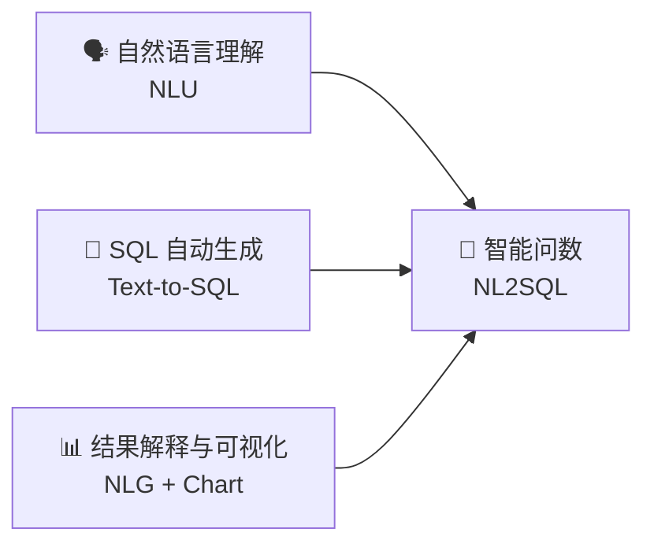
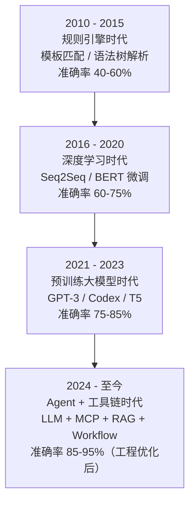

# 🚀 智能问数：自然语言驱动的数据查询

## 第 1 章 · 智能问数概述

> **讲师：大数据实训团队** | **课时：45 分钟** | **类型：理论**

[TOC]

---

## 📌 本章学习目标

学完本章后，你将能够：

- [ ] 清晰定义「智能问数」（NL2SQL）的概念
- [ ] 理解智能问数在数据民主化中的核心价值
- [ ] 了解行业主流智能问数产品及其技术路线
- [ ] 掌握 NL2SQL 的技术演进脉络
- [ ] 明确本实训课程的整体目标和交付物

---

## 🤔 情景导入：业务人员的困境

> *"张经理，上个月华东区销售额前 10 的商品是哪几个？"*

### 传统流程 ❌

1. 业务人员找数据分析师
2. 分析师理解需求（沟通损耗）
3. 手工编写 SQL
4. 等待查询执行
5. 导出 Excel / Markdown 报表
6. **耗时：2 小时 ~ 2 天**

### 智能问数 ✅

1. 业务人员在飞书直接提问
2. AI 理解自然语言
3. 自动生成 SQL 并执行
4. 即时返回结果 + 可视化图表
5. **耗时：10 秒 ~ 30 秒**

---

## 🎯 什么是「智能问数」

> **智能问数（Intelligent Data Querying）** 是指利用大语言模型（LLM）将用户的**自然语言问题**自动转化为**结构化查询语言（SQL）**，执行查询后将结果以**自然语言 + 可视化图表**的形式返回给用户的技术体系。

### 核心能力三要素

### 本质：降低数据查询门槛

| 角色 | 传统方式 | 智能问数方式 |
|------|----------|--------------|
| CEO/VP | 等周报 / 月报 | 飞书随口问 |
| 运营经理 | 提需求 → 等排期 | 自助查询 |
| 数据分析师 | 写 SQL → 出报表 | AI 辅助，效率 10x |
| 一线业务 | 无法接触数据 | 人人都是分析师 |

---

## 📈 行业前景：数据民主化的必然趋势

### 市场数据

| 指标 | 数据 |
|------|------|
| 全球 NL2SQL 市场（2024） | 约 $8.2 亿美元 |
| 预计 2030 年 | $48 亿美元+ |
| 年复合增长率（CAGR） | 34.6% |
| 企业数据利用率（传统 BI） | 仅 25-30% |
| AI 辅助后潜在提升 | 60-75% |

### 四大驱动因素

1. **🏢 企业数据量爆炸增长** — 单日产生的数据超过过去十年总和
2. **👥 数据人才严重短缺** — 数据分析师供需比约 1:8
3. **🤖 LLM 能力突破** — GPT-4 / Claude 在 NL2SQL 任务上准确率达 85%+
4. **💰 降本增效** — 减少 70% 的重复性数据查询人力成本

---

## 🏭 行业产品与技术路线对比

| 产品 | 厂商 | 技术路线 | 特点 |
|------|------|----------|------|
| **Power BI Q&A** | Microsoft | 规则引擎 + ML | 深度集成 Power BI 生态 |
| **Tableau Ask Data** | Salesforce | NLP 解析树 | 可视化探索式问答 |
| **DataV 智能问数** | 阿里云 | LLM + RAG | 中文优化，阿里云生态 |
| **网易有数 ChatBI** | 网易 | LLM + 知识图谱 | 行业 Know-How 注入 |
| **DataGPT** | 独立厂商 | 专用 NL2SQL 模型 | 专注对话式分析 |
| **Dify + 飞书**（本课程） | 开源生态 | LLM + MCP + 工作流 | **灵活可控、可私有化部署** |

### 为什么选择 Dify + 飞书方案？

| 对比维度 | 商业 BI 产品 | Dify + 飞书（本课程） |
|----------|:-----------:|:---------------------:|
| 部署方式 | SaaS / 私有化（昂贵） | 开源，完全私有化 |
| 数据安全 | 数据上传到第三方 | **数据不出企业内网** |
| 定制能力 | 有限 | **完全可定制** |
| 成本 | 按用户/年付费 | 仅 LLM API 费用 |
| 中文支持 | 参差不齐 | DeepSeek 原生中文优化 |

---

## 🔧 技术演进：从 SQL 到 ChatBI

### 关键转折点

- **2022 年**：Codex 发布，首次证明 LLM 可以生成高质量 SQL
- **2023 年**：GPT-4 在 Spider 基准测试上达到 85.3% 准确率
- **2024 年**：MCP 协议发布，标准化 AI-数据库交互；Dify 等低代码平台成熟
- **2025-2026 年**：工程优化（宽表 + RAG + Few-Shot）将准确率推至 95%+

---

## 🏗️ 本课程技术栈详解

| 组件 | 选型 | 版本 | 理由 |
|------|------|------|------|
| **协作入口** | 飞书机器人 | — | 企业通讯工具，员工无需额外 App |
| **工作流引擎** | Dify | ≥ 0.6.x | 开源、可视化编排、内置 LLM 连接器 |
| **大语言模型** | DeepSeek V4 | — | 高性价比、中文能力强、SQL 生成准确 |
| **数据库协议** | MCP | — | Anthropic 提出的标准 AI-工具交互协议 |
| **MCP Server** | mysql-mcp-server | 0.1.3 | npm 包，提供 describe_table / execute_query |
| **数据存储** | MySQL | 8.0 | OLAP 场景优化，大宽表设计 |
| **可视化** | ECharts / Dify 内置 | — | 轻量级，适配飞书卡片消息 |

---

## 🎓 课程整体架构

| 章节 | 标题 | 课时 | 类型 | 核心交付物 |
|------|------|------|------|------------|
| 第 1 章 | 智能问数概述 | 45min | 理论 | 理解 NL2SQL 价值 |
| 第 2 章 | 数据字典与星型模型 | 60min | 理论+实操 | 掌握 shop_db 全部表结构 |
| 第 3 章 | 技术架构设计 | 45min | 理论 | 理解五层架构 |
| 第 4 章 | 星型模型直接查询实战 | 90min | 实操 | 体会多表 JOIN 痛点 |
| 第 5 章 | 大宽表设计与实现 | 90min | 实操 | 创建宽表，提升准确率 |
| 第 6 章 | 端到端案例实现 | 120min | 项目实战 | 完整系统搭建 |

---

## ⚡ 快速预览：我们最终要做的

### 输入

在飞书上发送一条消息：

> *"上个月华东区销售额最高的 5 个品类是哪些？每个品类的销售额和订单量是多少？"*

### 输出

飞书机器人**秒级**回复：

> 📊 **2026 年 5 月华东区销售 TOP5 品类**
>
> 1. 🥇 **手机通讯** — 销售额 ¥128.5 万 | 订单量 3,421
> 2. 🥈 **电脑办公** — 销售额 ¥96.2 万 | 订单量 2,108
> 3. 🥉 **家用电器** — 销售额 ¥73.8 万 | 订单量 1,956
> 4. **服饰鞋包** — 销售额 ¥58.4 万 | 订单量 4,237
> 5. **美妆个护** — 销售额 ¥45.1 万 | 订单量 3,891
>
> 📈 *趋势洞察：手机通讯品类同比增长 23.5%，连续 3 个月位居首位。*

---

## 🤔 思考与讨论

1. 你所在的企业/团队中，日常数据查询的核心痛点是什么？
2. 如果有一个智能问数系统，你第一句想问它什么？
3. 你认为 NL2SQL 最大的技术挑战是什么？（提示：歧义、上下文理解、复杂聚合）
4. 对比商业 BI 产品和开源方案，你更倾向于哪种？为什么？

---

## 📚 课后阅读与资源

| 资源 | 链接/说明 |
|------|-----------|
| **NL2SQL 综述** | 《A Survey on Text-to-SQL》— arXiv |
| **Spider Benchmark** | Yale 大学 NL2SQL 评测基准 |
| **Dify 官方文档** | Chatflow + 工具节点使用指南 |
| **MCP 协议规范** | Anthropic MCP Specification |
| **DeepSeek API** | DeepSeek 开放平台文档 |

---

> **🔜 下一章预告**：我们将深入实训项目的电商数据仓库，掌握星型模型设计和完整数据字典！
