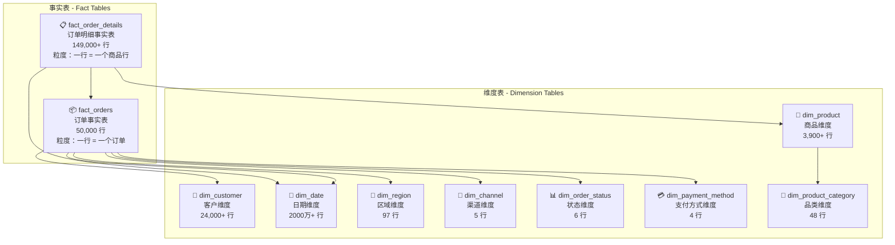

# 📖 数据字典与星型模型

## 第 2 章 · 行业案例数据说明

> **讲师：大数据实训团队** | **课时：60 分钟** | **类型：理论 + 实操**

[TOC]

---

## 📌 本章学习目标

学完本章后，你将能够：

- [ ] 理解电商数据仓库的星型模型设计理念
- [ ] 掌握 `shop_db` 全部 10 张表的字段含义和关联关系
- [ ] 独立编写多表 JOIN 分析查询
- [ ] 理解维度建模中代理键（Surrogate Key）和业务键（Business Key）的区别
- [ ] 能够从业务需求反推需要查询哪些表

---

## 🏪 业务场景：全品类 B2C 电商平台

### 模拟企业画像

| 维度 | 描述 |
|------|------|
| **企业类型** | 全品类 B2C 电商平台 |
| **商品规模** | 3,900+ SKU，涵盖 48 个品类 |
| **用户规模** | 24,000+ 注册用户 |
| **订单规模** | 50,000 笔订单，149,000+ 条订单明细 |
| **覆盖区域** | 全国 31 个省市，97 个行政区域 |
| **销售渠道** | App 商城、微信小程序、PC 官网、线下门店 |
| **支付方式** | 微信支付、支付宝、银行卡支付、货到付款 |
| **数据时间范围** | 2020-2026 年（日期维度覆盖约 2000 万天） |

---

## ⭐ 星型模型架构总览

**星型模型（Star Schema）** 是数据仓库中最经典的维度建模方法。中心是**事实表**（存储业务度量值），周围是**维度表**（存储描述性属性），形如星星。



### 核心设计理念

| 概念 | 说明 | 示例 |
|------|------|------|
| **代理键（Surrogate Key）** | 数据仓库自增整数主键，无业务含义 | `customer_key = 12345` |
| **业务键（Business Key）** | 来源系统的原始 ID | `customer_id = "CUST_00001"` |
| **事实表** | 存储可累加的度量值 | `actual_amount`, `quantity` |
| **维度表** | 存储描述性属性，用于分组和筛选 | `customer_level`, `channel_name` |
| **缓慢变化维度（SCD）** | 跟踪维度属性历史变化 | 客户等级从"普通"升级到"金卡" |

---

## 📋 数据字典 — 维度表篇

### 1. dim_channel — 渠道维度表

> **数据量**：5 行 | **用途**：分析不同销售渠道的表现

| 字段名 | 类型 | 键 | 说明 | 示例值 |
|--------|------|-----|------|--------|
| `channel_key` | tinyint | PK | 渠道代理键（自增） | `1` |
| `channel_id` | varchar(20) | UK | 渠道业务编码 | `CH_APP` |
| `channel_name` | varchar(50) | | 渠道名称 | `App 商城` |
| `channel_type` | varchar(20) | | 渠道类型 | `线上` / `线下` / `分销` |
| `is_active` | tinyint | | 是否启用 0/1 | `1` |
| `created_at` | datetime | | 创建时间 | 自动维护 |
| `updated_at` | datetime | | 更新时间 | 自动维护 |

**枚举值预览**：

| channel_id | channel_name | channel_type |
|------------|-------------|--------------|
| CH_APP | App 商城 | 线上 |
| CH_MINI | 微信小程序 | 线上 |
| CH_PC | PC 官网 | 线上 |
| CH_OFFLINE | 线下门店 | 线下 |

---

### 2. dim_customer — 客户维度表

> **数据量**：24,000+ 行 | **用途**：客户画像分析、RFM 模型、客户分层

| 字段名 | 类型 | 键 | 说明 |
|--------|------|-----|------|
| `customer_key` | bigint | PK | 客户代理键（自增） |
| `customer_id` | varchar(32) | UK | 客户业务 ID（来源系统） |
| `customer_name` | varchar(100) | | 客户姓名/昵称（脱敏存储） |
| `gender` | tinyint | | 性别：0=未知 1=男 2=女 |
| `email` | varchar(100) | | 电子邮箱 |
| `phone` | varchar(20) | MUL | 手机号码（有索引） |
| `id_card` | varchar(18) | | 身份证号（脱敏存储） |
| `birth_date` | date | | 出生日期 |
| `age_group` | varchar(20) | | 年龄段：18-25 / 26-35 / 36-45 / 46+ |
| `register_date_key` | int | MUL | 注册日期代理键 → dim_date |
| `customer_level` | varchar(20) | MUL | 客户等级：普通 / 银卡 / 金卡 / 钻石 |
| `points` | int | | 当前积分 |
| `total_order_amount` | decimal(12,2) | | 历史累计消费金额（元） |
| `total_order_count` | int | | 历史累计订单数 |
| `first_order_date` | date | | 首次下单日期 |
| `last_order_date` | date | | 最近下单日期 |
| `source_channel` | varchar(20) | | 注册来源渠道 |
| `is_active` | tinyint | | 是否活跃 0/1 |

> 🔑 **关键理解**：`customer_key` 是代理键（自增整数，仅用于 JOIN），`customer_id` 是业务键（来源系统 ID，用于溯源）。数据仓库中统一使用代理键关联，避免业务键变更影响。

---

### 3. dim_date — 日期维度表

> **数据量**：2000 万+ 行 | **用途**：时间维度分析（年/季/月/周/日/周末/节假日）

| 字段名 | 类型 | 键 | 说明 | 示例值 |
|--------|------|-----|------|--------|
| `date_key` | int | PK | 日期代理键（格式 YYYYMMDD） | `20260628` |
| `date_value` | date | UK | 业务日期 | `2026-06-28` |
| `year` | smallint | MUL | 年份 | `2026` |
| `quarter` | tinyint | | 季度 1-4 | `2` |
| `quarter_name` | varchar(10) | | 季度名称 | `Q2` |
| `month` | tinyint | | 月份 1-12 | `6` |
| `month_name` | varchar(10) | | 月份名称 | `6月` |
| `week_of_year` | tinyint | | 一年中的第几周 | `26` |
| `day_of_month` | tinyint | | 月中的第几天 | `28` |
| `day_of_week` | tinyint | | 星期几（1=周一, 7=周日） | `7` |
| `day_of_week_name` | varchar(10) | | 星期名称 | `星期日` |
| `is_weekend` | tinyint | | 是否周末 0/1 | `1` |
| `is_holiday` | tinyint | | 是否节假日 0/1 | `0` |
| `holiday_name` | varchar(50) | | 节假日名称 | NULL |
| `fiscal_year` | smallint | | 财年 | `2026` |
| `fiscal_quarter` | tinyint | | 财季 | `2` |

> 💡 **设计亮点**：日期维度预先计算好了 `is_weekend`、`is_holiday`、`fiscal_year` 等派生字段，查询时无需在 SQL 中计算。

---

### 4. dim_order_status — 订单状态维度表

> **数据量**：6 行 | **用途**：订单状态筛选

| order_status_key | status_name | status_type | 说明 |
|:---:|------------|-------------|------|
| 1 | 待付款 | 待付款 | 订单已创建，等待支付 |
| 2 | 已付款 | 待发货 | 支付完成，等待发货 |
| 3 | 已发货 | 已发货 | 商品已出库，运输中 |
| 4 | 已完成 | 已完成 | 买家确认收货 |
| 5 | 已取消 | 已取消 | 订单取消（未付款取消） |
| 6 | 已退款 | 已退款 | 已付款后退款 |

---

### 5. dim_payment_method — 支付方式维度表

> **数据量**：4 行 | **用途**：支付偏好分析

| payment_method_key | method_name | method_type | 说明 |
|:---:|-------------|-------------|------|
| 1 | 微信支付 | 在线支付 | 微信 App / 小程序支付 |
| 2 | 支付宝 | 在线支付 | 支付宝扫码 / 网页支付 |
| 3 | 银行卡支付 | 在线支付 | 银联 / 网银快捷支付 |
| 4 | 货到付款 | 货到付款 | 快递代收货款 |

---

### 6. dim_product — 商品维度表

> **数据量**：3,900+ 行 | **用途**：商品分析、库存管理、毛利计算

| 字段名 | 类型 | 键 | 说明 |
|--------|------|-----|------|
| `product_key` | bigint | PK | 商品代理键 |
| `product_id` | varchar(32) | UK | 商品业务 ID / SKU 编码 |
| `product_name` | varchar(200) | | 商品名称 |
| `category_key` | int | MUL | 品类代理键 → dim_product_category |
| `brand` | varchar(100) | MUL | 品牌 |
| `unit` | varchar(20) | | 计量单位：件/箱/kg/瓶 |
| `unit_price` | decimal(10,2) | | 标准单价（元） |
| `cost_price` | decimal(10,2) | | 成本价（元） |
| `barcode` | varchar(64) | MUL | 条形码 |
| `specification` | varchar(200) | | 规格描述 |
| `product_image_url` | varchar(500) | | 商品图片 URL |
| `shelf_status` | tinyint | | 0=下架 1=上架 2=预售 |
| `min_stock` | int | | 最低库存预警阈值 |
| `current_stock` | int | | 当前库存数量 |
| `sales_volume` | int | | 累计销量 |
| `is_active` | tinyint | | 是否有效 0/1 |

---

### 7. dim_product_category — 品类维度表

> **数据量**：48 行（自引用树形结构） | **用途**：品类层级分析

| 字段名 | 类型 | 键 | 说明 |
|--------|------|-----|------|
| `category_key` | int | PK | 品类代理键 |
| `category_id` | varchar(32) | UK | 品类业务 ID |
| `category_name` | varchar(100) | | 品类名称 |
| `parent_category_key` | int | MUL | **自引用**：父品类代理键 |
| `category_level` | tinyint | MUL | 层级：1=一级 2=二级 3=三级 |
| `category_path` | varchar(500) | | 全路径：`电子产品/手机通讯/智能手机` |
| `sort_order` | int | | 排序序号 |
| `is_active` | tinyint | | 是否启用 0/1 |

**品类树示例**：

```
📂 电子产品（Level 1）
  ├── 📱 手机通讯（Level 2）
  │   ├── 智能手机（Level 3）
  │   └── 功能手机（Level 3）
  └── 💻 电脑办公（Level 2）
      ├── 笔记本（Level 3）
      └── 台式机（Level 3）
📂 服饰鞋包（Level 1）
  ├── 👗 女装（Level 2）
  │   ├── 连衣裙（Level 3）
  │   └── T恤（Level 3）
  └── 👔 男装（Level 2）
📂 美妆个护（Level 1）
  ├── 💄 彩妆（Level 2）
  └── 🧴 护肤（Level 2）
```

---

### 8. dim_region — 区域维度表

> **数据量**：97 行（自引用树形结构） | **用途**：区域销售分析

| 字段名 | 类型 | 键 | 说明 |
|--------|------|-----|------|
| `region_key` | int | PK | 区域代理键 |
| `region_id` | varchar(20) | UK | 区域业务 ID（行政区划代码） |
| `region_name` | varchar(100) | | 区域名称 |
| `parent_region_key` | int | MUL | **自引用**：父区域代理键 |
| `region_level` | tinyint | MUL | 层级：1=国家 2=大区 3=省/市 4=区/县 |
| `region_path` | varchar(500) | | 全路径：`中国/华东/浙江省/杭州市` |
| `zip_code` | varchar(10) | | 邮政编码 |
| `area_code` | varchar(10) | | 电话区号 |
| `is_active` | tinyint | | 是否启用 0/1 |

**区域树示例**：

```
🇨🇳 中国（Level 1）
  ├── 🏙️ 华东（Level 2）
  │   ├── 上海（Level 3）
  │   ├── 浙江省（Level 3）
  │   │   ├── 杭州（Level 4）
  │   │   └── 宁波（Level 4）
  │   └── 江苏省（Level 3）
  ├── 🏙️ 华北（Level 2）
  │   ├── 北京（Level 3）
  │   └── 天津（Level 3）
  └── 🏙️ 华南（Level 2）
      ├── 广东省（Level 3）
      │   ├── 广州（Level 4）
      │   └── 深圳（Level 4）
      └── 福建省（Level 3）
```

---

## 📋 数据字典 — 事实表篇

### 9. fact_orders — 订单事实表

> **数据量**：50,000 行 | **粒度**：一行 = 一个订单 | **用途**：GMV、客单价、渠道分析

| 字段名 | 类型 | 键 | 说明 | 分析用途 |
|--------|------|-----|------|----------|
| `order_key` | bigint | PK | 订单代理键 | — |
| `order_id` | varchar(32) | UK | 订单业务 ID | 溯源查询 |
| `customer_key` | bigint | MUL | → dim_customer | 客户维度分析 |
| `order_date_key` | int | MUL | → dim_date（下单日期） | 时间维度分析 |
| `payment_date_key` | int | MUL | → dim_date（支付日期） | 支付时效分析 |
| `shipping_date_key` | int | MUL | → dim_date（发货日期） | 履约时效分析 |
| `region_key` | int | MUL | → dim_region | 区域维度分析 |
| `order_status_key` | tinyint | MUL | → dim_order_status | 订单状态分析 |
| `payment_method_key` | tinyint | MUL | → dim_payment_method | 支付偏好分析 |
| `channel_key` | tinyint | MUL | → dim_channel | 渠道分析 |
| `item_count` | int | | 商品总件数 | — |
| `item_sku_count` | int | | 不同商品数（SKU 宽度） | 客单宽度分析 |
| `original_amount` | decimal(12,2) | | 商品原价总金额 | 折扣前 GMV |
| `discount_amount` | decimal(12,2) | | 折扣总金额 | 让利分析 |
| `coupon_amount` | decimal(12,2) | | 优惠券抵扣金额 | 营销效果分析 |
| `shipping_fee` | decimal(10,2) | | 运费 | 物流收入 |
| `actual_amount` | decimal(12,2) | | **实付金额** = 原价 - 折扣 - 优惠券 + 运费 | 🔑 **核心 KPI** |
| `paid_amount` | decimal(12,2) | | 已支付金额（部分退款场景） | 回款分析 |
| `refund_amount` | decimal(12,2) | | 退款金额 | 退款率分析 |
| `delivery_address` | varchar(500) | | 收货地址（脱敏至区县级） | — |
| `buyer_comment` | varchar(500) | | 买家备注 | — |
| `is_first_order` | tinyint | | 是否首单 0/1 | 新客分析 |

---

### 10. fact_order_details — 订单明细事实表

> **数据量**：149,000+ 行 | **粒度**：一行 = 一个订单中的一个商品行 | **用途**：品类、品牌、SKU 分析

| 字段名 | 类型 | 键 | 说明 | 分析用途 |
|--------|------|-----|------|----------|
| `order_detail_key` | bigint | PK | 明细代理键 | — |
| `order_detail_id` | varchar(32) | UK | 明细业务 ID | — |
| `order_key` | bigint | MUL | → fact_orders | 关联订单 |
| `product_key` | bigint | MUL | → dim_product | 商品维度分析 |
| `order_date_key` | int | MUL | → dim_date（冗余字段） | 加速商品维度时间聚合 |
| `quantity` | int | | 购买数量 | 销量统计 |
| `unit_price` | decimal(10,2) | | 成交单价（下单时实际价） | 价格分析 |
| `original_unit_price` | decimal(10,2) | | 商品原价（折扣前） | 折扣分析 |
| `discount` | decimal(10,2) | | 行级折扣金额 | 让利分析 |
| `sub_total` | decimal(12,2) | | 行小计 = 单价×数量 - 折扣 | 🔑 **销售额** |
| `cost_price` | decimal(10,2) | | 成本价（快照） | 毛利计算 |
| `product_snapshot` | varchar(500) | | 下单时商品快照 JSON | 历史价格追溯 |

> 📐 **粒度理解**：
> - `fact_orders`：1 行 = 1 个订单（粗粒度），适合统计订单量、GMV
> - `fact_order_details`：1 行 = 1 个商品行（细粒度），适合统计品类、品牌、SKU 销量
> - **注意**：统计销售额时，明细表用 `SUM(sub_total)`，订单表用 `SUM(actual_amount)`，二者理论上应该一致（不含运费）

---

## 🔗 外键参照关系总表

| 子表（FK 所在表） | 外键字段 | 父表（参照表） | 说明 |
|-------------------|----------|---------------|------|
| fact_orders | `customer_key` | dim_customer | 谁下的单 |
| fact_orders | `order_date_key` | dim_date | 什么时候下单 |
| fact_orders | `payment_date_key` | dim_date | 什么时候付款 |
| fact_orders | `shipping_date_key` | dim_date | 什么时候发货 |
| fact_orders | `region_key` | dim_region | 收货地址在哪 |
| fact_orders | `order_status_key` | dim_order_status | 订单什么状态 |
| fact_orders | `payment_method_key` | dim_payment_method | 用什么支付 |
| fact_orders | `channel_key` | dim_channel | 从哪个渠道下单 |
| fact_order_details | `order_key` | fact_orders | 属于哪个订单 |
| fact_order_details | `product_key` | dim_product | 买了什么商品 |
| fact_order_details | `order_date_key` | dim_date | 下单日期（冗余） |
| dim_product | `category_key` | dim_product_category | 属于什么品类 |
| dim_region | `parent_region_key` | dim_region | 父区域（自引用） |
| dim_product_category | `parent_category_key` | dim_product_category | 父品类（自引用） |

---

## 💡 典型多表 JOIN 实战

### 示例 1：2026 年 5 月各渠道销售额排行

```sql
SELECT
    ch.channel_name     AS 渠道,
    COUNT(DISTINCT o.order_key) AS 订单数,
    ROUND(SUM(o.actual_amount), 2) AS 销售额,
    ROUND(AVG(o.actual_amount), 2) AS 客单价
FROM fact_orders o
JOIN dim_channel ch ON o.channel_key = ch.channel_key
JOIN dim_date d     ON o.order_date_key = d.date_key
WHERE d.year = 2026
  AND d.month = 5
  AND o.order_status_key NOT IN (5, 6)  -- 排除已取消和已退款
GROUP BY ch.channel_name
ORDER BY 销售额 DESC;
```

### 示例 2：手机品类下各品牌销售额 TOP5

```sql
SELECT
    p.brand            AS 品牌,
    COUNT(DISTINCT od.order_key) AS 订单数,
    SUM(od.quantity)   AS 销量,
    ROUND(SUM(od.sub_total), 2) AS 销售额
FROM fact_order_details od
JOIN dim_product p          ON od.product_key = p.product_key
JOIN dim_product_category pc ON p.category_key = pc.category_key
JOIN dim_date d             ON od.order_date_key = d.date_key
WHERE pc.category_name = '手机通讯'
  AND d.year = 2026
GROUP BY p.brand
ORDER BY 销售额 DESC
LIMIT 5;
```

> 🤔 **思考**：这个简单的「手机品牌 TOP5」需要 JOIN 4 张表。如果用户再加条件"华东区金卡会员通过 App 购买的"，需要 JOIN 多少张表？

---

## ⚠️ 星型模型在 NL2SQL 场景的核心挑战

| 挑战 | 说明 | 影响 |
|------|------|------|
| **JOIN 复杂度高** | 每个维度关联需要一次 JOIN，复杂问题涉及 6-8 张表 | LLM 生成错误率高 |
| **代理键混淆** | LLM 容易混淆 `customer_key` 和 `customer_id` 的使用场景 | JOIN 条件错误 |
| **聚合粒度陷阱** | 订单级 vs 明细级混用导致求和重复计算 | 数据不准确 |
| **枚举值未知** | LLM 不知道 `customer_level` 的具体取值 | WHERE 条件错误 |
| **注意力稀释** | Prompt 中塞入 10 张表结构，LLM 注意力分散 | 整体准确率下降 |

> 🎯 **解决方案**：第 5 章将介绍「大宽表」设计——将常用维度预先 JOIN 到一张表中，查询零 JOIN。

---

## 🧪 课堂练习

### 基础练习

1. 使用 `SHOW CREATE TABLE` 查看 `shop_db` 中每一张表的完整 DDL
2. 编写 SQL 查询：2026 年 Q1 每月实际 GMV（实付金额）趋势
3. 编写 SQL 查询：累计消费 TOP 5 客户的最近一次购买日期
4. 编写 SQL 查询：各支付方式的使用占比

### 进阶挑战

5. 要回答「华东区哪个品类的退款率最高」，需要关联哪些表？写出完整 SQL
6. 思考：如果 LLM 不知道 `customer_level` 的枚举值是 `'普通','银卡','金卡','钻石'`，会写出什么样的 SQL？

---

> **🔜 下一章预告**：技术架构设计 — 飞书 + Dify + MCP + LLM 如何串联成智能问数系统！
