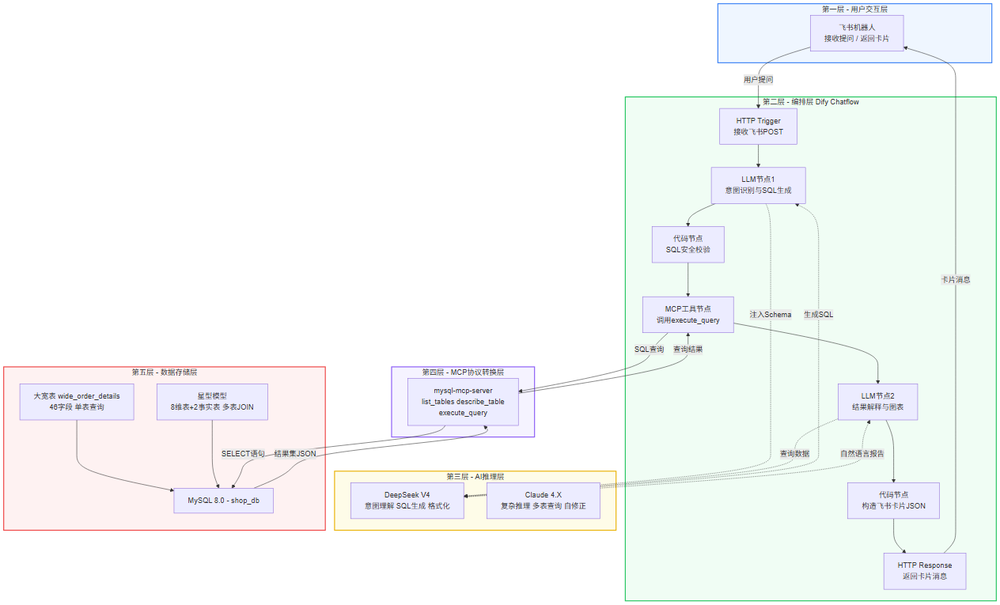
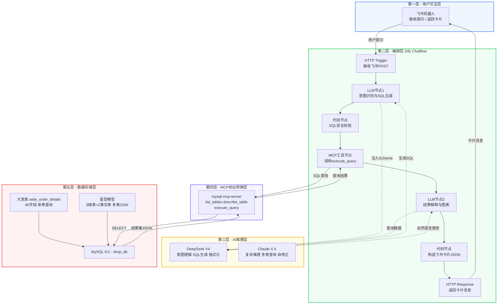
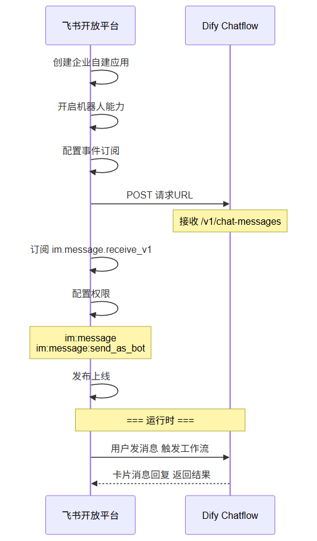
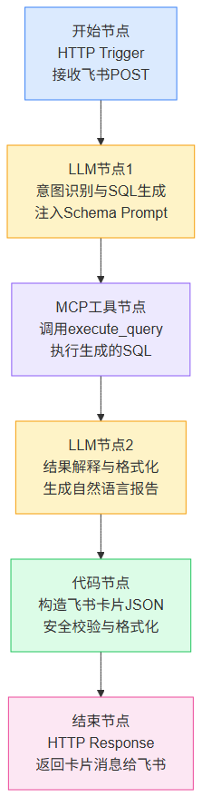
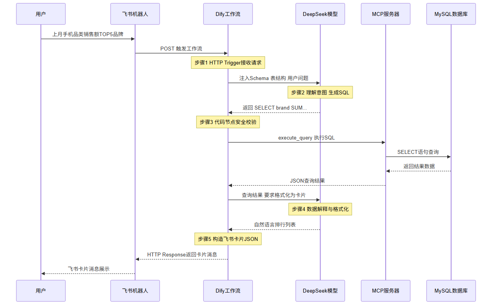

# 🏗️ 技术架构设计

## 第 3 章 · 飞书 + Dify + MCP + LLM + NL2SQL

> **讲师：大数据实训团队** | **课时：45 分钟** | **类型：理论**

[TOC]

---

## 📌 本章学习目标

学完本章后，你将能够：

- [ ] 理解智能问数系统的五层技术架构
- [ ] 掌握 Dify 工作流（Chatflow）的核心节点类型和用法
- [ ] 理解 MCP（Model Context Protocol）协议的设计理念
- [ ] 独立搭建飞书机器人 → Dify 的连接
- [ ] 掌握 Prompt Engineering 在 NL2SQL 中的三大核心策略

---

## 🔭 整体架构全景图



<details>
<summary>📐 点击展开 Mermaid 源码（可复制到支持 Mermaid 的编辑器编辑）</summary>



</details>

### 五层职责

| 层级 | 组件 | 职责 |
|------|------|------|
| **用户交互层** | 飞书机器人 | 接收自然语言提问，返回格式化结果 |
| **工作流编排层** | Dify Chatflow | 串联 LLM 推理 → SQL 生成 → 执行 → 格式化 |
| **AI 推理层** | DeepSeek V4 / Claude | 理解自然语言、生成 SQL、格式化结果 |
| **协议转换层** | MCP Server | 标准化 AI ↔ 数据库的交互协议 |
| **数据存储层** | MySQL + 大宽表 | 存储和分析数据 |

---

## 📱 第一层：飞书机器人 — 用户交互入口

### 为什么选择飞书？

| 优势 | 说明 |
|------|------|
| 🏢 **企业原生通讯** | 员工日常工作使用，无需额外下载 App |
| 🔗 **Webhook 支持** | 原生支持 Outgoing Webhook + 事件订阅 |
| 💬 **交互卡片消息** | 支持 Markdown、ECharts 图表、按钮等富交互组件 |
| 🔐 **安全可控** | 企业管理员可审计，数据不出企业内网 |
| 🌐 **开放 API** | 完善的机器人 API，支持消息收发、用户信息获取 |

### 飞书接入流程



---

## 🧩 第二层：Dify — 可视化 AI 工作流引擎

### Dify Chatflow 核心节点

Dify 是一个开源 LLM 应用开发平台，其 **Chatflow** 功能支持可视化编排 AI 工作流。



### 七个核心节点配置说明

| 节点 | 类型 | 关键配置 |
|------|------|----------|
| ① 开始 | HTTP Trigger | 接收飞书 POST 请求，提取用户消息 `{{#sys.query#}}` |
| ② LLM 1 | LLM | System Prompt 注入表结构 + SQL 生成规则 |
| ③ MCP 工具 | Tool (MCP) | 连接 mysql-mcp-server，调用 `execute_query` |
| ④ LLM 2 | LLM | 将查询结果解释为自然语言 |
| ⑤ 代码节点 | Code (JS) | 将文本构造为飞书消息卡片 JSON |
| ⑥ 结束 | HTTP Response | 返回 `application/json` 给飞书 |

---

## 🔌 第三层：MCP 协议 — AI 与数据库的标准接口

### 什么是 MCP？

> **MCP（Model Context Protocol）** 是由 Anthropic 提出的**开放协议**，定义了 AI 模型如何与外部工具和数据源进行标准化交互。可以类比为「AI 世界的 USB-C 接口」——统一了各种工具的接入方式。

### MCP 的核心概念映射到本项目

| MCP 概念 | 说明 | 本项目对应 |
|----------|------|------------|
| **Server** | 暴露工具和资源的服务端进程 | `mysql-mcp-server`（npm 包） |
| **Client** | 调用 MCP 工具的客户端 | Dify 的 MCP 工具节点 |
| **Tool** | Server 暴露的可调用能力 | `execute_query` / `describe_table` / `list_tables` |
| **Resource** | Server 暴露的数据资源 | 数据库表结构、Schema 元数据 |
| **Transport** | 通信方式 | stdio（标准输入输出） 或 HTTP |

### 本项目 MySQL MCP Server 配置

```json
{
  "mcpServers": {
    "mysql": {
      "command": "npx",
      "args": ["-y", "mysql-mcp-server"],
      "env": {
        "MYSQL_HOST": "localhost",
        "MYSQL_PORT": "3306",
        "MYSQL_USER": "root",
        "MYSQL_PASSWORD": "admin",
        "MYSQL_DATABASE": "shop_db"
      }
    }
  }
}
```

### MCP 工具清单

| 工具名 | 参数 | 说明 |
|--------|------|------|
| `list_databases` | 无 | 列出 MySQL 所有数据库 |
| `list_tables` | `database`（可选） | 列出指定数据库的表 |
| `describe_table` | `table`（必填）, `database`（可选） | 查看表结构 |
| `execute_query` | `query`（必填）, `database`（可选） | 执行只读 SQL 查询 |

---

## 🧠 第四层：LLM — 自然语言到 SQL 的核心引擎

### Prompt Engineering 三大核心策略

#### 策略 1：Schema 注入（Context Injection）

将表结构完整注入 System Prompt，让 LLM 知道有哪些表和字段：

```markdown
## 数据库表：wide_order_details（订单明细大宽表）

### 时间维度
- order_date (DATE) — 下单日期
- order_year (INT) — 年份
- order_month (INT) — 月份 1-12

### 客户维度
- customer_level (VARCHAR) — 客户等级：'普通'/'银卡'/'金卡'/'钻石'

### 商品维度
- product_name (VARCHAR) — 商品名称
- brand (VARCHAR) — 品牌
- category_name (VARCHAR) — 品类名称

### 区域维度
- region_name (VARCHAR) — 区域名称：'华东'/'华北'/'华南'等

### 渠道维度
- channel_name (VARCHAR) — 渠道名称：'App 商城'/'微信小程序'/'PC 官网'/'线下门店'

### 度量值
- quantity (INT) — 购买数量
- sub_total (DECIMAL) — 行小计（销售额）
- cost_price (DECIMAL) — 成本价
```

---

#### 策略 2：Few-Shot 示例注入

提供 3-5 个典型的「自然语言 → SQL」示例，帮助 LLM 建立模式：

```markdown
## 问答案例

### 案例 1：销售额排行
Q: 上月销售额最高的 5 个品类
A:
​```sql
SELECT category_name, ROUND(SUM(sub_total), 2) AS total_sales
FROM wide_order_details
WHERE order_year = 2026 AND order_month = 5
  AND order_status != '已退款'
GROUP BY category_name
ORDER BY total_sales DESC
LIMIT 5;
```

### 案例 2：多条件筛选
Q: 华东区金卡会员的季度消费趋势
A:
```sql
SELECT order_quarter, ROUND(SUM(sub_total), 2) AS total_sales
FROM wide_order_details
WHERE region_name = '华东'
  AND customer_level = '金卡'
  AND order_year = 2026
GROUP BY order_quarter
ORDER BY order_quarter;
```

### 案例 3：占比计算
Q: 各渠道销售额占比
A:
```sql
SELECT channel_name,
       ROUND(SUM(sub_total), 2) AS total,
       CONCAT(ROUND(SUM(sub_total) * 100.0 / 
         (SELECT SUM(sub_total) FROM wide_order_details WHERE order_status != '已退款'), 2), '%') AS pct
FROM wide_order_details
WHERE order_status != '已退款'
GROUP BY channel_name
ORDER BY total DESC;
```
```

---

#### 策略 3：错误恢复与自我修正

​```markdown
## 错误处理规则

如果上一次生成的 SQL 执行失败，请按以下步骤修正：

1. 分析错误信息中的关键提示
2. 检查字段名拼写是否正确（参考上方表结构）
3. 检查枚举值是否精确匹配（参考字段描述中的枚举值）
4. 生成修正后的 SQL

### 上次失败的 SQL
{{failed_sql}}

### 错误信息
{{error_message}}

请生成修正后的 SQL：
```

---

## 🔄 完整数据流时序图



---

## 🛡️ 安全设计清单

智能问数系统直接对接生产数据库，安全是红线：

| 层级 | 安全措施 | 实现方式 |
|------|----------|----------|
| **SQL 类型校验** | 仅允许 SELECT/SHOW/DESCRIBE | MCP Server 端 `isReadOnlyQuery()` |
| **多语句拦截** | 禁止 `;` 分割的多语句 | 检测 query 中是否含 `;` |
| **禁止关键词** | 拦截 INSERT/UPDATE/DELETE/DROP/ALTER 等 | 正则匹配拒绝 |
| **敏感字段脱敏** | 姓名、手机号返回时脱敏 | Proxy 层或宽表预处理 |
| **查询频率限制** | 每用户每分钟最多 10 次 | Dify 代码节点计数器 |
| **超时控制** | 单次查询超时 30 秒 | MySQL `max_execution_time` |
| **结果集限制** | 最多返回 1000 行 | SQL 追加 `LIMIT 1000` |
| **审计日志** | 记录所有查询的用户、时间、SQL | Dify 日志 + MySQL 审计插件 |

### Dify 代码节点：SQL 安全校验

```javascript
// 在 Dify 代码节点中执行 SQL 前的安全校验
const query = LLM1_OUTPUT.trim();

// 1. 检查是否为空
if (!query) return { error: "SQL 为空" };

// 2. 检查是否包含禁止关键词
const forbidden = ['INSERT', 'UPDATE', 'DELETE', 'DROP', 'ALTER', 'TRUNCATE', 'CREATE TABLE'];
const upperQuery = query.toUpperCase();
for (const word of forbidden) {
    if (upperQuery.includes(word)) {
        return { error: `SQL 包含禁止操作: ${word}` };
    }
}

// 3. 检查是否以 SELECT 开头
if (!upperQuery.startsWith('SELECT') && !upperQuery.startsWith('SHOW')) {
    return { error: "仅允许 SELECT 和 SHOW 查询" };
}

// 4. 通过校验
return { query: query, safe: true };
```

---

## 🧪 课堂练习

1. **画架构图**：用 Mermaid 画出智能问数系统的五层架构图
2. **安全分析**：如果 LLM 生成了一条 `SELECT * FROM users; DROP TABLE orders;`，我们的系统能在哪几层拦截？
3. **Prompt 设计**：为手机品类销售额分析场景写一个完整的 System Prompt
4. **对比思考**：大宽表 vs 星型模型在 Prompt 设计上的差异是什么？哪个更省 Token？

---

## 📚 关键参考资源

| 资源 | 说明 |
|------|------|
| Dify 官方文档 | Chatflow 节点使用指南、MCP 工具配置 |
| MCP 协议规范 | Anthropic MCP Specification（modelcontextprotocol.io） |
| mysql-mcp-server | npm 包文档、GitHub 仓库 |
| 飞书开放平台 | 机器人 API、卡片消息格式文档 |
| DeepSeek API 文档 | Prompt 设计最佳实践 |

---

> **🔜 下一章预告**：星型模型直接查询实战 — 用真实数据体会多表 JOIN 的痛点和 NL2SQL 的准确率挑战！
